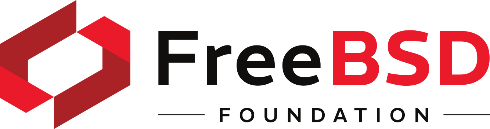

# Sylve

<a href="https://discord.gg/bJB826JvXK"></a>
<a href="https://sylve-ci.alchemilla.io"></a>
<a href="https://sylve-ci.alchemilla.io"></a>

> [!WARNING]
> This project is still in development so expect breaking changes!

https://gist.github.com/user-attachments/assets/7a9d002c-f647-4872-8b55-6b0cb1ce563b

Sylve aims to be a lightweight, open-source virtualization platform for FreeBSD, leveraging [Bhyve](https://wiki.freebsd.org/bhyve) for VMs and [Jails](https://wiki.freebsd.org/Jails) for containerization, with deep [ZFS](https://docs.freebsd.org/en/books/handbook/zfs/) integration. It seeks to provide a streamlined, Proxmox-like experience tailored for FreeBSD environments. Its backend is written in Go and the frontend is written in Svelte (with Kit).

## Sponsors

We’re proud to be supported by:

<p align="center">
  <picture>
      <source media="(prefers-color-scheme: dark)" srcset="./docs/sponsors/FreeBSD-White.png">
        
  </picture>
  &emsp;&emsp;&emsp;
  <a href="https://alchemilla.io">
    <picture>
      <source media="(prefers-color-scheme: dark)" srcset="./docs/sponsors/Alchemilla-White.png">
      
    </picture>
  </a>
</p>

- [FreeBSD Foundation](https://freebsdfoundation.org)  
- [Alchemilla](https://alchemilla.io)

You can also support the project by [sponsoring us on GitHub](https://github.com/sponsors/AlchemillaHQ).

# Development Requirements

These only apply to the development version of Sylve, the production version will be a single binary.

- Go >= 1.24
- Node.js >= v20.18.2
- NPM >= v10.9.2

# Runtime Requirements

Sylve is designed to run on FreeBSD 15.0 or later, and it is recommended to use the latest version of FreeBSD for the best experience.

## Dependencies

Running Sylve is pretty easy, but `sylve` depends on some packages that you can install using `pkg` or the corresponding port to that package. Here's a list of what you'd need:

| Dependency     | Min. version | Vendored | Optional | Purpose                                          |
| -------------- | ------------ | -------- | -------- | ------------------------------------------------ |
| smartmontools  | 7.4_2        | No       | No       | Disk health monitoring                           |
| tmux           | 3.2          | No       | No       | Terminal multiplexer, used for the (web) console |
| libvirt        | 11.7.0       | No       | Yes      | Virtualization API, used for Bhyve               |
| bhyve-firmware | 1.0_2        | No       | Yes      | Collection of Firmware for bhyve                 |
| samba4XX       | 4.XX         | No       | Yes      | SMB file sharing service                         |
| swtpm          | 0.10.1       | No       | Yes      | TPM emulator for VMs                             |
| jansson        | 2.14.1       | No       | No       | C library for JSON parsing                       |
| qemu-tools     | 10.1.0_1     | No       | Yes      | QEMU utilities for disk image manipulation       |

We also need to enable some services in order to run Sylve, you can drop these into `/etc/rc.conf` if you don't have it already:

```sh
sysrc ntpd_enable="YES" # Optional
sysrc ntpd_sync_on_start="YES" # Optional
sysrc zfs_enable="YES"
sysrc libvirtd_enable="YES" # Optional
sysrc dnsmasq_enable="YES" # Optional
sysrc samba_server_enable="YES" # Optional
```

Enabling `rctl` is required if you're using Jails with Sylve. Do this by adding the following line to `/boot/loader.conf`:

```sh
kern.racct.enable=1
```

> [!IMPORTANT]
> Please reboot your system after adding those entries to ensure that the
> services are started correctly and the kernel modules are loaded.

# Installation

## From source

Install required packages.

```sh
pkg install git node22 npm-node22 go tmux libvirt bhyve-firmware smartmontools tmux samba422 jansson swtpm
```

Clone the repo and build Sylve.

```sh
git clone https://github.com/AlchemillaHQ/Sylve.git
cd Sylve
make
```

# Usage

```sh
cd bin/
cp -rf ../config.example.json config.json # Edit the config.json file to your liking
./sylve
```

# Notes

1. Bhyve doesn't support bootorders yet

Since Bhyve doesn't support bootorders yet, you'll need to configure the order using the UEFI boot menu. You can download 

2. ARM64 support is still pending for Libvirt so the support is not there yet, for everything else it should just work out of the box.

# Contributing

Please read [CONTRIBUTING.md](docs/CONTRIBUTING.md) for details on our contributing guidelines.

# License

This project is licensed under the BSD 2-Clause License - see the [LICENSE](LICENSE) file for details.
