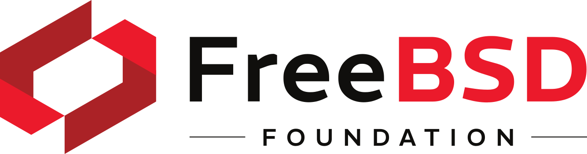
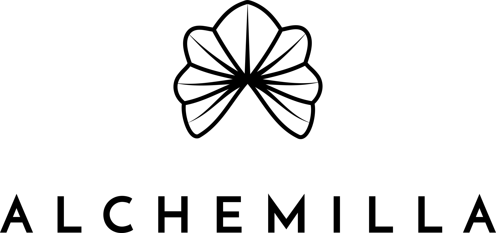

# Sylve

[](https://discord.gg/bJB826JvXK)
[](https://github.com/AlchemillaHQ/Sylve/actions/workflows/build.yaml)
[](https://github.com/AlchemillaHQ/Sylve/actions/workflows/test.yaml)
[](https://sylve.io/docs)

> [!NOTE]
> Sylve is under active development. Some features and APIs may change.

https://gist.github.com/user-attachments/assets/7a9d002c-f647-4872-8b55-6b0cb1ce563b

Sylve is a lightweight, open-source virtualization platform for FreeBSD. It combines **Bhyve virtual machines**, **FreeBSD Jails**, and **ZFS storage** into a modern web interface designed to deliver a streamlined, Proxmox-like experience tailored for FreeBSD environments.

The backend is written in **Go**, while the frontend is built with **SvelteKit**.

**Full documentation:** https://sylve.io/docs

# Features

- **Bhyve Virtual Machine Management**
- **FreeBSD Jail Management**
- **ZFS-first storage architecture**
- **Modern web UI**
- **Built-in clustering support**
- **Integrated networking tooling**
- **Zelta integration for backups**

Sylve aims to make FreeBSD virtualization easier to manage without relying on complex shell scripts.

# Quick Start

Sylve is designed to run on **FreeBSD 15.0 or later**.

Install dependencies:

```sh
# Other optional dependencies like libirt, bhyve-firmware, qemu-tools
# swtpm, samba4XX, etc. might be needed if you enable those features.
# Read the docs to be sure!

pkg install git node24 npm-node24 go
````

Clone the repository and build:

```sh
git clone https://github.com/AlchemillaHQ/Sylve.git
cd Sylve
make
```

Run Sylve:

```sh
cd bin
cp ../config.example.json config.json
./sylve
```

For full installation instructions, dependency details, and configuration guides, see the documentation:

[https://sylve.io/docs](https://sylve.io/docs)

# Sponsors

We’re proud to be supported by:

<p align="center">
  <picture>
      <source media="(prefers-color-scheme: dark)" srcset="./docs/sponsors/FreeBSD-White.png">
        
  </picture>
  &emsp;&emsp;&emsp;
  <a href="https://alchemilla.io">
    <picture>
      <source media="(prefers-color-scheme: dark)" srcset="./docs/sponsors/Alchemilla-White.png">
      
    </picture>
  </a>
  &emsp;&emsp;&emsp;
  <a href="https://iptechnics.com">
    <picture>
      <source media="(prefers-color-scheme: dark)" srcset="./docs/sponsors/IP-Technics-White.png">
      
    </picture>
  </a>
</p>

* [https://freebsdfoundation.org](https://freebsdfoundation.org)
* [https://alchemilla.io](https://alchemilla.io)
* [https://iptechnics.com](https://iptechnics.com)

You can also support the project by sponsoring us on GitHub:

[https://github.com/sponsors/AlchemillaHQ](https://github.com/sponsors/AlchemillaHQ)

# Contributing

Contributions are welcome. Please read docs/CONTRIBUTING.md before submitting pull requests.

# License

This project is licensed under the **BSD 2-Clause License**.

See the LICENSE file for details.