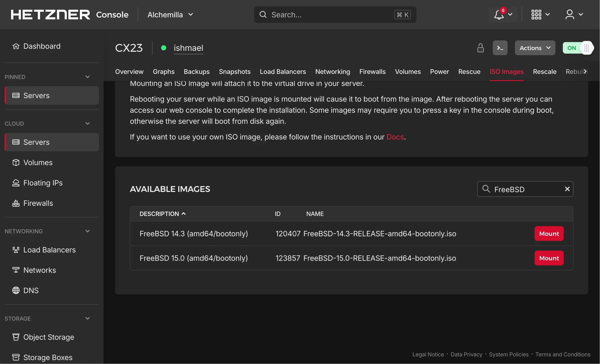

## System Requirements

As of the latest release, Sylve requires **FreeBSD 15.0-RELEASE or later**. You will also need to have a **ZFS pool** available for Sylve to use. Other filesystems such as UFS are not currently supported.

:::note
Although we list support for FreeBSD **15.0-RELEASE**, we **strongly recommend** using **-CURRENT** with pkgbase or at least **-STABLE**. Bhyve and related libraries such as `libvirt` are evolving rapidly.

Coming from Linux system administration, it can be tempting to run the oldest possible release to still have all your toys and not have things break. However, the FreeBSD ecosystem works a bit differently in this regard. If it is good enough for **[Netflix](https://freebsdfoundation.org/netflix-case-study/)**, it is probably good enough for us.

That said, if your use case requires maximum stability and you do not need the latest features or bug fixes, **15.0-RELEASE** or quarterly releases should work perfectly fine.
:::

## Software Dependencies

Sylve is designed to run using only **base FreeBSD dependencies** if you prefer. However, we recommend installing the following packages:

- `libvirt`, `bhyve-firmware`, `swtpm`, `qemu-tools`: Required for managing and running Bhyve virtual machines. The virtualization subsystem cannot be used without these dependencies.

- `samba4XX`: Enables SMB shares for guests and Jails. Basic sharing functionality and an audit log are supported out of the box when this dependency is installed.

- `dnsmasq`: Provides DHCP and DNS services. If installed, Sylve can directly manage DHCP ranges and leases.

## Hardware Requirements

We run several Sylve instances in production with the specifications listed below (Jails only), and they are more than sufficient for most use cases. If you plan to run **Bhyve virtual machines**, we recommend at least **2 vCPUs and 4 GB of RAM**.

- **CPU**: 1 vCPU (2+ recommended for better performance)
- **RAM**: 512 MB (1 GB+ recommended)
- **Storage**: 10 GB (ZFS pool with at least 20 GB recommended)
- **Network**: 50 Mbps (100 Mbps+ recommended)

As mentioned in the [Introduction](/docs/), Sylve is extremely lightweight. As part of this guide (and as a practical example), we will set up Sylve on a **CX23** machine on [Hetzner Cloud](https://hetzner.cloud/?ref=uD5CjfBFJSR9). This instance includes **2 vCPUs**, **4 GB of RAM**, a single **IPv4 address**, and an **IPv6 /64 subnet**, which is more than enough to run Sylve and explore its features.

:::note
The **CPX23**, and most machines advertised as VPS instances, typically **do not support nested virtualization**. This means you will not be able to run **Bhyve virtual machines** on them. However, you can still run **Jails**, which act as lightweight, VM-like environments.

The FreeBSD ports tree also provides an excellent collection of applications that can be installed directly inside Jails.
:::

On most of these providers, you will also probably need to mount a FreeBSD ISO and manually install it as they don't provide FreeBSD images by default.



You can mount that drive, and install as you usually would. If you're new to FreeBSD, this [section](https://docs.freebsd.org/en/books/handbook/bsdinstall/) of it is an excellent resource to get you up and running.

## Installing Sylve

:::note
This section is subject to change once we're in the Ports tree. For now, we recommend installing Sylve using the latest release from GitHub, which includes pre-built binaries and also the Source Code if you want to build it yourself, we'll cover both methods here.
:::

Regardlesss of what method we use, we will still need to install our dependencies, so let's start with that:

```bash
pkg install -y libvirt bhyve-firmware swtpm qemu-tools samba423 dnsmasq
```

If you're building from source, you will also need to have `git`, `go` and `node` installed.

```bash
pkg install -y git go node npm
```

### Installing from GitHub Releases

You can visit the [releases page](https://github.com/AlchemillaHQ/Sylve/releases) and download the latest release for your architecture. Once downloaded, you can extract the archive and move the `sylve` binary to a location in your `PATH`, such as `/usr/local/bin`. The below commands will do this for you:

```bash
fetch https://github.com/AlchemillaHQ/Sylve/releases/download/tip/sylve-amd64 -O sylve
chmod +x sylve
mv sylve /usr/local/sbin/
```

Should get you the absolute latest release, but if you want to get a specific version, just replace `tip` with the version tag you want to install, when it is available.

### Building from Source

Building Sylve is no more difficult than building any other Go application. You can clone the repository, navigate to the project directory, and run the build command:

```bash
git clone https://github.com/AlchemillaHQ/Sylve.git
cd Sylve
make
```

That should build both the backend and frontend, and place the `sylve` binary in the `bin/` directory. You can then move it to a location in your `PATH`:

```bash
mv bin/sylve /usr/local/sbin/
```

### Setting up Sylve

We will setup an `rc` script for running Sylve but prior to that we need to do 2 things:

1. Create a `config.json` file:

```json
{
  "environment": "production",
  "proxyToVite": false,
  "dataPath": "/var/db/sylve",
  "admin": {
    "email": "admin@sylve.local",
    "password": "replace-this-with-something-strong"
  },
  "tlsConfig": {
    "certFile": "/usr/local/etc/letsencrypt/live/sylve.example.com/fullchain.pem",
    "keyFile": "/usr/local/etc/letsencrypt/live/sylve.example.net/privkey.pem"
  },
  "logLevel": 3,
  "port": 8181,
  "httpPort": 8182,
  "raft": {
    "reset": false
  },
  "btt": {
    "rpc": {
      "enabled": false,
      "host": "127.0.0.1",
      "port": 6890
    },
    "dht": {
      "enabled": true,
      "port": 7246
    }
  }
}
```

Most of the above config is self-explanatory, we will discuss the ones that aren't:

- `proxyToVite`: This is a development setting that allows the backend to proxy requests to the Vite development server. It should be set to `false` in production.

- `tlsConfig`: This is where you specify the paths to your TLS certificate and key files. If you want to use HTTPS (which is highly recommended), you need to provide valid paths here. You can use Let's Encrypt or any other certificate authority to obtain your certificates. This is also important if you're going to setup Passkey based authentication.

- `logLevel`: This controls the verbosity of the logs. The levels are as follows:
  - `0`: Debug
  - `1`: Info
  - `2`: Warning
  - `3`: Error
  - `4`: Fatal
  - `5`: Panic

<br></br>

We recommend setting it to `3` for production to only log errors, but you can adjust this based on your needs. Setting it to `0` will log everything, which can be useful for debugging but may generate a lot of logs in a busy environment.

- `raft.reset`: If something goes catestrophically wrong with your cluster, you can set this to `true` to reset the Raft state. This will essentially start the cluster from scratch, on _this_ node. Use with caution, and only if you know what you're doing.

- `btt.dht`: This enables the Bittorrent DHT, which is used for peer discovery in the BTT network. It is recommended to keep this enabled unless you have a specific reason to disable it, downloading ISOs over magnets is one of the best features of Sylve and DHT makes it a whole lot better.

Now once you have the above config filled out, you need to place it in `/usr/local/etc/sylve/config.json`:

```bash
mkdir -p /usr/local/etc/sylve
mv config.json /usr/local/etc/sylve/
```

Once that is done we can also make a data directory for Sylve to store its data in:

:::caution
Make **sure** this directory can hold atleast a few gigabytes of data, especially if you plan on downloading a lot of ISOs or base tarballs, they all get stored in the data directory. All the SQLite, and RAFT databases also go here.
:::

```bash
mkdir -p /var/db/sylve
```

Now that we have both the config and data directories setup, we can create an `rc` script to run Sylve as a service. Create a file named `sylve` in `/usr/local/etc/rc.d/` with the following content:

```bash
#!/bin/sh
#
# PROVIDE: sylve
# REQUIRE: DAEMON NETWORKING
# KEYWORD: shutdown
#
# Add the following lines to /etc/rc.conf.local or /etc/rc.conf to enable sylve:
#
# sylve_enable (bool):      Set to "NO" by default.
#                           Set it to "YES" to enable sylve.
# sylve_user (user):        Set to "www" by default.
#                           User to run sylve as.
# sylve_group (group):      Set to "www" by default.
#                           Group to run sylve as.
# sylve_args (str):         Set to "-config %%ETCDIR%%/config.json" by default.
#                           Extra flags passed to sylve.

. /etc/rc.subr

name=sylve
rcvar=sylve_enable

load_rc_config $name

: ${sylve_enable:="NO"}
: ${sylve_user:="root"}
: ${sylve_group:="wheel"}
: ${sylve_args:="-config /usr/local/etc/sylve/config.json"}

export PATH="${PATH}:/usr/local/bin:/usr/local/sbin"

pidfile="/var/run/${name}.pid"
daemon_pidfile="/var/run/${name}-daemon.pid"
procname="/usr/local/sbin/sylve"
command="/usr/sbin/daemon"
command_args="-f -c -R 5 -r -T ${name} -p ${pidfile} -P ${daemon_pidfile} ${procname} ${sylve_args}"

start_precmd=sylve_startprecmd
stop_postcmd=sylve_stoppostcmd

sylve_startprecmd()
{
        if [ ! -e ${daemon_pidfile} ]; then
                install -o ${sylve_user} -g ${sylve_group} /dev/null ${daemon_pidfile};
        fi
        if [ ! -e ${pidfile} ]; then
                install -o ${sylve_user} -g ${sylve_group} /dev/null ${pidfile};
        fi
}


sylve_stoppostcmd()
{
        if [ -f "${daemon_pidfile}" ]; then
                pids=$( pgrep -F ${daemon_pidfile} 2>&1 )
                _err=$?
                [ ${_err} -eq 0 ] && kill -9 ${pids}
        fi
}

run_rc_command "$1"
```

Make the script executable:

```bash
chmod +x /usr/local/etc/rc.d/sylve
```

Once that is done you can enable the service by adding the following lines to your `/etc/rc.conf`:

```bash
sylve_enable="YES"
```

You can also just invoke `sysrc sylve_enable=YES` to do this for you. Now you can start the service using the following command:

:::note
Now prior to starting the service, if you're going to be utilizing Jails and ZFS it's required to have these entries in your /boot/loader.conf:

```bash
zfs_load="YES"
kern.racct.enable=1
```

We also recommend capping **vfs.zfs.arc_max** to something reasonable based on your system's RAM, for our CPX23 we're going to use something ridiculously low like **64 MB** to leave as much RAM as possible for Jails, but you can adjust this based on your needs. For a system with 4 GB of RAM, setting it to 512 MB is usually a good starting point. ZFS performance can degrade if the ARC is too small, but it can also consume too much RAM if it's too large, so finding the right balance is key. You can adjust this value in your `/boot/loader.conf` as well:

```bash
vfs.zfs.arc_max="67108864"
```

:::

Instead of starting like the command given below, at this stage it's good to reboot your machine to see if everything is in order with the system and that Sylve starts up correctly on boot. If you want to start it without rebooting, you can use the following command:

```bash
service sylve start
```

Now you should have Sylve up and running, you can access the web UI by navigating to `https://<your-server-ip>:8181` in your browser and login with the credentials you setup in the `config.json` file.
