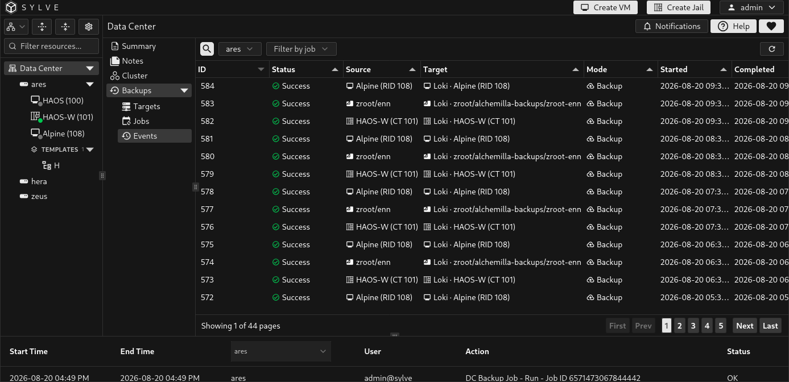
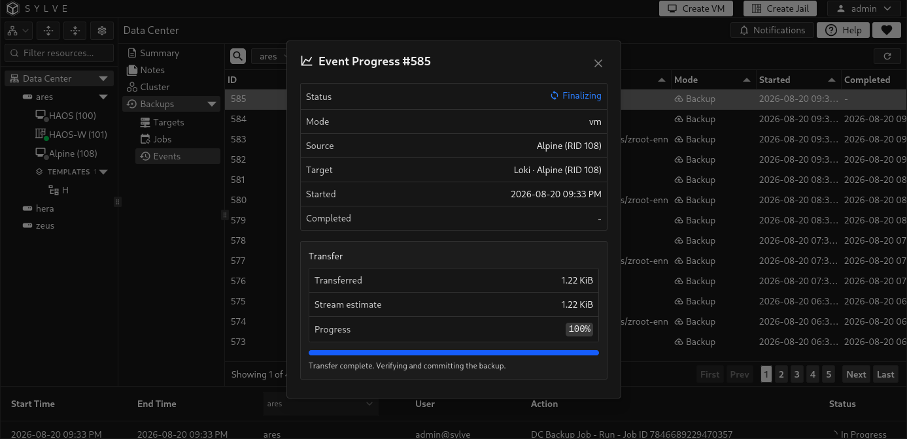
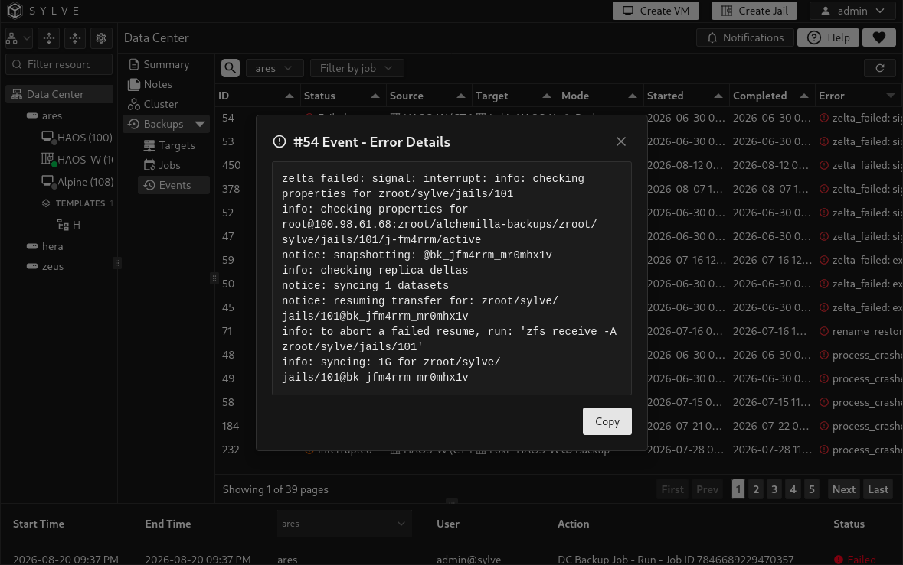

**Data Center → Backups → Events** is the operational record for backup and restore work. It shows scheduled runs, manual runs, job restores, and out-of-band restores, including the node that ran the work. The newest events appear first.

## Filter the event history

Use the search box to narrow the visible history, the job filter to focus on one job, and the node selector to view events recorded by a particular cluster node. The selected node defaults to the current node. In a cluster, Sylve forwards the request to the selected node when needed, which is useful when diagnosing a target that is reachable from one node but not another.

The event table is paginated so a long history remains responsive. Use the page controls at the bottom of the table to move through older events, and the refresh button to request the latest rows.

When an event belongs to a known job, Sylve resolves raw ZFS paths into readable source and target labels. Jail and VM events show the guest name with its CT or RID. Target labels include the configured target name and omit internal backup-lineage path segments. Snapshot labels are formatted as dates where possible. Hover a source or target cell to see its complete raw endpoint.

## Inspect a run

Select a running event and choose **View Progress** to open its live transfer details. The dialog shows its status, mode, source, target, start and completion times, transferred bytes, stream estimate, and progress percentage. It refreshes while open. A transfer that has sent all data can remain in **Finalizing** while Sylve verifies and commits the backup.

Completed and interrupted events retain their status and timestamps in the table. For a failed event, select the error cell to open the complete error text, then use **Copy** to take it to a ticket, terminal session, or support request. The error normally identifies whether the problem is connectivity, authentication, target readiness, ZFS, or source-side state.

Use the event record as the first place to verify a manual or scheduled run. A job row's last status is useful for a summary, while Events provides the individual execution history and diagnostics. Sylve retains completed events for up to 90 days, subject to a 10,000-row cap; queued and running events are not removed merely to satisfy that cap.
