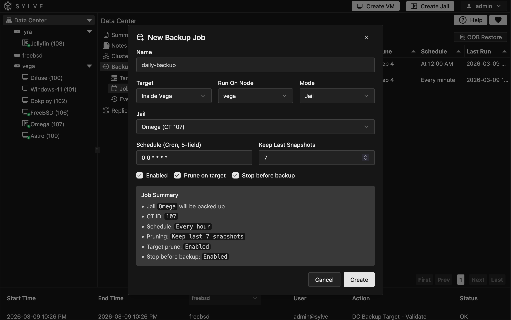
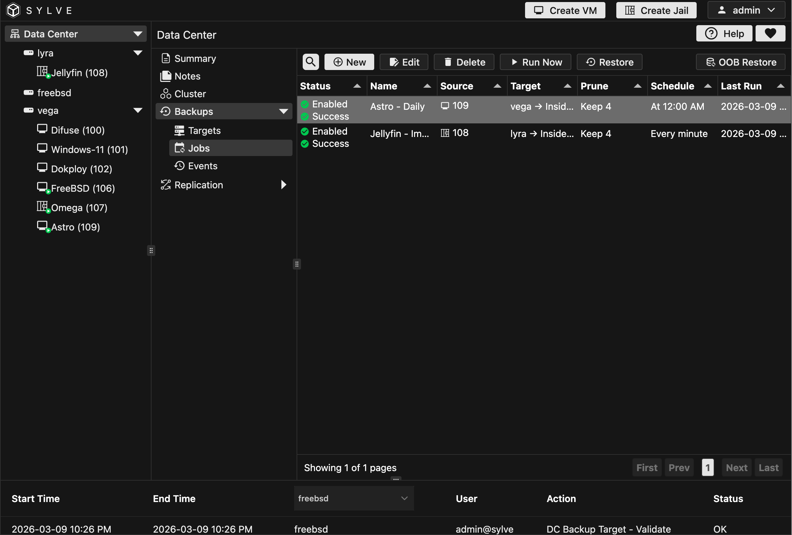
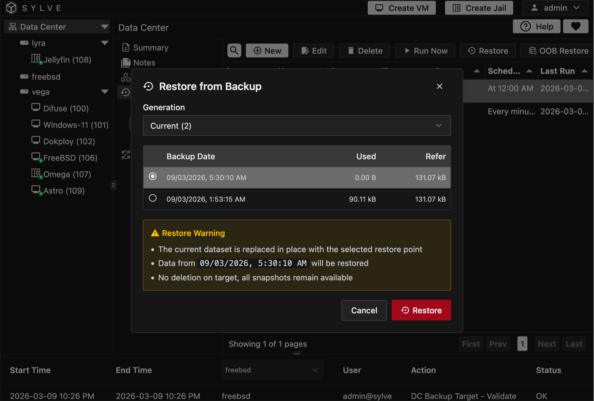
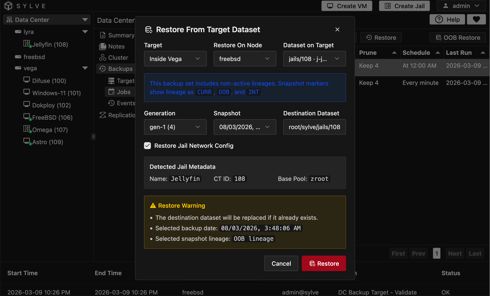

:::note
Backups are currently in early beta, so some features may not be available yet and the UI may change in the future. We are actively working on improving the backup experience, so stay tuned for updates!
:::

In this section, you will learn how to create backup jobs and restore data from existing backups.

A **target** defines *where* backups go.  
A **job** defines *what* to back up, *when* to run, and *which node* should run it.

## Creating a Backup Job

Go to **Backups → Jobs**, then click **New**.

### Job fields

| Field                          | Description                                                                                                                                     |
| ------------------------------ | ----------------------------------------------------------------------------------------------------------------------------------------------- |
| **Name**                       | Friendly name for the job.                                                                                                                      |
| **Target**                     | Which backup target this job writes to.                                                                                                         |
| **Run On Node**                | Node that executes this job. In clustered setups, choose the node you want. On standalone systems, this is automatically set to the local node. |
| **Mode**                       | Determines what is being backed up: **Single Dataset**, **Jail**, or **Virtual Machine**.                                                       |
| **Source Dataset / Jail / VM** | The specific dataset, jail, or VM to back up, depending on the selected **Mode**.                                                               |
| **Schedule (Cron, 5-field)**   | Backup schedule using cron syntax (for example, `0 * * * *` for hourly).                                                                        |
| **Keep Last Snapshots**        | Number of snapshots to retain for pruning. Setting `0` disables prune count enforcement.                                                        |
| **Enabled**                    | If disabled, the job is saved but will not run on its schedule.                                                                                 |
| **Prune on Target**            | Enables snapshot pruning on the backup target.                                                                                                  |
| **Stop Before Backup**         | Stops the guest before the backup begins when applicable.                                                                                       |

### Editing / Deleting / Running Manually

Select a row in the Jobs table to use context actions:

- **Edit**: Update target, schedule, source, and options.
- **Delete**: Remove the job.
- **Run Now**: Trigger an immediate run without waiting for the schedule.

## Understanding Generations and Lineage

During restore flows, snapshots are grouped by **Generation**. A generation is created when a backup job runs after a successful restore, and it represents a new backup lineage. Each generation contains snapshots taken during that run and subsequent runs until the next restore that creates a new generation.

## Restore from a Backup Job

Use this when you want to restore from snapshots produced by a specific job.

From **Backups → Jobs**, select a job, then click **Restore**.

### Steps

1. Select a **Generation**.
2. Select a **Snapshot**.
3. Review the restore warning.
4. Click **Restore**.

What happens:

- The destination dataset for that job is restored **in place**.
- Existing snapshots on the target are not deleted.
- Progress and result appear in backup events.

## Out-of-Band (OOB) Restore

Use **OOB Restore** when you want to restore directly from a target dataset/snapshot, independent of a specific job context.

From **Backups → Jobs**, click **OOB Restore**.

### OOB Restore fields

{/* - **Target**: Backup target to browse.
- **Restore On Node**: Node where restore should happen.
- **Dataset on Target**: Source dataset from target.
- **Generation**: Snapshot generation group.
- **Snapshot**: Specific restore point.
- **Destination Dataset**: Local dataset path to restore into.
- **Restore Jail/VM Network Config** (when applicable): Restores guest network config metadata. */}

| Field                          | Description                                                                                                                                     |
| ------------------------------ | ----------------------------------------------------------------------------------------------------------------------------------------------- |
| **Target**                     | Which backup target to browse for snapshots.                                                                                                         |
| **Restore On Node**            | Node where restore should happen. In clustered setups, choose the node you want. On standalone systems, this is automatically set to the local node. |
| **Dataset on Target**          | Source dataset from the target to restore.                                                                                                                               |
| **Generation**                 | Snapshot generation group to restore from.                                                                                                         |
| **Snapshot**                   | Specific restore point to use.                                                                                                         |
| **Destination Dataset**        | Local dataset path to restore into.                                                                                                                        |
| **Restore Jail/VM Network Config** | When restoring a jail/VM, this option restores network configuration metadata (IP address, MAC address, etc.) along with the dataset.

If Jail/VM metadata is detected, the UI will show inferred details (name, CT ID / RID, pools/base pool), and can auto-suggest destination dataset paths.

### OOB restore flow

1. Pick **Target** and **Restore On Node**.
2. Select **Dataset on Target**.
3. Choose **Generation** and **Snapshot**.
4. Confirm / adjust **Destination Dataset**.
5. Click **Restore**.

:::caution
If the destination dataset already exists, it will be replaced.
:::