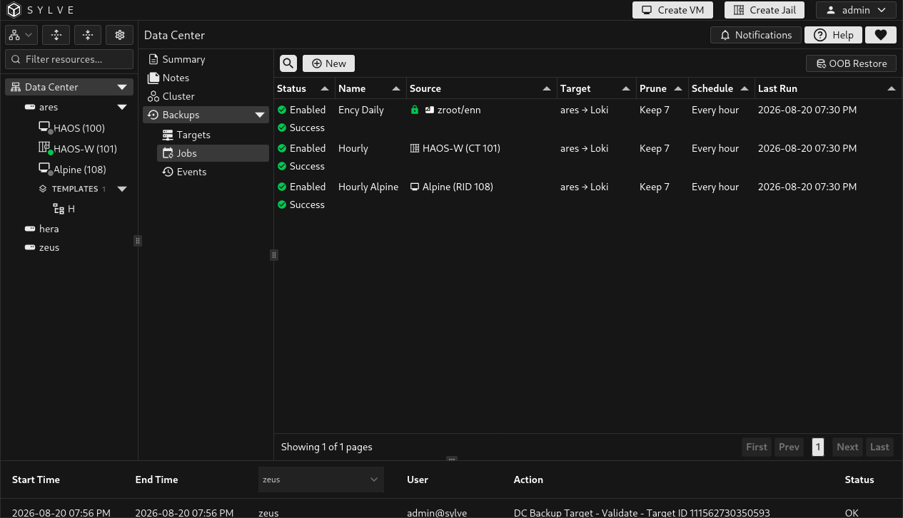
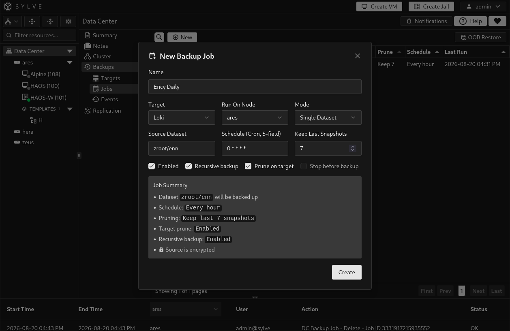
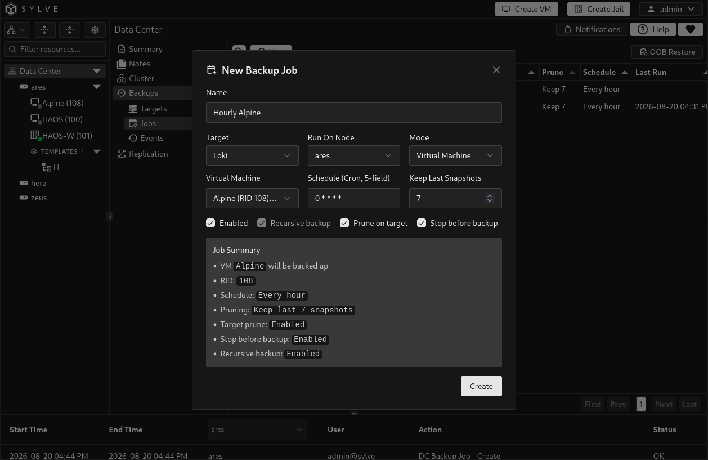
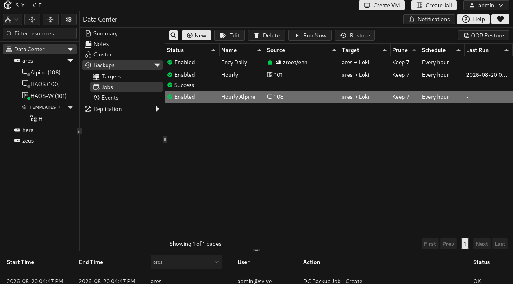
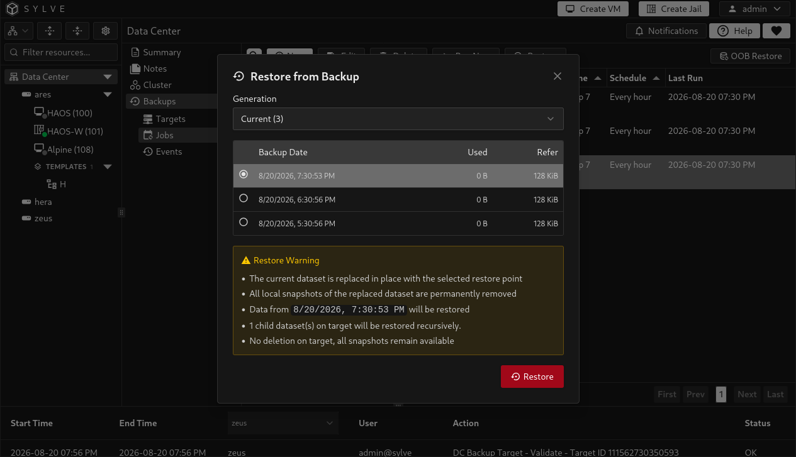
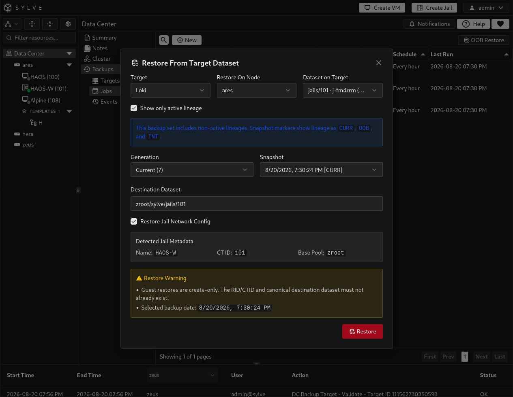

A backup job combines a source, a target, a runner node, and a schedule. Create and manage jobs in **Data Center → Backups → Jobs**. Before creating one, add a target and validate it from the node that will run the job.

## Create a job

Select **New** and choose a target, runner, and backup mode.

| Field | Description |
| --- | --- |
| **Name** | A name for the scheduled backup. |
| **Target** | Remote backup target that receives the data. |
| **Run On Node** | Node that performs the backup. In a cluster, select the node that owns the selected source. |
| **Mode** | **Dataset** backs up one chosen ZFS dataset, **Jail** backs up a Sylve jail, and **Virtual Machine** backs up a Sylve VM. |
| **Source Dataset / Jail / Virtual Machine** | The source appropriate to the selected mode. |
| **Schedule (Cron, 5-field)** | Five-field cron expression, for example `0 * * * *` for hourly. |
| **Keep Last Snapshots** | Number of backup snapshots to retain. `0` disables count-based pruning. |
| **Enabled** | Saves a job without scheduling it when unchecked. |
| **Recursive backup** | Includes descendant datasets. It is required for VM backups because a VM can have child disk datasets. |
| **Prune on target** | Applies the configured retention count to copies stored on the remote target. |
| **Stop before backup** | Stops a jail or VM before its backup. It does not apply to dataset jobs. |

### Dataset job

### Virtual machine job

### Choosing safe job options

- Use **Stop before backup** when you need an offline, application-consistent guest copy and its downtime is acceptable.
- Keep **Recursive backup** enabled for virtual machines. Disabling it would omit child disk datasets, and Sylve prevents that for VM jobs.
- Enable **Prune on target** only after choosing a retention count that matches your recovery policy. A value of `0` does not enforce a keep-last limit.

### Large snapshot histories

Sylve does not impose a fixed maximum on backup recovery points. The restore selector loads the newest 100 points first; choose **Load older backups** to continue through the history without making one request validate and return every snapshot.

Retention still matters for capacity and routine maintenance. Each successful backup pass selects at most 64 expired generations and applies the budget at generation boundaries, so every eligible snapshot object for a selected generation enters the same pass. Safety-protected incremental bases can remain. If a larger backlog exists, the backup event includes `backup_prune_deferred` and later successful runs continue draining it.

With **Keep Last Snapshots** set to `0`, count-based cleanup is disabled on both the source and target. With a positive value and **Prune on target** disabled, the source follows the keep-last value while target recovery points continue accumulating.

The out-of-band target browser discovers dataset roots without counting every snapshot first. Snapshot counts are therefore omitted until a dataset is selected, when its recovery points are fetched in the same paged form.

### Encrypted sources

Sylve detects encryption at the start of a backup run. For a recursive job, it checks every included dataset. For a virtual machine, it checks every storage root belonging to that VM, including roots on other pools. If any included source is encrypted, its ZFS key must already be loaded on the runner node. A missing or unavailable key stops the run before data is backed up; load the key with ZFS and run the job again.

The lock in the jobs table records the last encryption state Sylve successfully determined. It is informational and does not decrypt data or replace normal ZFS key management. If a later encryption check cannot be completed, Sylve retains the last known state instead of incorrectly clearing the lock.

### Dataset source restrictions

**Dataset** mode is for ordinary ZFS datasets, not Sylve-managed guest storage. Sylve rejects `<pool>/sylve`, such as `zroot/sylve`, every dataset below that managed hierarchy, and any parent dataset that contains a managed jail or virtual machine. Back up those guests with **Jail** or **Virtual Machine** mode so Sylve can preserve their lifecycle metadata and restore safety checks.

### Job identity is fixed after creation

After a job is created, its **Target**, **Mode**, **Source**, and, for a dataset job, **Run On Node** are fixed. This preserves the backup lineage and prevents a job from silently changing what or where it protects. Create a new job when you need a different target, mode, dataset, or dataset runner.

For jail and VM jobs, the guest can move to another node through migration or failover repair. Sylve updates the guest runner through that workflow rather than allowing it to be selected in the job editor.

You can still edit the job name, schedule, enabled state, retention, pruning, stop-before-backup, and recursive option. Be careful when changing **Recursive backup** for a non-VM job: Sylve can archive the active generation and require a full reseed because the protected dataset set has changed.

## Read the jobs table

For jail and VM jobs, the source column shows the guest's friendly name together with its stable identifier: **CT** for a jail and **RID** for a VM. This makes it easier to distinguish guests with similar names and to follow a guest after its storage location changes.

The Jobs list is cluster-wide. Requests made through a follower are forwarded to the current leader, so the shared job list remains consistent regardless of which Data Center member you are viewing.

## Run, edit, and delete jobs

Select a job to open its context actions. **Run Now** queues an immediate backup without changing its cron schedule. **Edit** changes the job's policy options. **Delete** removes the job definition; it does not remove backup data already stored on the target.

When a guest changes ownership or its routing node, a job may show that its runner needs repair. Complete the applicable migration or failover repair workflow before relying on the next scheduled run.

## Restore from a job

Select a job and choose **Restore** to browse the snapshots that belong to that job. Select a generation and snapshot, then supply an encryption passphrase when the source is encrypted. The job restore returns the backup to its job-defined destination.

For a legacy restore point (Pre v0.3.0), Sylve cannot cryptographically verify the complete dataset set. Legacy VM restore points are blocked. For a legacy dataset or jail restore, set **Recursive backup** to the value that was in use when that restore point was created before restoring it.

### Restoring a virtual machine with storage on multiple pools

Sylve treats a virtual machine with storage on multiple pools as one coordinated backup and restore set. It discovers every storage root belonging to the VM, records all roots in one committed manifest, and considers the generation restorable only when the complete set is present. The storage is never flattened into one dataset.

| Original VM storage | Restore in place | Restore as new to `tank/sylve/virtual-machines/108` |
| --- | --- | --- |
| `fast/sylve/virtual-machines/42` | Restored to `fast/sylve/virtual-machines/42` | The selected root becomes `tank/sylve/virtual-machines/108`. |
| `slow/sylve/virtual-machines/42` | Restored to `slow/sylve/virtual-machines/42` | Remains on `slow/sylve/virtual-machines/108`. |

Before changing storage, Sylve validates every destination pool and rejects mappings where two roots would collide. It restores each root as a coordinated operation and rolls back roots already restored if a later root or VM metadata reconciliation fails.

:::caution
For a restore as new, only the selected VM root moves to the destination pool. Additional storage roots retain their original pool names and must exist on the restore node. If a required pool is absent, preflight fails safely. Sylve cannot currently consolidate every VM disk onto the selected pool during this restore.
:::

## Out-of-band restore

Use **OOB Restore** when you need to browse a target independently of its current job, such as restoring to a different node or dataset. Select the target, destination node, remote dataset, generation, snapshot, and destination dataset. For jail and VM data, Sylve detects stored metadata and can present the guest details and an appropriate destination suggestion. The optional network setting restores the guest's saved network metadata.

| Field | Description |
| --- | --- |
| **Target** | Remote target to browse. |
| **Restore On Node** | Node where Sylve performs the restore. |
| **Dataset on Target** | Remote backup dataset to restore. |
| **Generation** | Backup lineage to browse. |
| **Snapshot** | Exact recovery point to receive. |
| **Destination Dataset** | Local ZFS destination for the restored data. |
| **Restore Jail/VM Network Config** | Restores detected guest network metadata when available. |

:::caution
An out-of-band restore can replace an existing destination dataset. Confirm the destination path and retain any data you need before starting it.
:::
