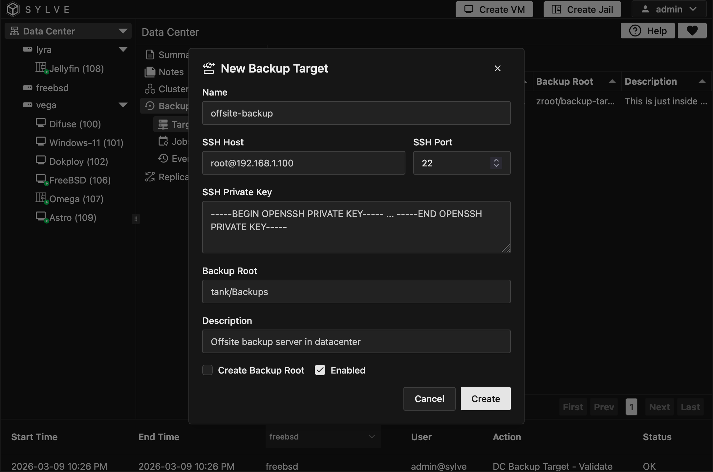

:::note
Backups are currently in early beta, so some features may not be available yet and the UI may change in the future. We are actively working on improving the backup experience, so stay tuned for updates!
:::

In this section, you will learn how to set up backup targets for your node(s). Backup targets are the destinations where your backup data will be stored. 

Right now we only support targets that support both SSH and ZFS, but we are working on adding support for more types of targets in the future. They don't need to have any special software running on them, just SSH and ZFS. This means that you can even use Proxmox Backup Server as a backup target for your nodes, which is a great option if you already have it set up in your environment.

## Adding a Backup Target

You can go to the Backups -> Targets page to add a new backup target. Once you're in that page you can click on the "New" context button to open up this modal:

Let's go over the options:

- **Name**: This is the name of the backup target. It can be anything you want, but it should be something that helps you identify the target later on.

- **SSH Host**: This is the username@port combo for the node you will be connecting to.

- **SSH Port**: This is the port number for SSH connections. The default is usually 22, but if your target uses a different port, you can specify it here.

- **SSH Private Key**: This is the private key that will be used to authenticate with the target. The key must be valid OpenSSH format and should have the appropriate permissions set on the target node.

- **Backup Root**: This is the ZFS root on the target side, if you have a pool named tank on your target node, you can specify it here as **tank/sylve-backups**. This is where your backup data will be stored on the target node.

- **Description**: This is an optional field where you can add any additional information about the backup target.

- **Create Backup Root**: If this option is enabled, the system will attempt to create the specified backup root on the target node if it doesn't already exist. This can be useful if you want to ensure that the backup root is set up correctly without having to manually create it beforehand.

- **Enabled**: This option allows you to enable or disable the backup target. If a target is disabled, it will not be used for backups until it is enabled again.

## Editing a Backup Target

You can edit a backup target by clicking on the "Edit" context button for the target you want to modify. This will open up the same form as when you create a new target, but it will be pre-filled with the existing information for that target. You can make any necessary changes and then save the updated target.