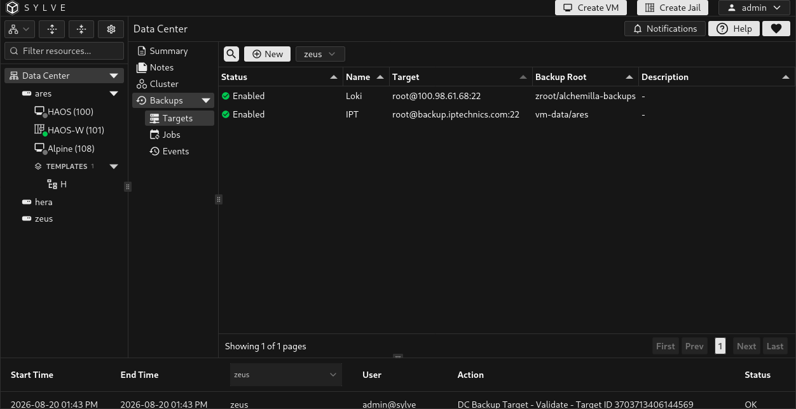
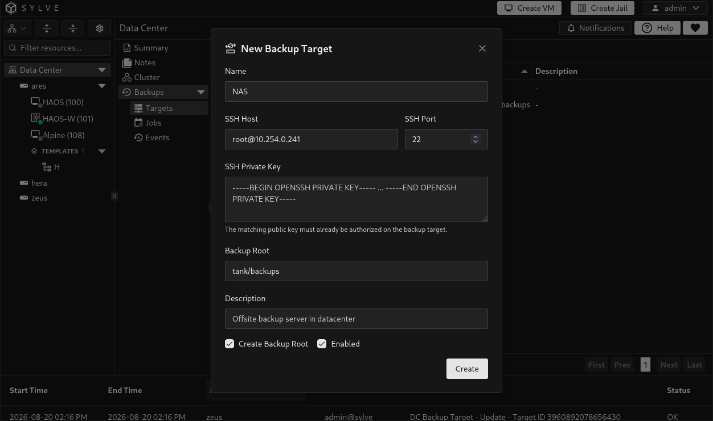
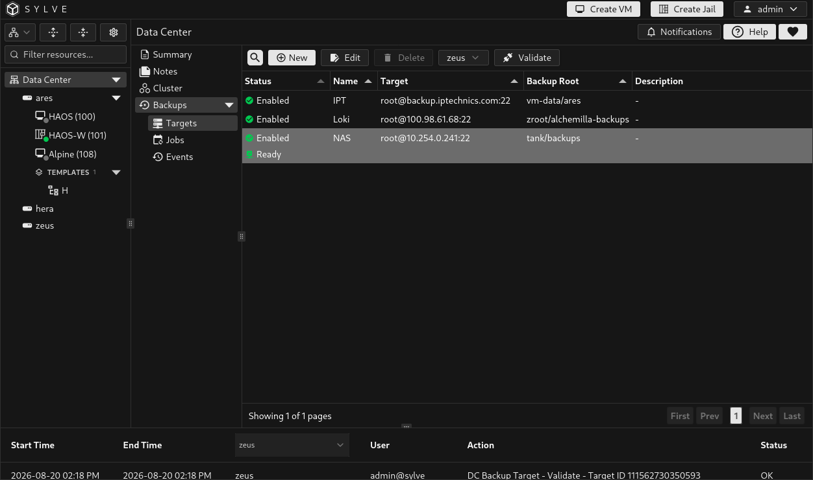

A backup target is the remote ZFS destination that receives data from a backup job. Sylve connects to it over SSH, so the target needs a reachable SSH service, ZFS, and an account whose key can create and write the configured ZFS path.

## Add a target

Open **Data Center → Backups → Targets** and select **New**.

| Field | Description |
| --- | --- |
| **Name** | A recognizable name for this destination. |
| **SSH Host** | The target's hostname or IP address. Enter the host only, not `user@host` or a port. |
| **SSH Port** | SSH port on the target. The default is `22`. |
| **SSH Private Key** | Private key Sylve uses to authenticate. A new target requires a key. When editing, leave it empty to retain the already stored key. |
| **Backup Root** | ZFS dataset path that contains backed-up datasets, such as `tank/sylve-backups`. |
| **Description** | Optional operator-facing context for the target. |
| **Create Backup Root** | Create the configured root dataset if it does not already exist. |
| **Enabled** | Allows jobs to use the target. Disable it before deleting it. |

## Validate connectivity per node

In a cluster, each participating node needs to be able to reach the target with the configured credentials. Select the node in the validation selector, choose a target, then select **Validate**. The target table shows the selected node's readiness state.

| Readiness | Meaning |
| --- | --- |
| **Ready** | The selected voter recently connected and validated the current target configuration. |
| **Not validated** | No successful validation has been recorded for that node. |
| **Failed** | The last validation attempt failed. Inspect the target, network reachability, account permissions, and key. |
| **Configuration changed** | The target changed after its last validation. Validate again with the current settings. |

Validation does not send a backup. It is a safe way to check the selected node's path to the remote ZFS target before assigning or running a job.

## Edit, disable, and delete

Select one row to reveal **Edit** and **Delete**. Changes to host, port, key, or root invalidate previous readiness, so validate again afterwards. Sylve requires a target to be disabled before it can be deleted. This prevents an active destination from disappearing by accident.

:::caution
Deleting a target removes its Sylve configuration, not the datasets already stored on the remote ZFS server. Manage retained remote backup data deliberately.
:::
