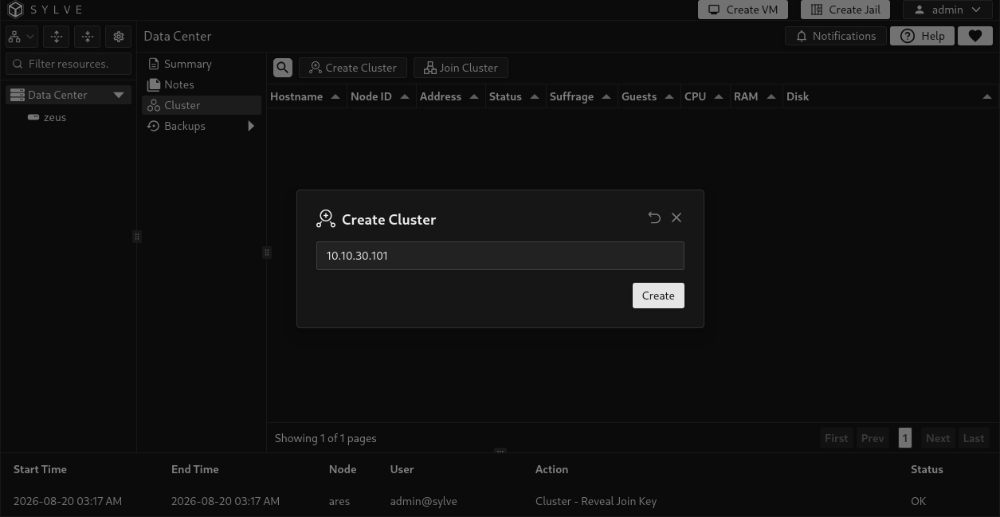
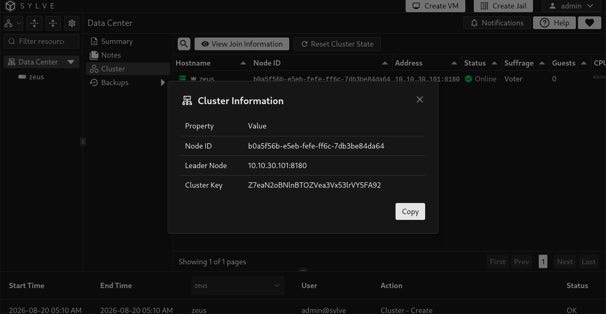
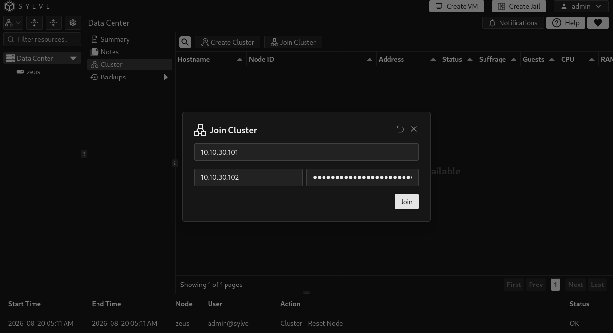
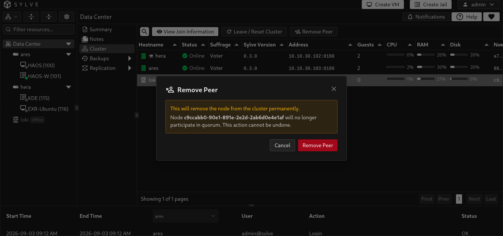
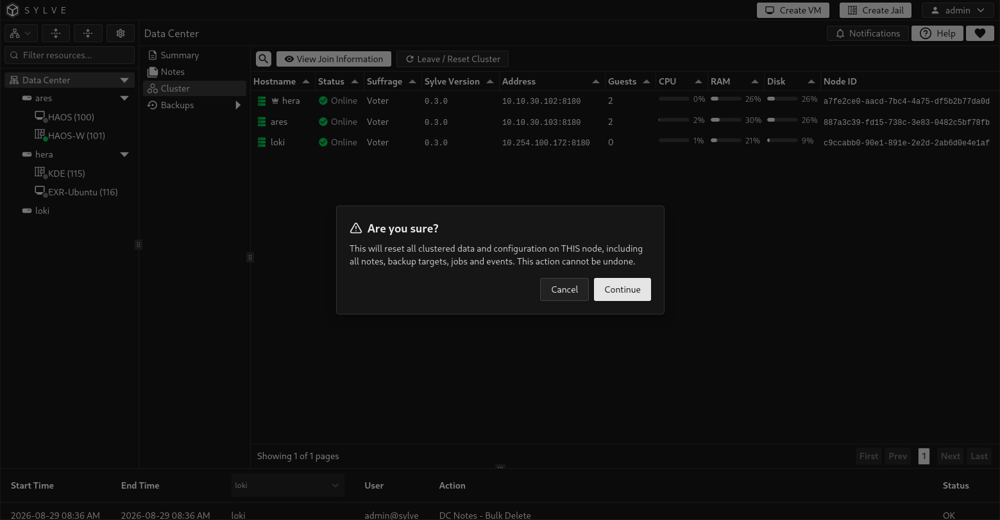

import QuorumCalculator from '../../../../../components/QuorumCalculator.astro';
import clusterJoinWalkthrough from './cluster-join.mp4';
import clusterOverview from './clustering-overview-v031.png';

A Sylve cluster gives you one Data Center view for its member nodes. Cluster state backs shared features such as backup targets and jobs, while each node continues to run its own workloads and services.

Sylve uses [HashiCorp Raft](https://github.com/hashicorp/raft), a battle-tested implementation of the **Raft** consensus model, to keep that shared state consistent. Raft gives the cluster a clear leader, replicated changes, and quorum-based safety when members fail or reconnect. It is a proven foundation for distributed control planes: Kubernetes commonly uses etcd, whose own distributed store is built on Raft.

Sylve does not depend on etcd. Instead, it builds its own focused control plane directly on HashiCorp Raft. This keeps the cluster stack contained and simple to operate while providing the consensus guarantees needed for Sylve's shared Data Center configuration.

Use a stable, private network between the nodes and keep every node on the same Sylve version. A three-voter cluster is the practical minimum for fault tolerance: it can retain quorum after one voter is lost. A smaller cluster can be useful for evaluation, but it cannot tolerate the same failures.

## Quorum calculator

Set the number of **voting** nodes in your planned cluster. Quorum is a strict majority of voters. Non-voting members do not increase quorum or the number of failures the cluster can tolerate.

<QuorumCalculator />

An odd voter count is usually the most efficient choice. For example, four voters still tolerate only one failure, just like three voters, while five voters can tolerate two. This calculator describes consensus availability, not workload capacity: your replica and backup design must still provide enough storage and compute capacity after a failure.

:::caution
Cluster communication is foundational infrastructure. Do not expose its internal addresses to untrusted networks, and do not treat a WAN link as equivalent to a reliable local network. Ensure every node can consistently reach the others before joining it.
:::

## Before you begin

- Decide the stable IP address each node will use for cluster communication.
- Confirm all nodes are running the same Sylve version.
- Keep the system clock synchronized on every node; a node whose clock differs from the leader by more than about 30 seconds is rejected with `cluster_join_clock_drift`. See [Keep the system clock accurate](/getting-started/) for NTP setup.
- Plan the voter count before adding production workloads. Three voters allow one voter failure without losing quorum.
- Ensure the nodes can communicate over the cluster network on `8180/TCP` for Raft, `8183/TCP` for Sylve's embedded SSH service, and `8184/TCP` for the internal cluster API.

## Create the first cluster node

Open **Data Center → Cluster** on the first node and select **Create Cluster**. Enter the node's cluster IP address, then confirm. That node becomes the initial Raft voter and cluster leader.



After creation, return to the Cluster page to see its member table. The leader is marked in the table, and **View Join Information** provides the values needed by another node.


## Join another node

On the cluster leader, select **View Join Information** and copy the cluster key. Treat this key as a credential: a node that has it and can reach the leader can request admission to the cluster.

On the node to add, open **Data Center → Cluster**, select **Join Cluster**, and provide the following values.

| Field | What to enter |
| --- | --- |
| **Node IP** | The joining node's own cluster IP address. |
| **Leader IP** | The current leader's cluster IP address. Enter only the address, not a URL or port. |
| **Cluster Key** | The key copied from the leader's join information. |

If this is the same node returning after a leave with guests, select **Join**. Sylve checks all of its current guest IDs against the surviving cluster before saving the join intent and again while the node is staged. A VM RID and a jail CTID with the same number conflict, even when the guest types differ.





The join process verifies the cluster key, exact Sylve version, member identity, clock offset, and VM and Jail identities across the cluster. The node is first added as a staged non-voter. It synchronizes and verifies replicated state before promotion to voter, so it does not affect quorum while it is catching up.

The **Cluster Join** progress control shows the current phase, synchronized Raft entries, automatic retry attempts, and technical details when an error occurs. Temporary leader changes and connection failures can resume automatically. Do not reset the joining node merely because a retry is in progress. Resolve the reported version, identity, connectivity, storage, or quorum problem and allow the workflow to continue.

On cooperative leave, the surviving cluster releases the departing node's guest ID claims after its membership is removed. Remaining members can then use those numbers. The departed node keeps its local guests and can rejoin with any current guest set whose numeric IDs are all free in the cluster. If another node reused one of its IDs, the entire join is rejected until the conflicting local guest ID is changed or the cluster conflict is otherwise resolved. A guest deleted while standalone needs no separate release when the node returns.

<video class="docs-walkthrough-video" autoplay muted loop playsinline controls aria-label="Cluster join walkthrough showing the joining node details, masked cluster key, and the node appearing as an online voter">
  <source src={clusterJoinWalkthrough} type="video/mp4" />
</video>

## Read the member table

| Column | Meaning |
| --- | --- |
| **Hostname** | Hostname reported by the member. The cluster leader has a crown icon. |
| **Node ID** | Sylve's stable identifier for the member. |
| **Address** | The Raft address used for cluster consensus. |
| **Status** | Whether Sylve can currently see the member as online or offline. |
| **Suffrage** | The member's Raft role. A **Voter** participates in quorum; a **Non Voter** does not; **Staging** is a temporary joining state. |
| **Sylve Version** | Version and build commit reported by the member. The commit is shown when available. A join requires the joining node to report exactly the leader's version; a third-party member that reports a different version or cannot be reached is reported as a warning rather than failing the version check, although the membership change itself still requires Raft quorum. Removals require every participating member to report the same version. |
| **Guests** | Number of guests currently associated with that member. |
| **CPU**, **RAM**, **Disk** | The member's current reported resource usage. Use these indicators when deciding where work can move before planned maintenance. |

Compare build commits as well as versions when checking an upgrade, especially with `tip` builds: two binaries can report the same release version but come from different commits. A missing commit does not prove that the builds match. You can also inspect reported commits with `sylve datacenter cluster members`; see the [Data Center CLI guide](/guides/node/cli-console/data-center/).

## Remove a peer

Only the current cluster leader can remove another member. Select a non-leader row, then select **Remove Peer**. Removing a voter immediately reduces the cluster's redundancy, so confirm that the remaining voters will still satisfy your required quorum.



Normal removal contacts the target, fences new work there, waits for active operations to drain, removes its Raft membership, cleans its local clustered state, and restarts it as a standalone node. Every participating member must run the same Sylve version. The dialog reports an unreachable target, a version-check failure, an uncertain outcome, or cleanup that could not be confirmed instead of pretending the removal completed cleanly.

Sylve checks cluster-owned dependencies before changing Raft membership. Removal is blocked if the node still owns or is involved in resources such as guests, backup jobs or operations, replication policies or leases, restore operations, guest operations, runner rebinds, lifecycle tasks, or state repairs. The dialog lists blockers that must be resolved. If all blockers are guests, it offers **Leave and keep guests** instead of a resource list. This runs the cooperative leave while those guests stay on the target. Their numeric IDs become reusable by other members after the leave completes.

Removing a peer does not erase its workloads or storage. If leadership changes while the dialog is open, refresh the Cluster page and retry on the new leader.

If the target is unreachable before removal begins, the dialog can open **Force Remove Peer**. Use it only after externally fencing the target's power, storage, or network. Force removal changes Raft membership without contacting or cleaning the target, cannot bypass missing quorum, and remains blocked by cluster-owned dependencies. Before the target is used again, reset its stale local cluster state while it remains isolated.

If Sylve reports that the outcome is uncertain, do not immediately retry or force remove the peer. Inspect the target's leave status and the authoritative membership first. Repeating a membership operation without knowing whether the first one committed can make recovery harder.

## Leave or reset the current node

Select **Leave / Reset Cluster** on the member that should leave. The normal workflow fences new work, waits for active mutations to finish, transfers leadership when necessary, removes the member from Raft, cleans local clustered state, and restarts Sylve as a standalone node. The confirmation warns that local copies of clustered notes, backup targets, jobs, and events are cleared.

The **Cluster Leave** progress control identifies whether the node is fencing work, removing membership, or cleaning local state. If active consoles or operations prevent the node from draining, close or finish them and select **Retry Leave**. If a leader cannot transfer leadership, restore connectivity to another voter before retrying.

If the normal leave is blocked only by local guests, the page offers **Leave and keep guests**. The node keeps its VM and jail registrations while its clustered configuration is cleared and Sylve restarts. The surviving cluster releases those guest IDs for reuse after membership removal. The node waits for release confirmation before local cleanup. Backup jobs, replication state, active operations, lifecycle tasks, and state repairs still block a cooperative leave.



### Force a local reset

**Force Local Reset** is available only after a leave failure. It clears this machine's local cluster state and does not remove the member from surviving Raft membership. The dialog therefore requires the local Node ID and acknowledgements that remote membership is repaired or will be repaired separately, and that duplicate workloads and shared storage are externally fenced.

Use it only when the normal leave workflow cannot be recovered. Keep the reset node isolated until a healthy cluster leader removes or repairs its old membership. The node restarts after the local reset.

### The `raft.reset` recovery flag

If a failed node was removed while offline, keep it isolated until its stale cluster state is repaired. Do not return it to the cluster network and assume that its old membership is harmless. The one-time `raft.reset` flag in `config.json` affects Raft storage only:

```json
{
  "raft": {
    "reset": true
  }
}
```

On startup with this flag, Sylve clears the old Raft storage and bootstraps a one-node Raft group. It does **not** clear the local cluster row or replicated configuration, and it does not make the node standalone. Sylve automatically changes `raft.reset` back to `false` in `config.json`. The flag alone is insufficient to prepare a safe rejoin.

:::caution
Use this flag only as part of a specific recovery procedure on a stopped node whose old membership has already been removed. Do not set it on a healthy cluster member. Use **Leave / Reset Cluster** for a normal leave, or the guarded **Force Local Reset** action after a failed leave.
:::

## Upgrade clustered nodes safely

For releases whose upgrade notes permit mixed-version operation, upgrade a cluster as a rolling maintenance operation, one node at a time. Keep the mixed-version period as short and quiet as possible. Sylve requires a joining node to report exactly the leader's version, but it does not continuously reject an existing member after that member is upgraded, and a member that is unreachable or on a different version no longer blocks the version check. The membership change itself still requires Raft quorum, so a cluster that cannot reach a majority still cannot complete the join. This temporary tolerance is useful for compatible rolling maintenance, but it is not a promise that different releases can safely handle every new Raft command or cluster workflow together.

Release-specific upgrade notes take precedence over this general playbook. If a release requires all nodes to stop together, a particular intermediate version, or another special step, follow that instruction instead.

:::caution[Large version jumps require a coordinated outage]
Do not assume the rolling procedure below is safe for a large version jump. Releases with substantial changes to Raft commands, database schemas, or node-to-node APIs may not be compatible while different versions are running in the same cluster.

The upgrades from **0.2.3 to 0.3.0** and from **0.3.0 to 0.3.1** are such jumps. Plan a coordinated control-plane outage instead:

1. Back up the configuration and `dataPath` on every node.
2. Stop scheduled backups, migrations, and other cluster tasks.
3. Stop Sylve on every node before upgrading any node.
4. Upgrade every node while all Sylve services remain stopped. Confirm the target release's hostname, FreeBSD, configuration, and VM-management requirements from its release notes.
5. Start the voting members so the cluster can regain quorum, then start the remaining members.
6. Confirm that every node reports the same version, the cluster has a leader, and workloads and backups are healthy before resuming normal operations.

Use this coordinated procedure for any other large jump unless its release notes explicitly document a supported rolling path.
:::

### Before stopping any node

1. Read the release notes for the target version and confirm the supported upgrade path.
2. Back up `/usr/local/etc/sylve/config.json` and the configured `dataPath` on every node. The package default is `/var/db/sylve`. Use a consistent filesystem snapshot or another backup method suitable for the storage that holds it.
3. Open **Data Center → Cluster** and confirm that every expected member is online, identify the current leader, and verify that enough voters will remain online to preserve quorum.
4. Wait for migrations, backup and restore operations, replication runs, and other long-running guest tasks to finish.
5. Decide what should happen to workloads on the node. Migrate or shut down workloads that must not remain there during maintenance.

:::caution[Replication-protected guests]
A clean Sylve service shutdown fences the local replication leases and stops replication-protected VMs and jails on that node. Depending on the policy and cluster health, HA may make the workload eligible to run elsewhere. Do not stop Sylve on an active replication owner while assuming its protected guests will continue running locally.
:::

### Rolling upgrade order

Upgrade healthy followers first and the current leader last. This keeps the leader available for cluster writes during most of the maintenance and avoids an unnecessary election at the beginning. Recheck the crown icon before each node because leadership can change while the upgrade is in progress.

Never take more voters offline at once than the cluster can tolerate. In a three-voter cluster, upgrade exactly one voter at a time. A two-voter cluster loses quorum when either voter is stopped, so it cannot provide an uninterrupted rolling control-plane upgrade. Non-voting members do not contribute to quorum.

On each selected node, use either the FreeBSD package or a GitHub release binary.

To upgrade with `pkg`, run:

```sh
service sylve stop
pkg update
pkg upgrade sylve
service sylve start
```

Alternatively, download the binary from the [Sylve releases page](https://github.com/AlchemillaHQ/Sylve/releases). Replace `v0.3.1` with the exact target release, and replace `amd64` with `arm64` on ARM64 systems:

```sh
service sylve stop
fetch https://github.com/AlchemillaHQ/Sylve/releases/download/v0.3.1/sylve-amd64 -o /tmp/sylve-new
chmod 0555 /tmp/sylve-new
mv /tmp/sylve-new /usr/local/sbin/sylve
service sylve start
```

Use the same release version and architecture-appropriate binary across every cluster member. You may upgrade to the `tip` build, but its downloadable binary can change while the reported Sylve version remains the same. Download it once and distribute that exact binary to equivalent cluster members, or compare checksums to confirm every node received the same build.

Then verify the node before moving to the next one:

```sh
service sylve status
sylve --version
```

Confirm that the service is running, the expected version is reported, and the member returns to **Online** in the Cluster table. Check the node's Summary page and Sylve logs for startup or database-migration errors. Do not continue while the upgraded node is offline, unhealthy, or repeatedly leaving and rejoining consensus.

During the mixed-version window, avoid cluster configuration changes, peer removal, backup-target changes, migrations, replication-policy changes, and manual failover unless they are required to recover the upgrade. Finish upgrading the remaining followers, then upgrade whichever node is the leader at that point.

### After every node is upgraded

- Confirm every member reports the same Sylve version and is online. Compare reported build commits too, especially when using `tip` builds.
- Confirm the cluster has a leader and the expected voter and non-voter roles.
- Review failed or interrupted tasks before resuming scheduled maintenance.
- Verify important workloads, replication policies, backup jobs, and backup targets.

An offline member during a normal upgrade is still a cluster member. Do not select **Remove Peer**, **Leave / Reset Cluster**, or set `raft.reset` merely because the service is temporarily stopped. Those are membership and recovery actions, not upgrade steps.
