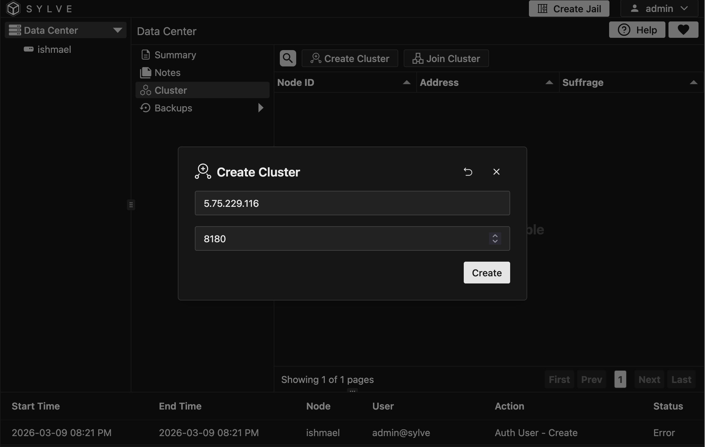
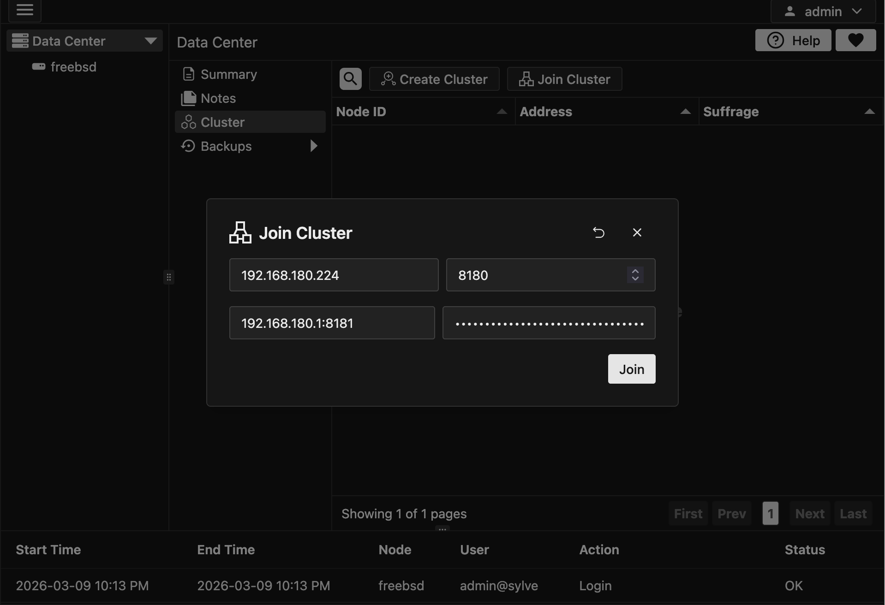
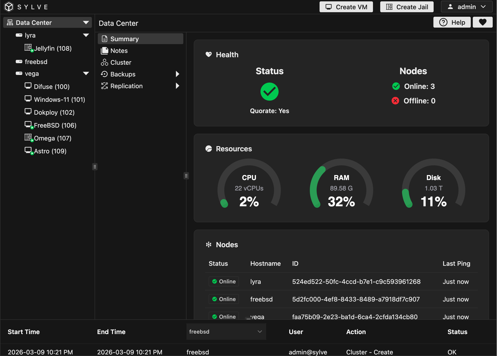

## Preface

Clustering in Sylve allows you to connect multiple Sylve nodes together to create a single, unified system. This can be useful for a variety of reasons, SPOG (Single Pane of Glass) is one of our killer features where you can manage multiple Sylve nodes from a single interface. Clustering is also aimed at making backups and replication simpler.

We built clusering from the ground up with simplicity in mind, we use the battle tested hashicorp/raft library to handle all the complexities of clustering and consensus. This means that you can set up a cluster in just a few minutes and it will be rock solid. This also means that it's quite lightweight and doesn't require a lot of resources to run.

That being said, there are a few things that will make clustering a lot smoother, some of them are listed below:

- Make sure that all nodes in the cluster have the same version of Sylve installed. This will ensure that there are no compatibility issues between the nodes. Although we do our best to maintain backward compatibility (some times at the cost of our sanity!), it's always best to have all nodes on the same version.

- Make sure that all nodes in the cluster have a stable network connection. Clustering relies on a stable network connection between the nodes to function properly. If there are network issues, it can cause problems with clustering and may lead to data loss. It doesn't have to be a super fast connection, but it should be stable and reliable.

- We **DO NOT**, and we cannot stress this enough, recommend using clustering over a WAN connection. Clustering is designed to work on a local network and may not perform well over a WAN connection.

- It is also **extremely important** to have atleast 3 nodes in the cluster, this is because of the way that clustering works, it uses a consensus algorithm to ensure that all nodes in the cluster are in agreement. If you have less than 3 nodes, you can run into issues with split brain and data loss. With 3 nodes, you can have one node go down and still maintain a quorum, which means that the cluster can continue to function without any issues. We **will not** support issues that arise from running a cluster with less than 3 nodes, so please make sure to have at least 3 nodes in your cluster. 

The upcoming replication feature is also disabled on nodes with less than 3 nodes, so if you want to use replication, you will need to have at least 3 nodes in your cluster. The 3rd node doesn't need to be super powerful, it can be a small node that is just used for maintaining quorum, sylve is light enough that as a quorum node, it doesn't need to do much work (less than 128 MB of RAM and 0.5vCPU is plenty!)

## Setting up a Cluster

Setting up a cluster is pretty straightforward, all you need to do is to navigate to Datacenter -> Cluster and then click on "Create Cluster". Once you do that a modal opens up where you can fill out the IP of your node that will be used for clustering and the port as well, this port must be **identical** on all nodes in the cluster, the default port is 8180.



Once you create a cluster, you will be logged out. You can log back in again and you will see that you are now in the cluster view.

You can use the "Reset Cluster" button to reset clustering state on a node, this can be done on a node that is part of an existing cluster as well to remove itself as LONG as its not a leader node. Leader nodes have a small icon next to them in the cluster table.

Once a cluster is setup, more nodes can join in. You can click on the "View Join Information" button to get the cluster key.

:::danger
Treat the cluster key like a password, anyone with the cluster key can join the cluster and potentially cause issues. Make sure to keep it safe and only share it with trusted individuals and nodes.
:::

## Joining a Cluster

To join a cluster, copy the cluster key from the first node or the **LEADER NODE** and click on "Join Cluster" on the node that you want to join the cluster. This will open up a modal where you can paste the cluster key, and the API of the **LEADER NODE**, the API is NOT running on port 8180 or whatever your RAFT port is, it will be running on "192.168.172.203:8181" or whatever ip:port you use to access the WebUI of the leader. Once that is done click on "Join". Once you do that, the node will attempt to join the cluster and if successful, it will be added to the cluster view. This is what the join modal looks like:



It might take a few seconds, if for some reason joining fails, you can reset the cluster by setting this flag to true in your config.json:

```json
  "raft": {
    "reset": false
  },
```

What that will do is to reset the clustering state on the node, and force it to bootstrap as a single node cluster. Once that is done you can reset the cluster again from the UI and then try joining again.

:::note
If you're clustering over a WAN connection, the UI might take some time to load in. Even if not in a WAN cluster, try hard refreshing the page to make sure that you have the latest information from the cluster.
:::

Once you join a cluster successfully, your `/datacenter/summary` dashboard should look something like this:



## Testing out RAFT

We have a nice little "Notes" application similar to the Notes application found inside each node, but the difference with this one is that the data is RAFT replicated meaning if you make a note on one node it should eventually be present on all Nodes. This is the best litmus test to see if everything is fine before you proceed with more interesting things.