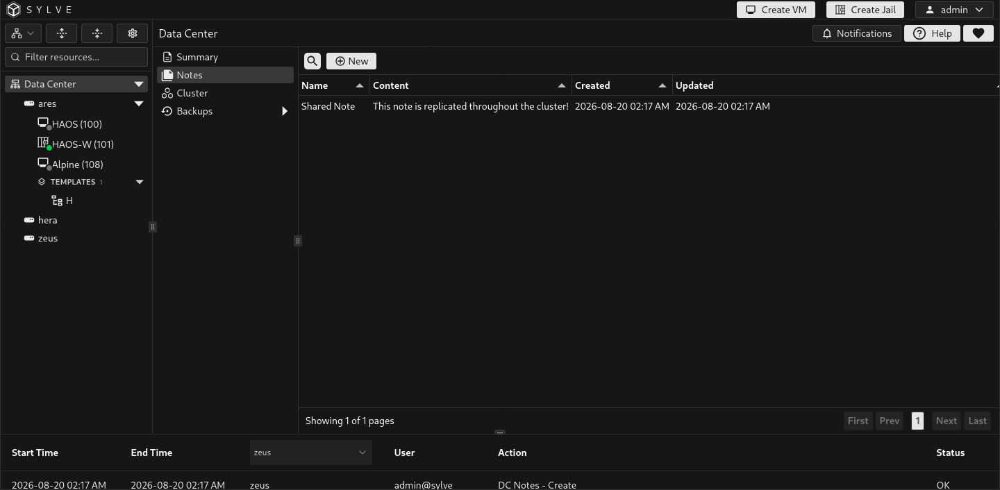
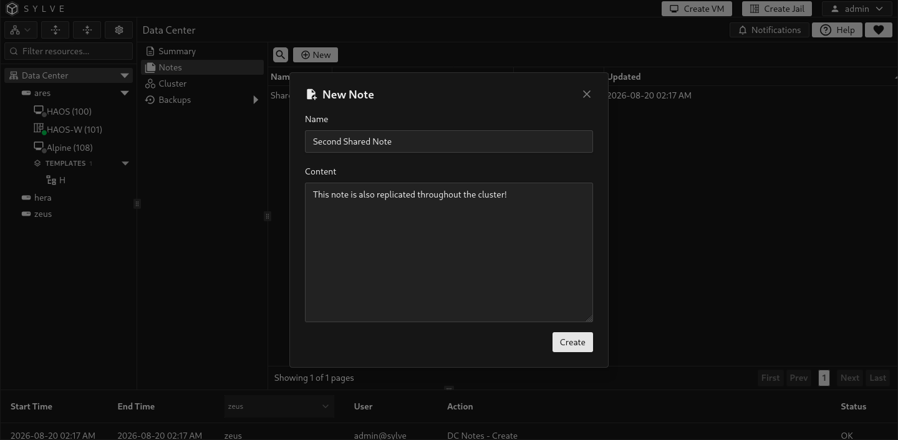
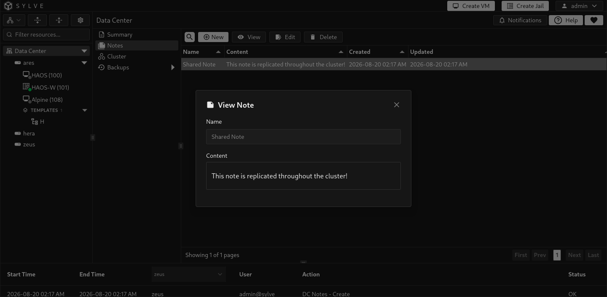
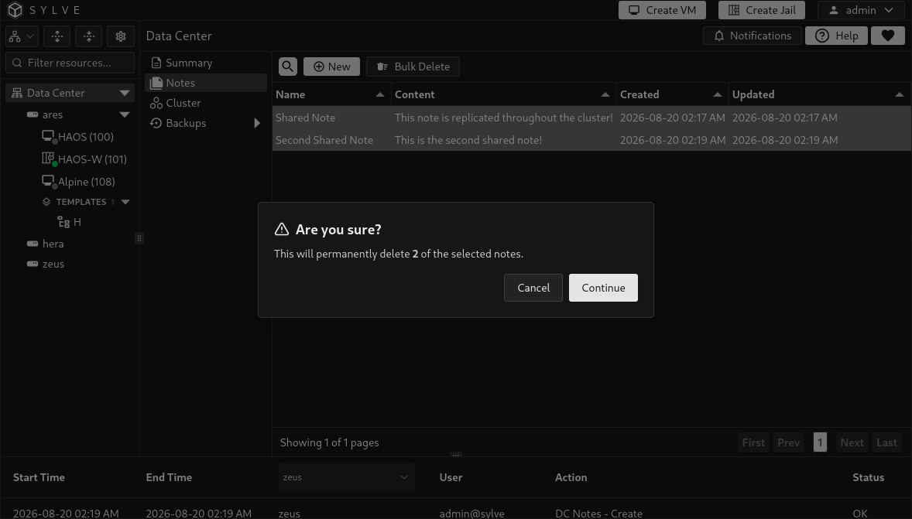

**Data Center → Notes** stores notes in the cluster rather than on one individual node. Use it for operational runbooks, maintenance context, recovery contacts, and handover information that should follow the Data Center.

## Use notes as a cluster smoke test

After creating or joining a cluster, create a short Data Center note on one node, then open **Data Center → Notes** from another member and confirm that it appears. Editing or deleting that test note should also be reflected across the cluster.

This is a useful quick check that shared Raft-backed data is functioning before you rely on cluster-wide configuration such as backup targets and jobs. It does not replace checking quorum, member health, or workload-specific recovery behaviour.

## Create a note

Select **New**, then enter a **Name** and **Content**. Both are required. Content supports Markdown and is rendered when you view a note, which makes it suitable for headings, lists, links, and short procedures.

## View and edit notes

Select one note to reveal **View**, **Edit**, and **Delete**. The table shows a short content preview along with creation and update times. Use **View** to see the rendered Markdown, and **Edit** to modify the source text. The editor's reset control restores the currently saved version while the dialog is open.

## Delete notes

Select one note to delete it, or select multiple rows and use **Bulk Delete**. Deletion is permanent, so retain longer runbooks in your version-controlled documentation as well when appropriate.

