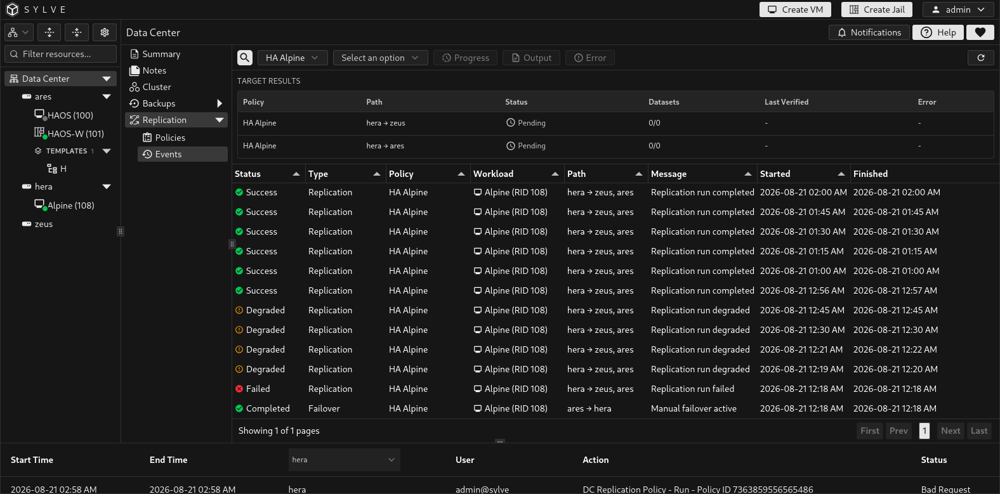
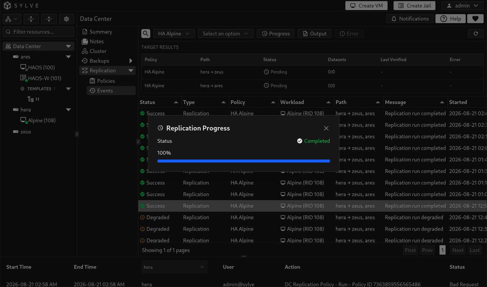
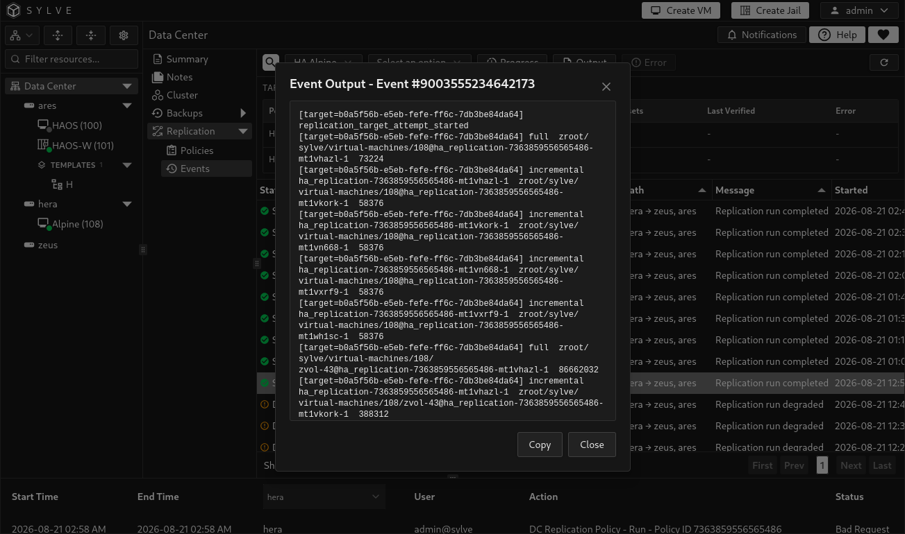

**Data Center → Replication → Events** records policy synchronization and workload transitions. Use it alongside the policy table when you need to confirm a replica is current, investigate a failed target, or follow a failover.

## Read target results

The **Target Results** table appears above the event history. It shows each configured path from the active source node to a target node, the number of datasets available for that target, when it was last verified, and any target-specific error. It is the quickest way to see whether a policy has a usable standby replica.

| Status | Meaning |
| --- | --- |
| **Ready** | The target has a current, verified replica. |
| **Syncing** or **Validating** | Sylve is transferring or verifying the target. Wait for it to complete before relying on the replica. |
| **Needs sync**, **Incomplete**, or **Pending** | The target is not currently ready for recovery. |
| **Stale** | The target's readiness verification has expired. Run or wait for another synchronization. |
| **Failed** | The target reported an error. Read the error column and the event history. |

## Filter and inspect events

Use the policy selector to follow one protected VM or jail. The node selector defaults to **Auto-detect node** and uses the policy's active or source node; select a node explicitly to inspect the work associated with that member. The search field narrows the current event list, while refresh requests the latest policy and event state.

The event table records status, type, policy, workload, source-to-target path, message, and start and finish times. It includes **Replication**, **Failover**, **Failback**, and **Demotion** records. A local event describes work performed on a member; a transition event records the cluster-wide workflow.

## Track a running operation

Select a local event and choose **Progress** to open its live status. The dialog shows the current state, transferred and total bytes when available, and calculated progress. It refreshes while the operation is running, demoting, catching up, or promoting. Transition events do not expose this per-transfer progress view.

## Read output and errors

Select an event and choose **Output** to view its full transfer or workflow output. Choose **Error** when the event has failed. Both dialogs provide a **Copy** button so the complete text can be included in a support request or used while troubleshooting from the terminal.

:::note
A successful event means the recorded operation completed. Before a maintenance or recovery decision, also confirm the policy's protection state and target readiness on the Policies page and in Target Results.
:::
