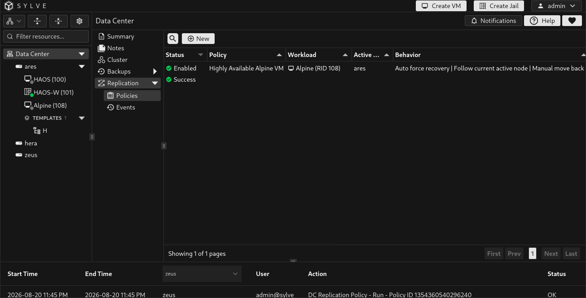
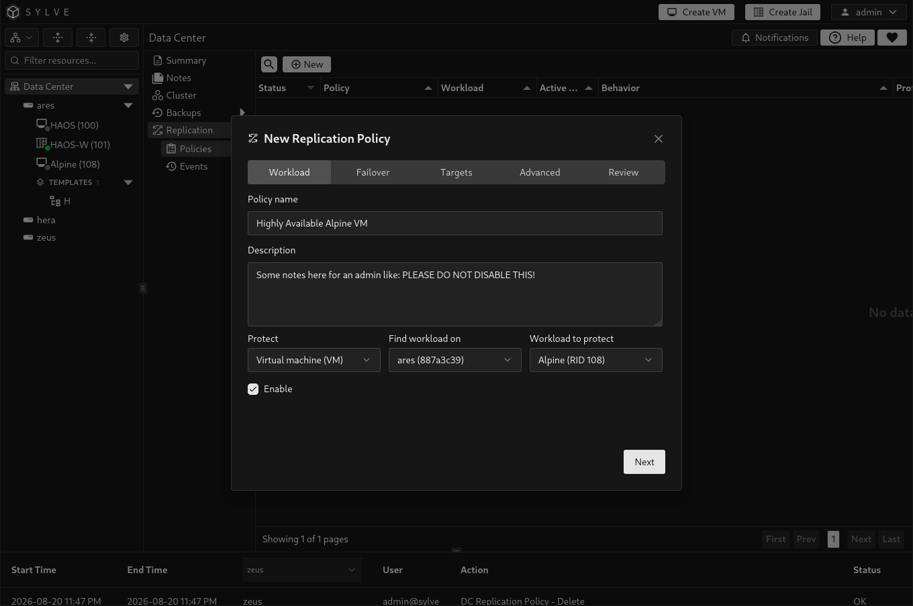
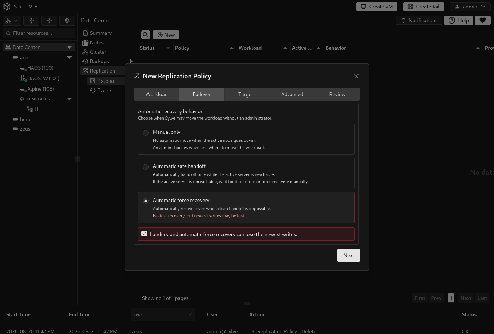
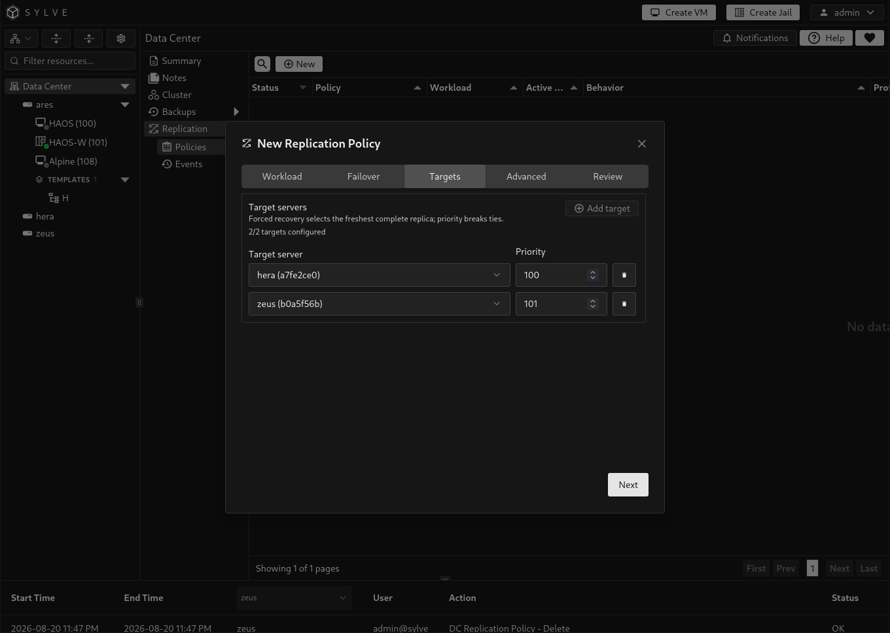
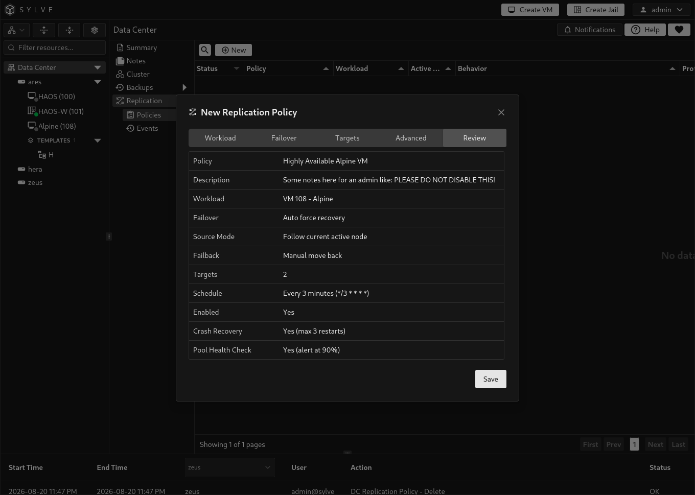
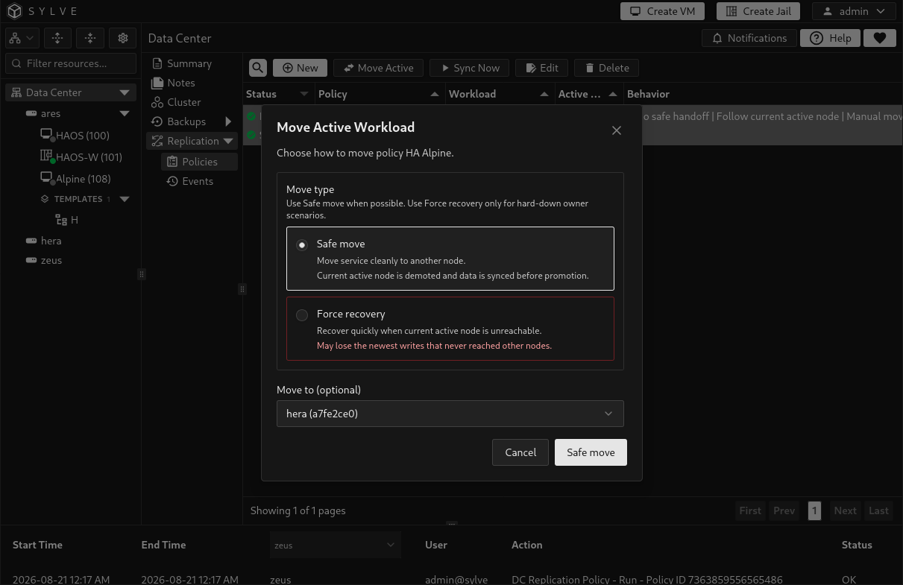

import replicationPolicyAdvancedWalkthrough from './replication-policies-advanced.mp4';

Replication policies maintain recoverable copies of a Sylve virtual machine or jail on other cluster nodes. They are available after Replication has been revealed in the UI and the cluster has at least three configured Raft voters. The backend enforces these requirements.

A policy protects one workload and has one or more target servers. At least one target must be remote from the workload's effective source node. A target server is another cluster node, not a Backup Target. Sylve synchronizes the guest's ZFS data on schedule and records whether each target has a current, complete replica. This enables an administrator, or the configured policy, to move recovery to a suitable target.

:::caution
Replication is an HA feature, not a substitute for an independent backup. Keep backup targets and retention appropriate to your recovery requirements.
:::

## Create a policy

Open **Data Center → Replication → Policies** and select **New**. The policy editor is organized into Workload, Failover, Targets, Advanced, and Review tabs.

### Workload

Select the guest type, the node where it is currently found, and then the VM or jail to protect.

| Field | Description |
| --- | --- |
| **Policy name** | An operator-facing name for this protection policy. |
| **Description** | Optional explanation of the service and recovery intent. |
| **Protect** | Select **Virtual machine (VM)** or **Jail (container)**. |
| **Find workload on** | Node used to find the selected guest. |
| **Workload to protect** | The VM or jail included in this policy. |
| **Enable** | Allows scheduled replication and configured HA behavior. |

Each VM or jail can have only one replication policy. After creating a policy, its protected guest type and identifier are fixed. Create a new policy if you need to protect a different guest.

:::note
An enabled policy cannot protect a VM with enabled filesystem storage. Replication requires storage that Sylve can replicate safely as ZFS datasets. Remove or disable filesystem storage for that VM before enabling its policy.
:::

### Failover behavior

| Mode | Behaviour |
| --- | --- |
| **Manual only** | Sylve does not move the workload automatically. An administrator chooses if and where recovery happens. |
| **Automatic safe handoff** | Sylve may hand off automatically while the active server is reachable. If it is unreachable, recovery waits for an administrator to make the decision. |
| **Automatic force recovery** | Sylve can recover when a clean handoff is impossible. It minimizes downtime but can lose the newest writes from the old active node. Confirmation is required when you configure it. |

Choose manual mode unless you have tested the service's recovery behavior and understand the data-loss tradeoff of forced recovery.

### Target servers

Add one or more distinct target servers. Do not select the active workload node as a target, and ensure that at least one configured target is remote from the policy's effective source node. The target's **Priority** is used to break ties when forced recovery chooses between equally fresh complete replicas. It does not make a stale or incomplete replica safe to use.

### Advanced behavior

| Option | Description |
| --- | --- |
| **Normal source behavior: Stay with whichever node is currently active** | After a move, the new active node becomes the source for later replication. |
| **Normal source behavior: Keep one preferred primary node** | Uses a fixed preferred source node until you change it. Select that node in **Preferred primary node**. |
| **When preferred primary comes back** | **Manual** leaves the guest on its current active node. **Auto** moves it back to the preferred primary. |
| **Sync schedule (Cron)** | Five-field cron schedule for regular synchronization, such as `*/15 * * * *`. |
| **Auto-detect and restart crashed guests** | Attempts local guest restarts before escalating to failover. |
| **Max local restart attempts before failover** | Number of local restart attempts before the configured failover behaviour applies. |
| **Monitor ZFS pool health** | Monitors health and capacity of the active storage pool. |
| **Capacity threshold (%)** | Capacity pressure at this percentage uses a safe handoff. An unhealthy pool uses force recovery and can lose newest writes. |

<video class="docs-walkthrough-video" autoplay muted loop playsinline controls aria-label="Advanced replication policy settings walkthrough">
  <source src={replicationPolicyAdvancedWalkthrough} type="video/mp4" />
</video>

### Review

Use **Review** to confirm the workload, failover behavior, source mode, targets, schedule, and monitoring settings before saving. Select **Save** only after verifying that the target nodes and recovery behavior match the service's requirements.

## Synchronize and monitor

Select a policy and use **Sync Now** to queue a replication run outside its normal schedule. The policy row summarizes the current protection state, last result, next run, active node, and target readiness. A target must have a current and complete replica before it is a credible recovery option. A policy can show reduced redundancy while one voter is down, but replication and recovery actions are blocked when the cluster has lost quorum.

## Move or recover a workload

Use the policy's **Failover** action when you need to move the protected guest.

| Action | When to use it |
| --- | --- |
| **Safe move** | The active owner is online and a clean handoff is possible. This is the preferred planned-maintenance path. |
| **Force recovery** | The active owner cannot be reached and recovery cannot wait. It requires an explicit data-loss acknowledgement and confirmation text because the newest writes may not be present on the target. |

You can select a target when more than one is available. For a pinned-primary policy, the dialog can also make the recovery target the new preferred primary, avoiding an unwanted move back.

:::danger
Do not use force recovery simply to speed up a planned move. Its purpose is to restore availability when the previous active node cannot participate safely, and it can discard the newest unreplicated writes.
:::

## Remove a policy

Deleting a policy removes its HA configuration and starts cleanup of its standby replicas and policy-owned HA snapshots. The active VM or jail data is preserved. If cleanup is incomplete, restore the unavailable node or replication service and retry the deletion until Sylve confirms it has finished.
