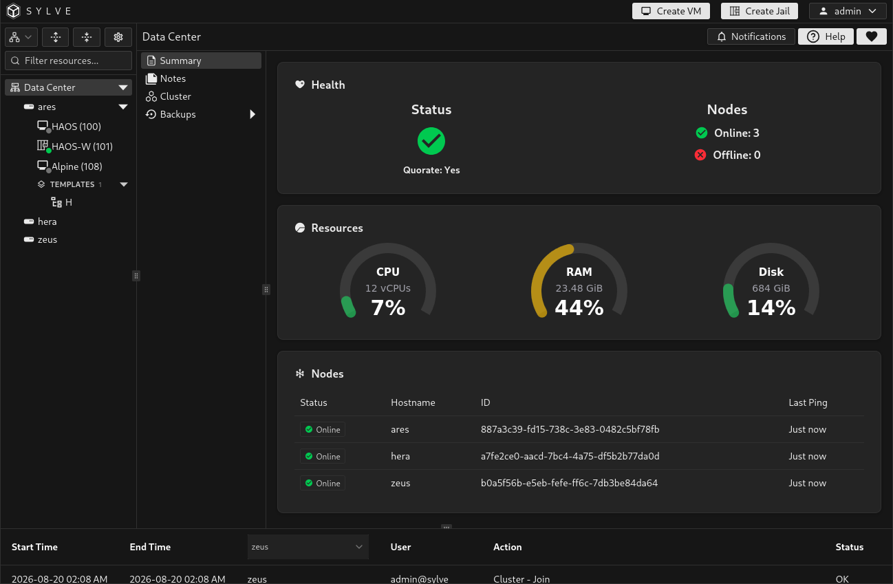
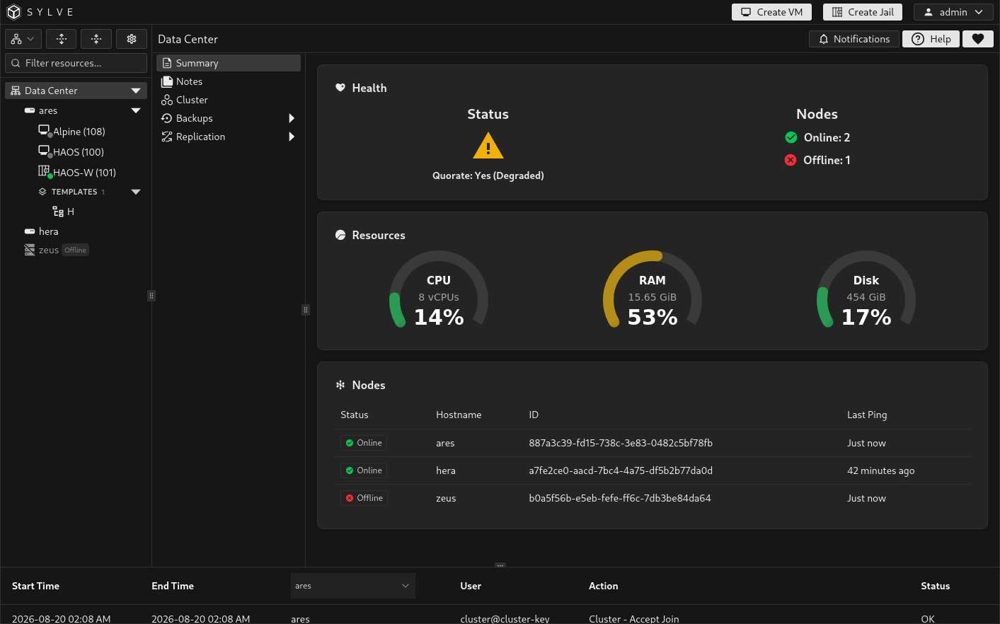

**Data Center → Summary** is the default landing page for the Data Center. It combines the current cluster health, aggregate CPU, memory, and disk usage, and, when clustering is enabled, the status of every member node.

## Health

The **Health** card reports whether the Data Center is operating as a single node or whether the cluster has quorum.

| Status | Meaning |
| --- | --- |
| **Single Node** | This Sylve node is not clustered. |
| **Quorate: Yes** | The cluster has enough online voters to make shared configuration changes safely. |
| **Quorate: Yes (Degraded)** | The cluster retains quorum, but one or more members are unavailable or degraded. Investigate before another failure occurs. |
| **Quorate: No** | Too few voters are available for quorum. Clustered changes are restricted until enough members recover. |

The Nodes count beside it separates online and offline members.

## Resources

The CPU, RAM, and Disk charts show total capacity and current usage. On a cluster, the totals aggregate online nodes. Offline nodes do not contribute to the displayed capacity or usage, so a sudden change in the totals can be a useful signal to inspect the Nodes table.

On a standalone node, the same charts show the local node's resources.

## Nodes

When clustering is enabled, the Nodes table lists each member's status, hostname, stable node ID, and most recent ping time. Use it to correlate an offline member with the cluster health card before opening **Cluster** for membership details or starting a recovery procedure.

