## Introduction

Jellyfin is a free and open-source media server that allows you to organize and stream your media collection. Running it in a FreeBSD jail is a breeze and Sylve makes it even easier. In this guide, we will walk you through the steps to set up Jellyfin in a FreeBSD jail using Sylve, with support for Intel GPU transcoding.

## Prerequisites

Before we begin, make sure you have the following:

**-** FreeBSD system with Sylve installed (see [Getting Started](/getting-started)).  
**-** Network access to download packages.  
**-** A machine with an intel iGPU, in this case we're using an **Intel(R) Xeon(R) E-2176G CPU @ 3.70GHz**, that we got from [Hetzner](https://hetzner.cloud/?ref=uD5CjfBFJSR9). you can google your CPU model to check if it has an iGPU. You can use the command `sysctl hw.model` to check your CPU model. Also make sure you have the drivers installed on the host system and that the iGPU is working properly.

## Downloading a Jail Base

Now you can skip this step entirely if you already have downloaded a jail base using the downloader in sylve, but if you haven't, you can do so by navigating to `Utilities > Downloader` in your node's context menu and filling in the following details:

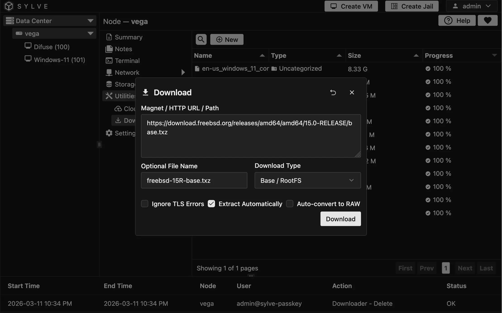

| Field | Value |
|------|------|
| **HTTP URL** | `https://download.freebsd.org/releases/amd64/amd64/15.0-RELEASE/base.txz` |
| **Optional File Name** | `freebsd-15R-base.txz` |
| **Download Type** | Base / RootFS |
| **Extract Automatically** | Enable this option so the jail base is extracted after downloading. |


:::note
You don't need to specify a name but I like to do it so that I can easily identify which jail base is which, especially if I have multiple versions downloaded.
:::

## Creating the Jail

1. Click on **Create Jail** on the top right and let's fill out some basic details:

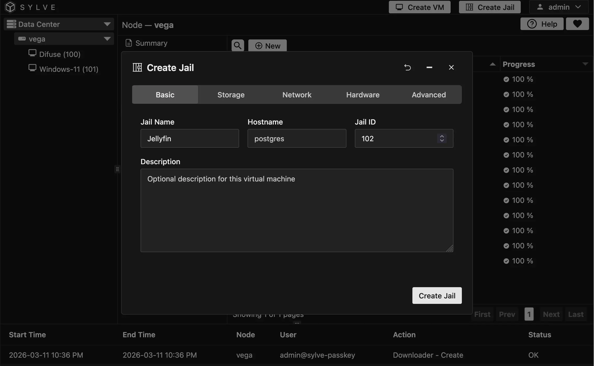

2. In the next `Storage` step, we pick `zroot` as our pool (you can pick any) and the FreeBSD 15 Release base we just downloaded as our base:

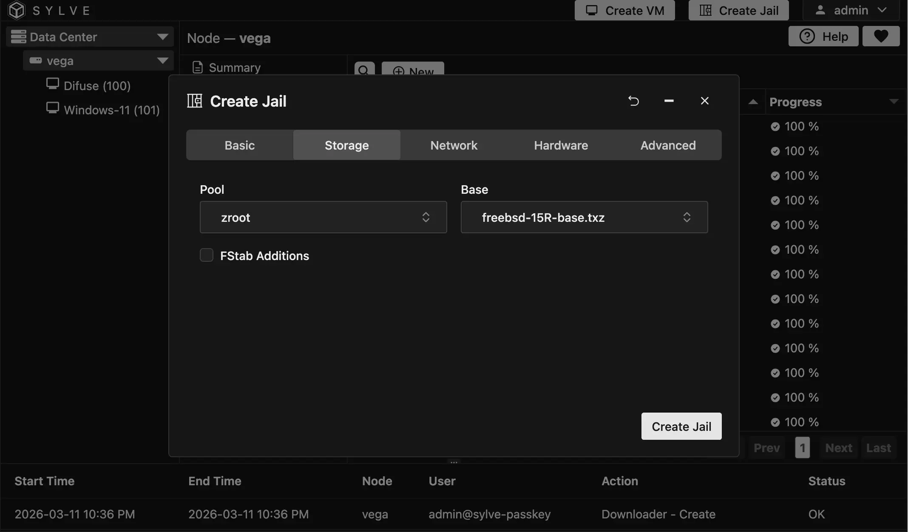

We **don't** need FSTab additions for this jail so we can keep it unchecked.

3. In the `Network` step, we highly recommend you use a a Standard or Manual switch, but for simplicity's sake you could just use the `Inherit` option which will use the host's network. If you choose to use a Standard or Manual switch, make sure to assign an IP address to the jail (or use DHCP/SLAAC). In our case, we're going to use our `LAN` standard switch:

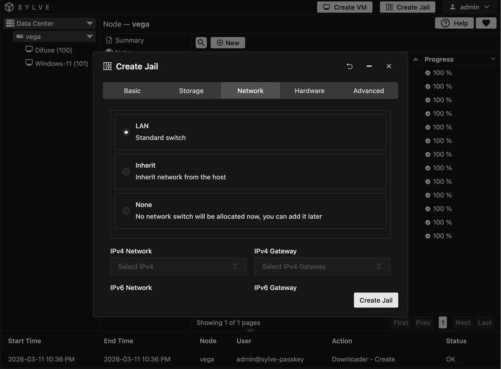

We also used the `Populate DNS Resolver Configuration` option which will let us specify custom DNS servers for the jail, but you can skip this if your upstream gateway (or switch) provides DNS addresses in the DHCP offer.

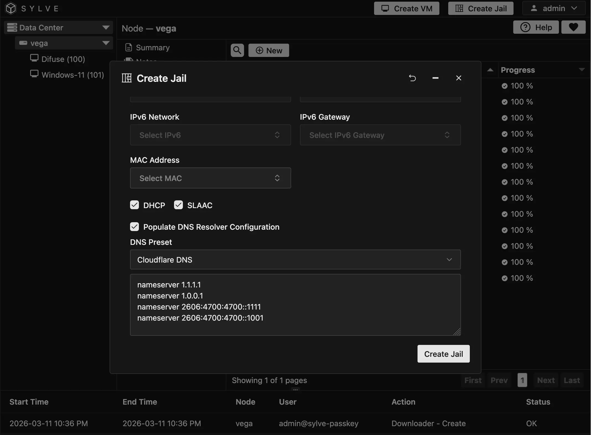

4. In the **Hardware** step, things get a bit more interesting. Sylve uses `rctl` to cap the jail's CPU and RAM usage if resource limits are enabled. However, for a media server like Jellyfin it's usually best to leave these limits disabled so the jail can use the resources it needs.

We also need a custom `devfs ruleset` to allow the jail to access the iGPU for hardware transcoding. You can click on the `Custom Devfs Ruleset` checkbox and fillout the form as follows:

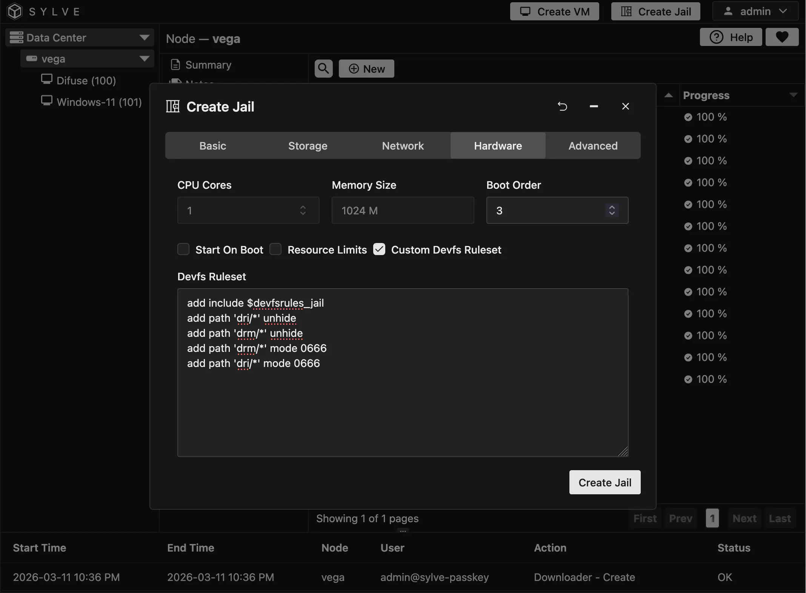

Here's the configuration we used for the custom devfs ruleset so you can copy and paste it:

```
add include $devfsrules_jail
add path 'dri/*' unhide
add path 'drm/*' unhide
add path 'drm/*' mode 0666
add path 'dri/*' mode 0666
```

5. Now in the last step `Advanced` you can keep most of the defaults but make sure to enable `Memory Locking (allow.mlock)` under the allowed options:

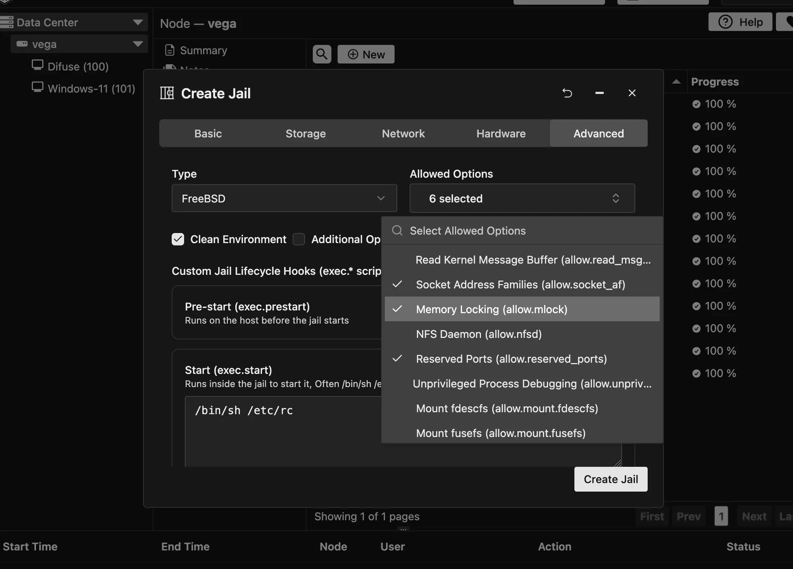

Now once that's all done you should be good to go and you can click on `Create Jail` to setup your jail! If everything went well you should see your new jail in the sidebar list and once you navigate to it you should see something like this:

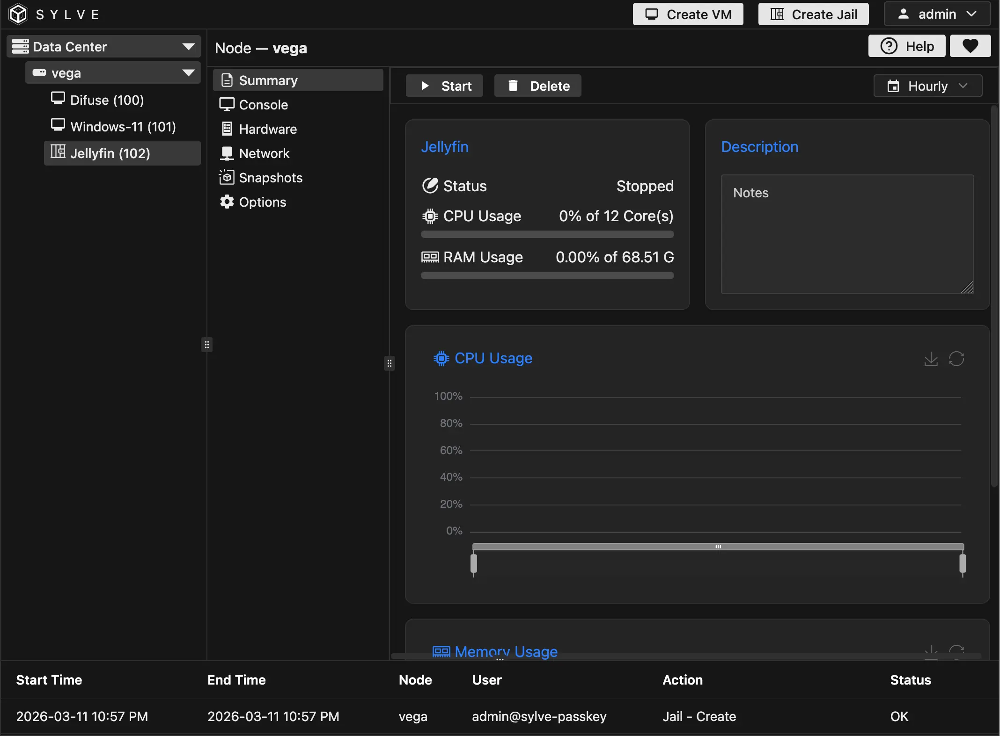

You can start the jail and then access it's console so we can start installing and configuring Jellyfin!

## Setting up Jellyfin

The first thing you can do when you're inside your jail console is to update the package repository catalog and then install Jellyfin:

:::note
`pkg` will ask you to let it bootstrap itself since this is a new jail and it doesn't have `pkg` installed yet, just type `y` and hit enter to let it do it's thing.
:::

```bash
pkg update
pkg install jellyfin libva libva-utils libva-intel-media-driver gmmlib
```

The install may take a few minutes depending on your network speed since it has to download the jellyfin package and all of its dependencies (it's a dotNET app!). libva, libva-utils, etc. are needed for hardware transcoding support, you can test if the iGPU is working properly by running `vainfo` after installing those packages, if you see a list of supported codecs then you're good to go!

Once it's done you can run the following command to enable the jellyfin service so it starts on boot:

```bash
service jellyfin enable
```

Now that's about it! You can access the web interface by navigating to `http://<jail-ip>:8096` in your web browser and you should see the Jellyfin setup page where you can create your admin account and start adding media libraries.

For the media I like to keep it a part of the jail rootfs, so I just created a `jellyfin` folder inside `/media/`:

```bash
mkdir -p /media/jellyfin/movies
mkdir -p /media/jellyfin/tv
mkdir -p /media/jellyfin/music
```

And then I added that folder as a media library in the Jellyfin web interface. You can also use external storage if you want, just make sure to mount it inside the jail and give the jail access to it.

For purposes of demonstration I populated the movies directory with [sintel](https://www.peach.themazzone.com/durian/movies/sintel-1024-surround.mp4) which is a free movie provided by the Blender Foundation, you can use it for testing transcoding and streaming performance.

### Setting up Hardware Transcoding

On jellifin's web interface, navigate to `Dashboard > Playback > Transcoding` and make sure to select `VAAPI` as the hardware acceleration method. You can also adjust the transcoding settings here if you want, but the defaults should be fine for most use cases.

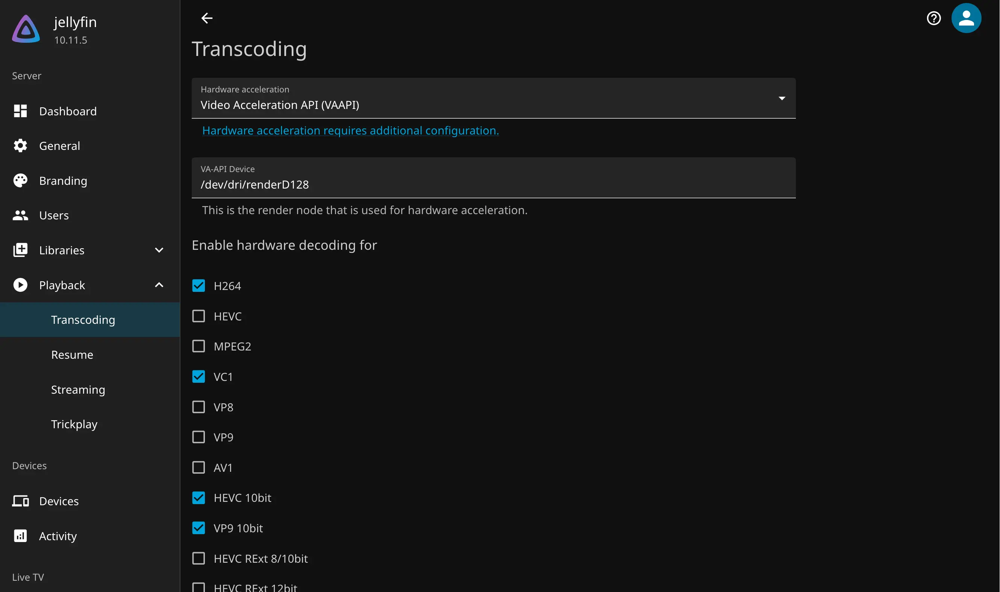

That should be pretty much it! You can now enjoy your media server with hardware-accelerated transcoding.

## Sharing data storage with other jails

After configuring Jellyfin, maybe you also want to integrate it with other software stack, like [*arr](https://wiki.servarr.com/), to have a fully fledged media library. Thanks to Sylve's integration with ZFS, doing it is quite simple!

The following steps assume your other services are configured in different jails.

To begin, we should create a new ZFS dataset. A ZFS dataset acts as a separate filesystem, similar to BTRFS volumes. You can specify different options to a dataset, e.g., you can enable compression, configure record sizes, disable access time modification and you can even create complex access control lists to restrict access to your files.

Let's get started with creating our ZFS dataset where we will store the media files used by our services, and where Jellyfin can access this media.

1. Go to your node and select `Storage > ZFS > Datasets > File Systems`. Click **New** to create a new dataset.

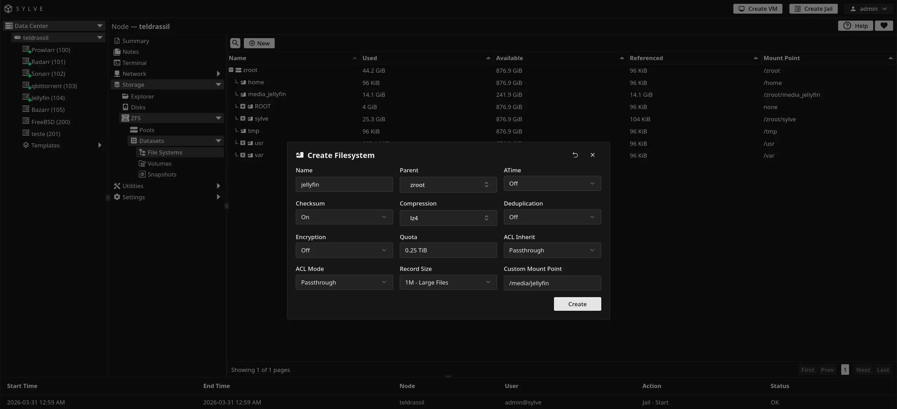

:::note
You can configure the dataset based on your own needs. It's recommended to disable **atime** and to set record size to 1M, as we are mostly dealing with media files, which are considered large files. 

For the mount point, I chose **/media/jellyfin**, the path you can access your dataset in the host system. I also chose a 256GiB quota for it, but you're free to choose any value you want (setting that field to empty disables quotas).
:::

2. Now we need to mount the filesystem to our jails. You can add the dataset to a new jail directly through the UI, but I advise against it because you need to create the mount point before the jail is created, otherwise it won't turn on.

In my case, I want to mount the new filesystem in `/media/jellyfin`, so this directory was already created on the jail itself.

Select an existing jail on your node (e.g. the newly created Jellyfin jail), go to `Options > FSTab Entries` and click **Edit FSTab Entries**.

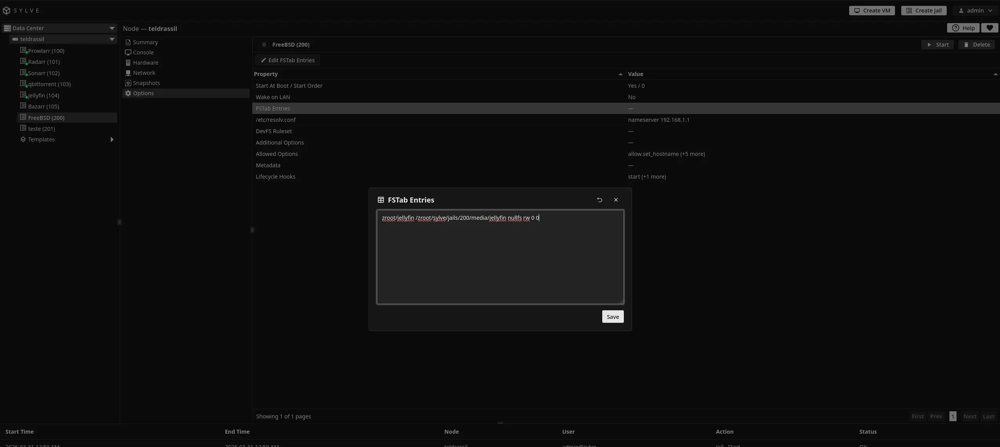

You can check the snippet for the fstab entry below. Make sure to replace `<jail-id>` with the ID of your jail. 

:::note
We are mounting the ZFS dataset as a nullfs. It's the most recommended filesystem type for sharing data between jails in FreeBSD. You can read more information about it [on FreeBSD's website](https://man.freebsd.org/cgi/man.cgi?query=nullfs&manpath=FreeBSD+15.0-RELEASE+and+Ports.quarterly).
:::

```bash
# <device> <dir> <type> <options> <dump> <fsck>
zroot/jellyfin /zroot/sylve/jails/<jail-id>/media/jellyfin nullfs rw 0 0
```

3. We have created the shared directory, now we need to setup the permissions for it, so that our different services can read and write to it. 

One thing to note, however, is that the user ID for your different services might not be the same depending on your setup. Thankfully, with ZFS ACLs, we can simply allow read-write access to different user IDs.

Open a shell in your node, and type the following command apply add read, write and execute permissions for the Jellyfin user in our newly created filesystem. Jellyfin typically uses user ID 868 in FreeBSD, although:

```bash
setfacl -m u:868:rwx:fd:allow /zroot/jellyfin
```

And that's it! If you have more jails you want to share the directory with, just repeat these simple steps, and make sure to add permissions for the new user IDs.