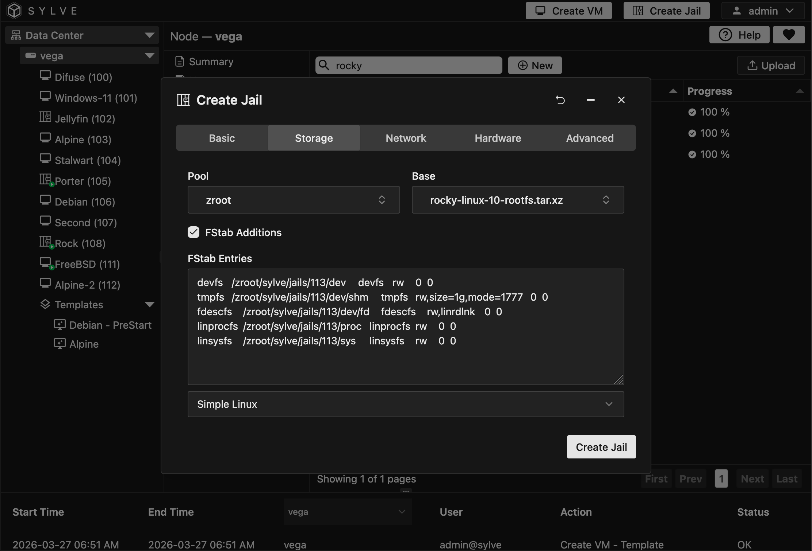
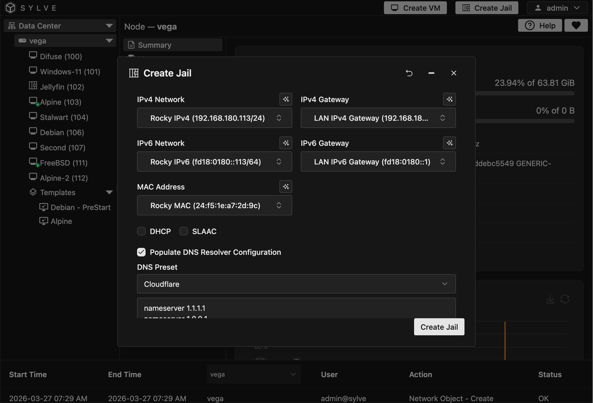
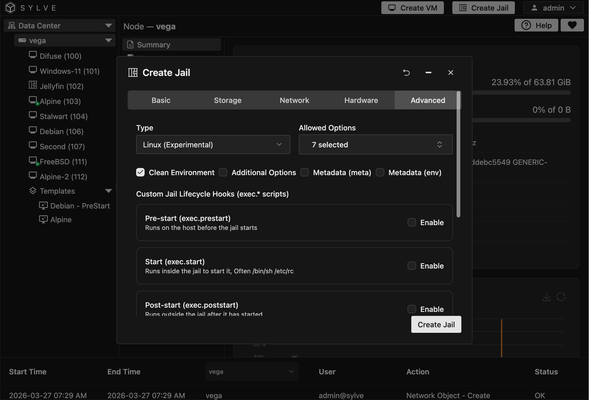
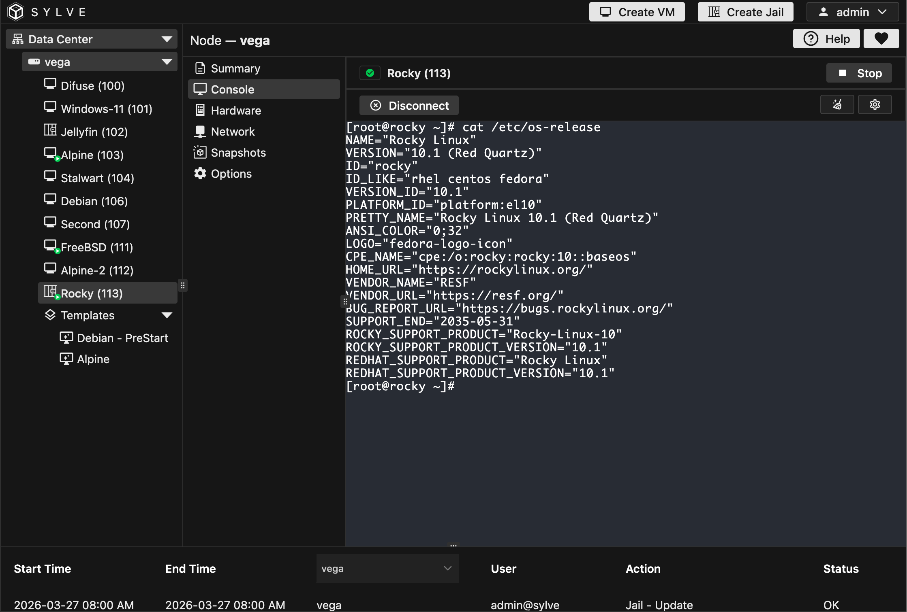

## Introduction

In this guide, we will walk you through the process of setting up a Rocky Linux jail. This uses the Linux binary compatibility layer in FreeBSD, which allows you to run Linux applications in a FreeBSD environment!

## Downloading a Rocky Linux Base

You can pick the latest one from `https://images.linuxcontainers.org/images/rockylinux/10/amd64/default/`. In our case, we will go with `https://images.linuxcontainers.org/images/rockylinux/10/amd64/default/20260326_02%3A06/rootfs.tar.xz`.

Navigate to the downloader and paste the URL. Make sure **Automatic Extraction** is enabled and a meaningful name is set in the optional filename field. Once the download is complete, you should have a file named `rockylinux-10-amd64-default-XXX.rootfs.tar.xz` in your downloads list.

## Creating the Jail

Now creating a Linux jail is pretty similar to a regular one apart from a few small but very important differences. Starting with the **Storage** section:

You can see that we are using the jail base that we downloaded in the `Base` select box. For linux jails we also need some FSTab additions, which we can toggle using the checkbox. Once the checkbox is toggled a text area field shows up, right below it you can just pick `Simple Linux` and the necessary FSTab entries will be generated for you.

Now moving on to the **Networking** section, we're going to be using our LAN switch for this jail. Once the switch is selected you have to pick and IPv4/IPv6 network address and gateway host. You can click the top right button on each of the select boxes to create network objects on the fly. After creation/selection they should look something like this:

Now in the last section, **Advanced**, you need to pick Jail type as `Linux`. This will set the necessary parameters for the jail to be able to run Linux binaries. 

## Using the Jail

Once those are done, you can click on the create button and you should be good to go! You can start the jail and open the console to see it flying!

:::caution
Try **not** to use MUSL based distributions in a Linux jail, they cause a lot of undefined behavior and are not recommended for use with the linux binary compatibility layer (atleast for now).

Rocky Linux is a great choice for a Linux distribution in a jail, as it is based on RHEL and uses glibc, which has good compatibility with the linux binary compatibility layer, the package manager `dnf` also works without any issues and you can install a wide variety of software using it.
:::