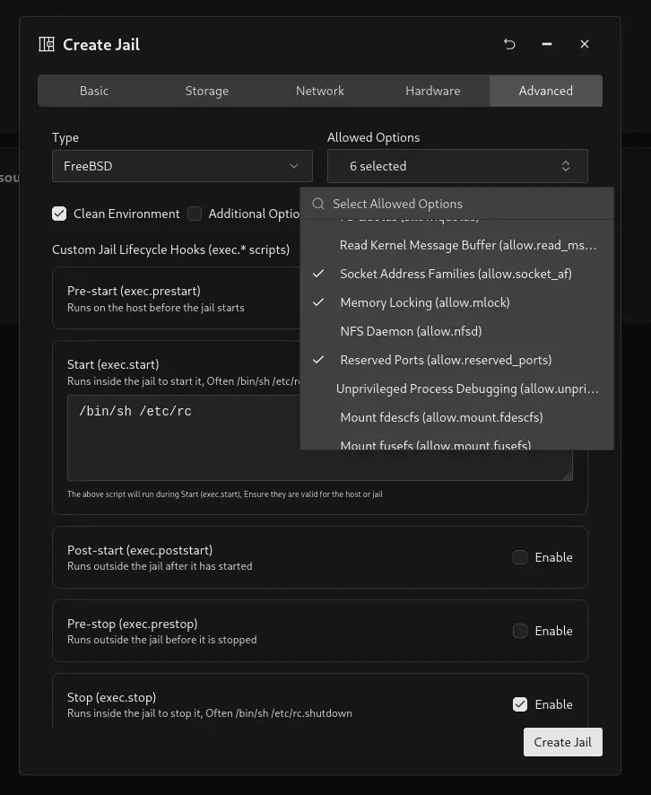
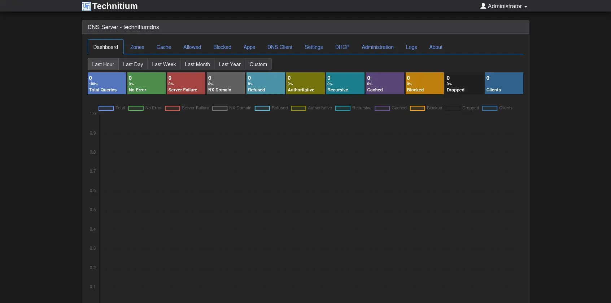

:::caution
Since Dotnet 10 is not **officially** supported on FreeBSD yet, this guide relies on community provided binaries that may not be stable or secure. Use this guide at your own risk and always make sure to keep your system updated and monitor for any security advisories related to dotnet on FreeBSD.
:::

## Introduction

Technitium DNS is a powerful and flexible DNS server that can be easily deployed in a FreeBSD jail using Sylve. This guide will walk you through the steps required to set it up, allowing you to manage your DNS services efficiently and securely.

## Prerequisites

Before we begin, make sure you have the following:

**-** FreeBSD system with Sylve installed (see [Getting Started](/getting-started)).  
**-** Network access to download packages.

## Step 1: Create a Jail

:::note
We are going to assume you are using a FreeBSD **15.x** jail base, you can use any base that supports (unofficially for now) .NET 10, including 14.x or 13.x. However, using the latest base is recommended so you can benefit from the newest improvements and fixes.

These steps may require significant adjustments on older base versions, so your mileage may vary.
:::

Please follow the instructions in the [Jellyfin Jail Guide](/guides/deployments/jellyfin-jail) to create a new jail for Technitium DNS. We're going to name our jail `TechnitiumDNS` with the hostname `technitiumdns`.

One important thing to note is that since Technitium DNS is a dotnet based application you **need** to select the `Memory Locking` option in `Allowed Options` for it to work, along with the other default options for a FreeBSD Jail that is pre-selected when creating a new jail.



## Step 2: Installing Dotnet 10

As of writing dotnet 10 is not available in the ports tree, so we will need to install it manually.

First we install `compat14x-amd64` package which is required for dotnet 10 to work (on FreeBSD 15+ jail bases):

```bash
pkg install misc/compat14x
```

We also need to install some runtime dependencies for dotnet 10 to work:

```bash
pkg install libunwind icu libinotify
```

Once that is done we can proceed to install Dotnet binaries provided by [sec](https://github.com/sec/dotnet-core-freebsd-source-build).

```bash
mkdir -p /opt/dotnet10
cd /opt/dotnet10
fetch https://github.com/sec/dotnet-core-freebsd-source-build/releases/download/10.0.103-vmr/dotnet-sdk-10.0.103-freebsd.14-x64.tar.gz
tar xzf dotnet-sdk-10.0.103-freebsd.14-x64.tar.gz
rm -rf dotnet-sdk-10.0.103-freebsd.14-x64.tar.gz
```

Once the binaries are extracted we can try to run dotnet to see if it works:

```bash
DOTNET_OPENSSL_VERSION_OVERRIDE=35 /opt/dotnet10/dotnet --info
```

If everything is working correctly you should output similar to this:

```bash
root@technitiumdns:/opt/dotnet10 # DOTNET_OPENSSL_VERSION_OVERRIDE=35 /opt/dotnet10/dotnet --info
.NET SDK:
 Version:           10.0.103
 Commit:            c2435c3e0f
 Workload version:  10.0.100-manifests.a62d7899
 MSBuild version:   18.0.11+c2435c3e0

Runtime Environment:
 OS Name:     FreeBSD
 OS Version:  15
 OS Platform: FreeBSD
 RID:         freebsd.14-x64
 Base Path:   /opt/dotnet10/sdk/10.0.103/

.NET workloads installed:
There are no installed workloads to display.
Configured to use workload sets when installing new manifests.
No workload sets are installed. Run "dotnet workload restore" to install a workload set.

Host:
  Version:      10.0.3
  Architecture: x64
  Commit:       c2435c3e0f

.NET SDKs installed:
  10.0.103 [/opt/dotnet10/sdk]

.NET runtimes installed:
  Microsoft.AspNetCore.App 10.0.3 [/opt/dotnet10/shared/Microsoft.AspNetCore.App]
  Microsoft.NETCore.App 10.0.3 [/opt/dotnet10/shared/Microsoft.NETCore.App]

Other architectures found:
  None

Environment variables:
  DOTNET_OPENSSL_VERSION_OVERRIDE          [35]

global.json file:
  Not found

Learn more:
  https://aka.ms/dotnet/info

Download .NET:
  https://aka.ms/dotnet/download
root@technitiumdns:/opt/dotnet10 #
```

Now we have dotnet 10 installed and working in our jail, we can proceed to install Technitium DNS.

## Step 3: Installing Technitium DNS

The following steps will download and extract the latest version of Technitium DNS in the `/opt/technitium-dns` directory. You can change this path if you want to install it somewhere else.

```bash
mkdir -p /opt/technitium-dns
cd /opt/technitium-dns
fetch https://download.technitium.com/dns/DnsServerPortable.tar.gz
tar xzf DnsServerPortable.tar.gz
rm -rf DnsServerPortable.tar.gz
```

Now once that is done, we can run test it manually with the following command:

```bash
cd /opt/technitium-dns
DOTNET_OPENSSL_VERSION_OVERRIDE=35 DOTNET_ROOT=/opt/dotnet10 PATH=/opt/dotnet10:$PATH /opt/dotnet10/dotnet DnsServerApp.dll
```

If everything went right, you should see the Technitium DNS server starting up and outputting logs in the terminal like this:

```bash
root@technitiumdns:/opt/technitium-dns # DOTNET_OPENSSL_VERSION_OVERRIDE=35 DOTNET_ROOT=/opt/dotnet10 PATH=/opt/dotnet10:$PATH /opt/dotnet10/dotnet DnsSer
verApp.dll
Technitium DNS Server was started successfully.
Using config folder: /opt/technitium-dns/config

Note: Open http://technitiumdns:5380/ in web browser to access web console.

Press [CTRL + C] to stop...
```

## Step 4: Setting Up as a Service

Now we don't really want to run the server manually every time, so let's set it up to run as a service, the following commands will create a new service file for Technitium DNS and enable it to start on boot:

```bash
mkdir -p /usr/local/etc/rc.d

cat > /usr/local/etc/rc.d/technitium <<'EOF'
#!/bin/sh

# PROVIDE: technitium
# REQUIRE: LOGIN
# KEYWORD: shutdown

. /etc/rc.subr

name="technitium"
rcvar="technitium_enable"

load_rc_config "$name"

: ${technitium_enable:="NO"}
: ${technitium_user:="root"}
: ${technitium_dir:="/opt/technitium-dns"}
: ${technitium_dotnet:="/opt/dotnet10/dotnet"}
: ${technitium_dotnet_root:="/opt/dotnet10"}
: ${technitium_openssl_override:="35"}

pidfile="/var/run/${name}.pid"
procname="${technitium_dotnet}"
command="/usr/sbin/daemon"

command_args="-f -p ${pidfile} -u ${technitium_user} /usr/bin/env \
DOTNET_OPENSSL_VERSION_OVERRIDE=${technitium_openssl_override} \
DOTNET_ROOT=${technitium_dotnet_root} \
PATH=${technitium_dotnet_root}:/sbin:/bin:/usr/sbin:/usr/bin:/usr/local/sbin:/usr/local/bin \
${technitium_dotnet} ${technitium_dir}/DnsServerApp.dll"

run_rc_command "$1"
EOF

chmod +x /usr/local/etc/rc.d/technitium
sysrc technitium_enable=YES
service technitium start
```

Now Technitium DNS should be running as a service and will start automatically on boot. You can check the status of the service with the following command:

```bash
service technitium status
```

To check if the ports are listening correctly, you can use the following command:

```bash
sockstat -4 -l | grep -E '(:53|:5380)'
```

The output of which should look something like this:

```bash
root dotnet     93068 228 tcp46 *:5380                *:*
root dotnet     93068 229 udp4  *:53                  *:*
root dotnet     93068 230 tcp4  *:53                  *:*
```

Now you can access the Technitium DNS web console by going to `http://<ip>:5380/` in your web browser. You should see the login page where you can change the default credentials and start configuring your DNS server!


