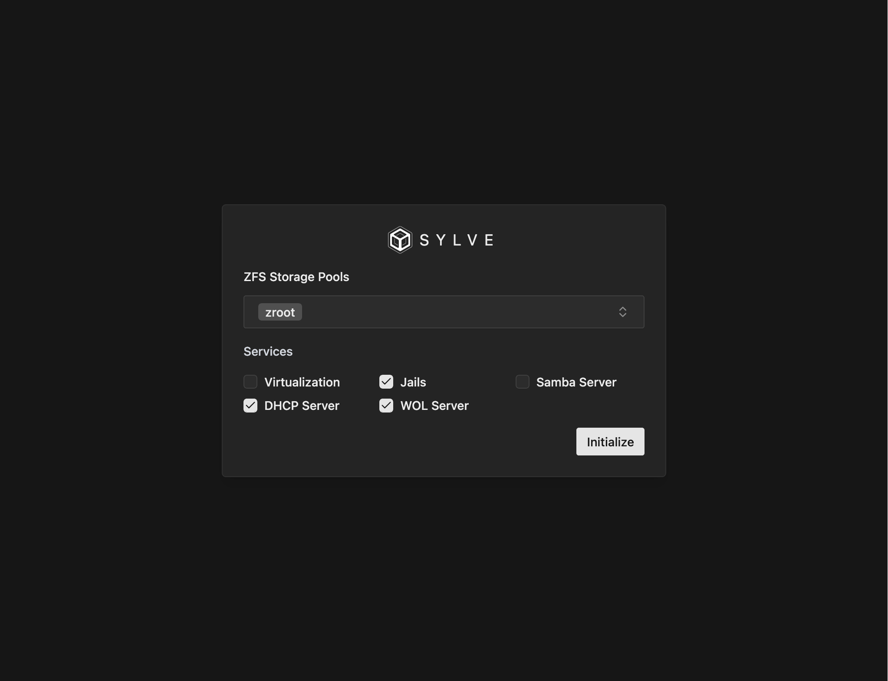
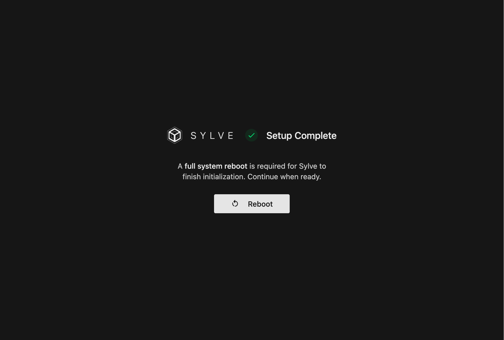
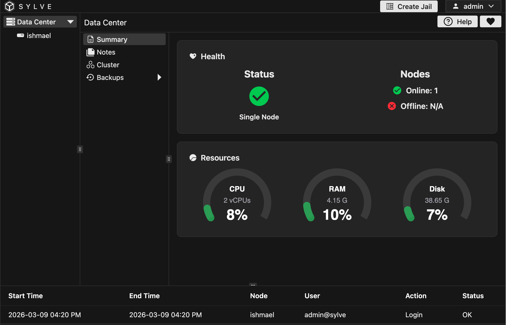

Congratulations 🎉 on reaching the guides section! This is where we get our hands dirty and start working with Sylve in a practical way.

The first thing you'll need to do is to initialize the Sylve environment. This involves you picking the subsystems you'd like to enable/use, and don't worry too much about trying to forecast your needs at this point, you can always enable or disable any feature you'd like within the UI later.

:::note
We **highly** recommend running Sylve with a proper TLS certificate, or if you're lazy like us, you can use Caddy to do all the heavy lifting for you. Caddy is just one `pkg install` away.

An example Caddyfile for Sylve would look like this:

```
subdomain.example.org {
    /*
      The HTTP port will suffice here as this
      is a trusted internal connection.

      Traffic is only between the reverse proxy
      and the local service.
    */
    reverse_proxy 127.0.0.1:8182
}
```

:::

Navigating to `https://<your-server-ip>:8181` or `https://subdomain.example.org` you should see the login page, enter your credentials and log in. You should now be greeted with this page:



As you can see above, due to our server being pretty tiny, we're only choosing Jails, DHCP Server and WoL (Wake-On-LAN) Server, now Jails and the WoL server doesn't require any extra dependencies, but DHCP Server does which was covered in the Getting Started instructions earlier.

Once you select what you need, you can click on **Initialize** and you should see this page:



You can go ahead and click on the `Reboot` button and wait for the server to come back up, after a few more minutes you should be greeted with this page:



The first thing you need to do is resize the pane's to your liking by dragging the small button in the middle of each pane lines, this is stored in the browser's local storage so it will be remembered on your next visit.
