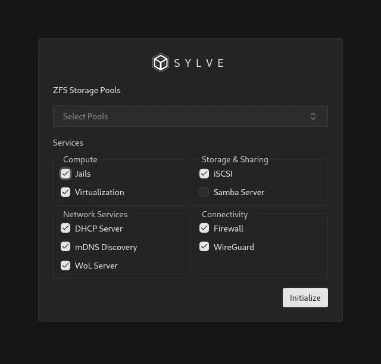
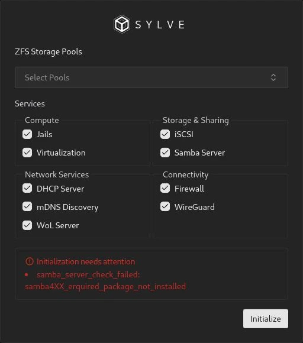
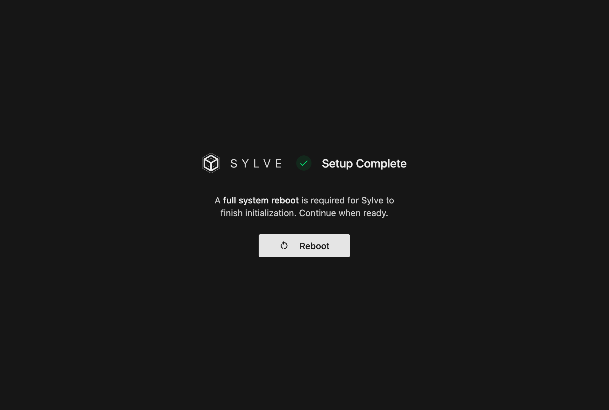
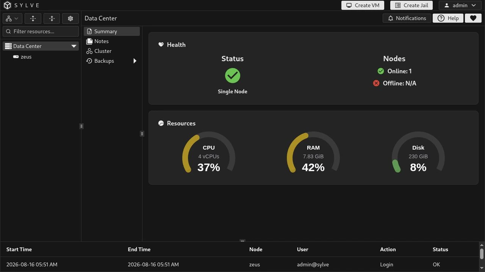

## Initialize Your Node

After signing in for the first time, Sylve opens the initialization dialog. It records the ZFS pools that Sylve can manage and enables the subsystems this node will provide. Services can be enabled or disabled later from the UI, so choose what you need now without treating this as a permanent design decision.

The dialog is shown automatically after you log in at `https://<your-server-ip>:8181` or your configured Sylve hostname:



### ZFS Storage Pools

Select each existing ZFS pool that Sylve should use. This is **optional**: you can initialize the node without a pool and create or add one later. For every selected pool, Sylve creates or adopts its managed dataset layout:

```text
<pool>/sylve
<pool>/sylve/virtual-machines
<pool>/sylve/jails
<pool>/sylve/bootstraps
```

Use a pool only if you want Sylve to manage workloads and storage beneath that layout. Existing datasets will **not** be removed by initialization.

## Select Services

The checkboxes are grouped by what the service provides. The defaults shown on the initialization screen are a starting point, not a hardware-detection result.

| Group | Service | What enabling it prepares |
| --- | --- | --- |
| Compute | **Jails** | Enables Sylve's FreeBSD Jail management and runtime monitoring. Sylve verifies jail accounting and visibility sysctls; if `racct` is missing, it can add the boot-time loader setting and asks for a reboot. |
| Compute | **Virtualization** | Enables bhyve virtual machine management through libvirt. Sylve verifies the required virtualization packages and `qemu-img`, then loads `vmm` when needed. At operational startup it starts `libvirtd` and the virtual TPM service. |
| Storage & Sharing | **iSCSI** | Enables iSCSI initiator and target management. At startup, Sylve preserves unmanaged `/etc/iscsi.conf` and `/etc/ctl.conf` once, writes its managed configuration, and starts `iscsid` and `ctld`. |
| Storage & Sharing | **Samba Server** | Enables SMB sharing and Samba audit-log handling. Sylve checks for a Samba 4XX package, manages the Samba configuration, and starts `samba_server` when the node starts. |
| Network Services | **DHCP Server** | Enables managed DHCP and DNS service through `dnsmasq`. Initialization checks that `dnsmasq` is installed, and Sylve starts it after the node enters operational mode. |
| Network Services | **mDNS Discovery** | Enables multicast DNS records for discovering Sylve-managed services on the local network. Sylve rebuilds the advertised record set when the service starts or its settings change. |
| Network Services | **WoL Server** | Enables Sylve's Wake-on-LAN listener, allowing configured devices to receive magic-packet wake requests that can turn on VMs and Jails. |
| Connectivity | **Firewall** | Enables management and application of the node's PF firewall configuration. PF is part of FreeBSD, so this option does not require an additional package check during initialization. |
| Connectivity | **WireGuard** | Enables WireGuard VPN management. Sylve verifies that the FreeBSD `if_wg` kernel module is available, loading it when necessary, then enables the WireGuard service during operational startup. |

Select the services that match the node's role. For example, a storage-and-sharing node might select Samba and mDNS, while a hypervisor node normally selects Virtualization, Jails, and one or more storage pools. Do not select DHCP, firewall, or WireGuard merely because they are shown: each one can affect live network behavior once configured.

## Finish Initialization

Click **Initialize** after making your selections. Sylve validates the selected services before saving the configuration. If a requirement is missing, the dialog shows the failed check so you can install or configure what is needed and try again.



### Initialization validation messages

These are the service checks that a valid submission from this screen can produce. The identifier before any operating-system detail is stable. The text after a colon can include the command or system error that caused the check to fail.

| Area | Message shown | What to do |
| --- | --- | --- |
| Virtualization | `virtualization_check_failed: virt_required_package_<package>_not_installed` | Install the named dependency. Sylve checks `libvirt`, `bhyve-firmware` on `amd64` or `u-boot-bhyve-arm64` on `arm64`, and `swtpm`. |
| Virtualization | `virtualization_check_failed: virt_required_command_qemu-img_unavailable: <detail>` | Install or repair the package that provides `qemu-img`, then retry. |
| Virtualization | `virtualization_check_failed: virt_failed_to_load_vmm: <detail>` | Check that bhyve virtualization is available on the host and that the `vmm` kernel module can load. |
| Virtualization | `virtualization_check_failed: virt_unexpected_vmm_load_output: <detail>` | Inspect the reported loader output and host logs before retrying. |
| Jails | `jails_check_failed: jails_failed_to_check_racct: <detail>` | Resolve the reported `kern.racct.enable` sysctl query failure. |
| Jails | `jails_check_failed: jails_enforce_statfs_not_enabled` | Enable `security.jail.enforce_statfs` and retry. |
| Jails | `jails_check_failed: jails_failed_to_check_enforce_statfs: <detail>` | Resolve the reported `security.jail.enforce_statfs` sysctl query failure. |
| Jails | `jails_check_failed: jails_racct_autoconfig_failed: <detail>` | Allow Sylve to update the boot-time `racct` setting, or make the setting manually, then reboot. |
| DHCP | `dhcp_server_check_failed: dhcp_server_required_package_dnsmasq_not_installed` | Install `dnsmasq`, or deselect DHCP Server. |
| Samba | `samba_server_check_failed: samba4XX_erquired_package_not_installed` | Install a Samba 4XX package, such as `samba419`, then retry. The identifier intentionally matches the current server response. |
| Samba | `samba_server_check_failed: failed to run pkg info: <detail>` | Repair `pkg` access on the host, then retry. |
| WireGuard | `wireguard_check_failed: wireguard_failed_to_load_if_wg: <detail>` | Check that the `if_wg` kernel module is available and can load. |

Some initialization choices require a reboot before the node can enter its full operational mode, especially when jail resource accounting has been enabled for the first time. When Sylve asks for it, use the reboot screen to restart the host:



After the host comes back online, sign in again. Sylve starts the selected services and opens the data-center dashboard:



You can resize the dashboard panes by dragging the divider handles. The layout is stored in your browser, so it is remembered on later visits.
