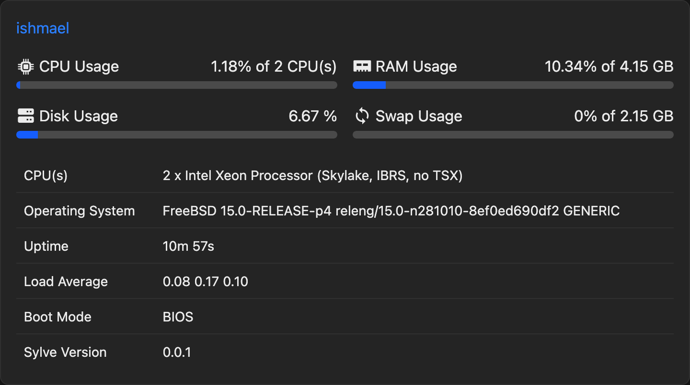
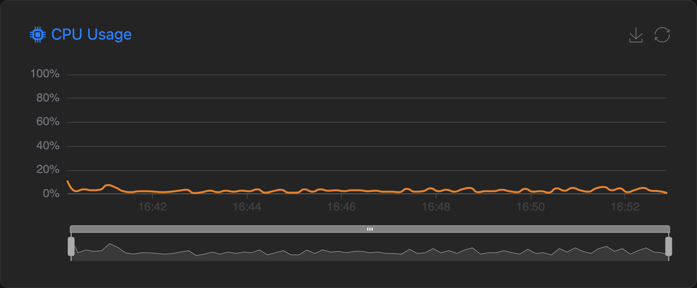
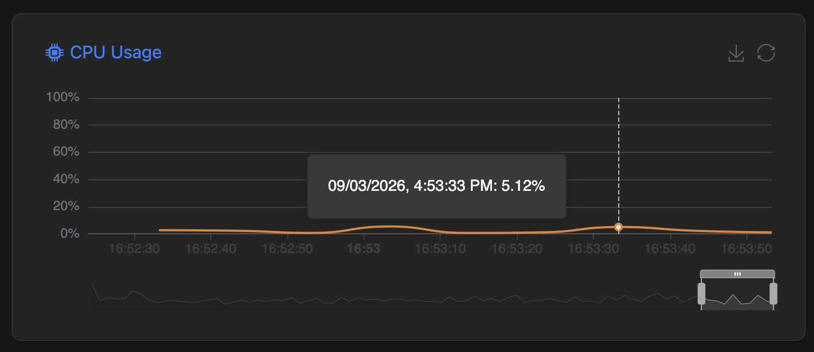

This page provides a summary of the Node you're active in, including its status, resource usage, and recent activity.

That is the summary of our CPX23 instnace. Now scrolling a bit further down you will see a few graphs, let's take a look at the CPU graph:

The bar right below the graph can be used to adjust the time range of the graph, and the graph itself can be hovered over to see more detailed information about CPU usage at specific points in time.

All other graphs behave the same way.