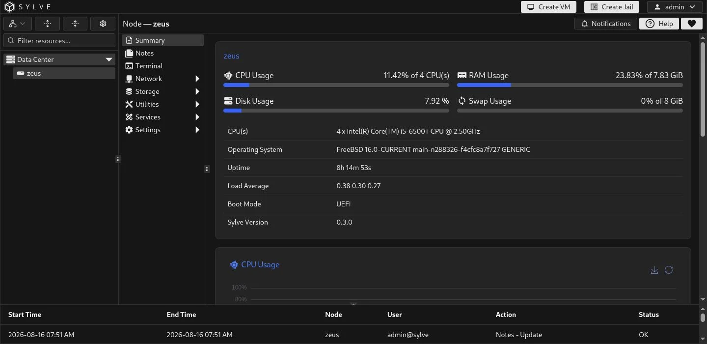

The **Summary** page is the operational overview for the active node. It combines the current state of the host with a short history, so you can see both what is happening now and what changed recently.

## Current Capacity

The top panel shows four live meters:

- **CPU Usage** shows the portion of the node's available CPU currently in use.
- **RAM Usage** shows used memory against the host's usable memory.
- **Disk Usage** shows the percentage of managed storage currently occupied.
- **Swap Usage** shows current swap consumption and available swap capacity.

Treat these as a quick health check before placing a VM, Jail, or other workload on the node. The values update as Sylve receives new host metrics.

## Host Details

Below the meters, Sylve records the identifying details that are useful when diagnosing or comparing nodes:

- CPU count and model
- FreeBSD version and kernel
- Uptime and load average
- Boot mode
- Installed Sylve version

## Resource History

The page then charts **CPU**, **RAM**, and **network** usage over time. The network chart separates received and sent traffic so spikes are easier to attribute.

Hover a chart to inspect a point in time. Use the compact range selector beneath it to focus on a smaller interval without losing the broader timeline. The icons in each chart header let you reset the selected range or save the chart as an image when you need to investigate further.

## Recent Activity

The activity table at the bottom shows recent actions performed against the node, including their start and end times, user, action, and result. Use it to correlate a resource spike or configuration change with the operation that produced it.
