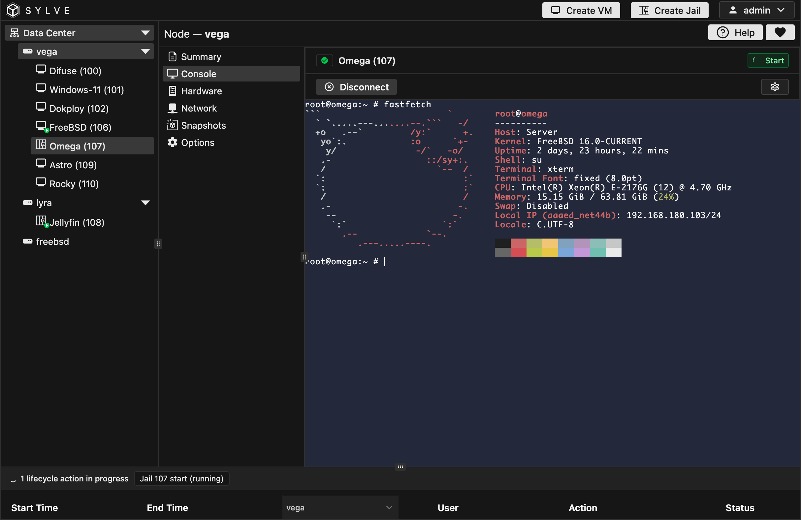
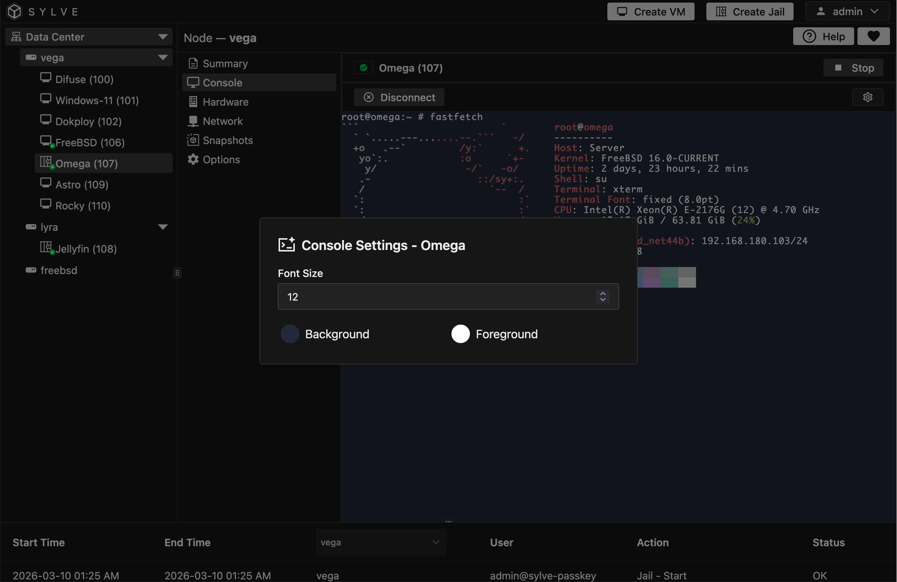

:::caution
The terminal requires a secure context (HTTPS) to function. Sylve automatically configures HTTPS for your nodes, so no additional setup is needed. However, if you access Sylve over HTTP, the terminal will not work. Ensure you are using HTTPS when accessing Sylve.
:::

The **Console** page gives you an interactive terminal session inside the browser by connecting to the jail shell over WebSocket. Console preferences are stored per jail, so your theme and font choices persist between sessions.

From **Console Settings** you can tune font size, background color, and foreground color for a setup that is easy to read during longer maintenance sessions.

:::note
If the jail is powered off, the console view stays in an inactive state until you start the jail.
:::

 

