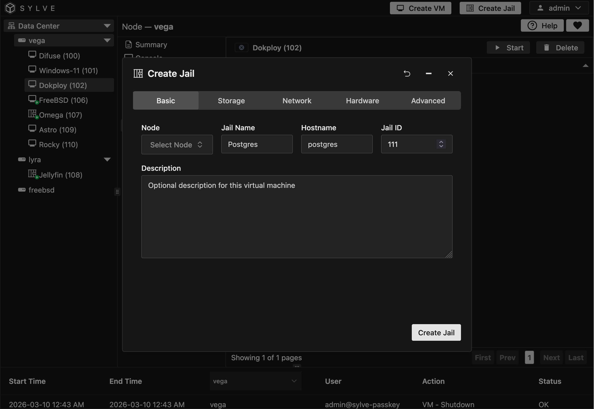
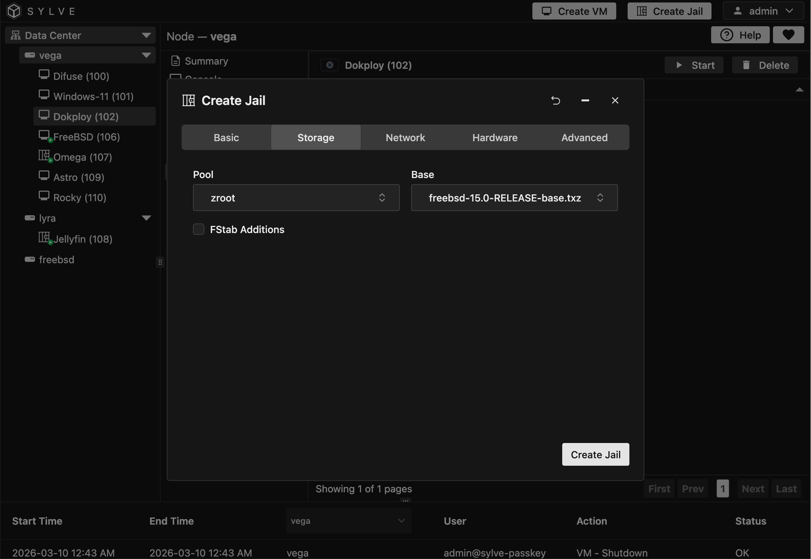
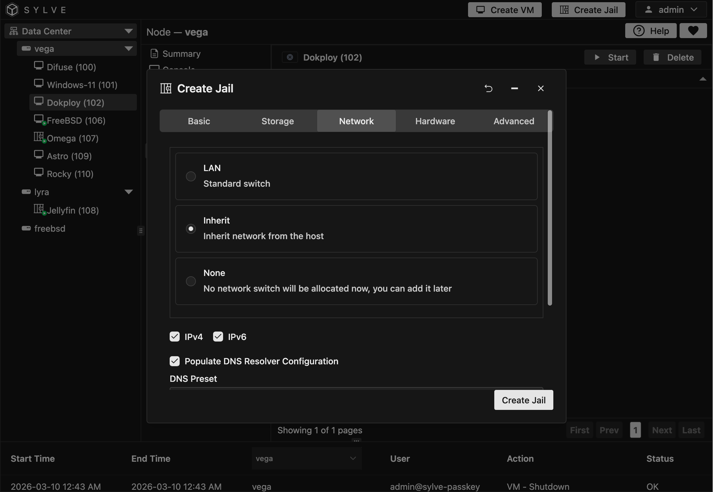

:::note
Your node needs to have the Jail service toggled, else you will not even see the **Create Jail** button on the top right corner of the app.
:::

To create a jail, click on the **Create Jail** button on the top right corner of the app. This will open a form where you can enter the details of your jail.

For this example we're going to be setting up a simple FreeBSD 15 jail with inherited network stack, but you can create all sorts of different jails with different configurations using the same form, so feel free to experiment with it and see what works best for your specific use case.

## Basic Information

In the **Basic** tab, there are a few fields that you need to fill out:

- **Node**: The node this jail belongs to, this select box will only show up if you're in a cluster.

- **Jail Name**: Name for the jail you're about to create

- **Hostname**: The hostname for the jail, this is optional but it's good to set it to something meaningful, especially if you're going to be running multiple jails on the same host.

- **Jail ID**: This is a number between 1-9999, it **HAS** to be unique cluster-wide, if you are clustered that is.

- **Description**: An optional description for the jail you are about to create.

## Storage

In the Storage tab, you can select the dataset where (pool) the jail's root filesystem will be created,
you also have to select a base that you downloaded. You can download a base.txz from https://download.freebsd.org/releases/amd64/15.0-RELEASE/base.txz using the downloader (rememeber to select the correct architecture and version) and also to enable extraction in the downloader.

You should have also set the download type to Base/RootFS for the selectbox here to contain the downloaded base.txz.

## Network

You can attach your Jail to a bridge and get DHCP/SLAAC or even use static IPs (actually better), but to keep things simple lets just use "inherited" networking, this means the jail will share the host's network stack, this is the simplest way to get your jail connected to the network, but it has some limitations, for example you won't be able to use port forwarding or have multiple jails with the same IP address, but it's a good option if you just want to get your jail up and running quickly without having to worry about networking.

## Hardware

Jail hardware provisioning isn't an exact science, it's more about setting limits and reservations for the resources that the jail will use, but it doesn't actually "provision" hardware like in a VM, so if you assign 2 CPU cores to a jail, it doesn't mean that the jail will always use those 2 cores, it just means that the jail can use up to 2 cores if it needs to, but it can also use less if it doesn't need that much.

If your Jails don't misbehave and use too much resources you can actually uncheck the "Resource Limits" checkbox and let them use as much resources as they need, but if you want to be on the safe side you can set some limits here to prevent a misbehaving jail from taking down your whole system. You can also specify a custom devfs ruleset here which is very important for things like GPU "sharing" etc.

Another thing you can set here is the boot order which is pretty self-explanatory.

## Advanced

The **Advanced** tab gives you control over jail runtime behavior and low-level jail.conf options.

You can choose either a **FreeBSD** jail type or **Linux (Experimental)**. The selection applies a sensible template automatically. FreeBSD defaults to traditional `exec.start` and `exec.stop` scripts (`/bin/sh /etc/rc` and `/bin/sh /etc/rc.shutdown`) with a conservative allowed option set, while Linux defaults to mount and compatibility options suited for Linux jails and leaves start/stop scripts disabled.

Beyond type selection, this page also lets you tune allowed capability flags (`allow.*`), choose whether to run with a clean environment, add raw custom jail config text, and define metadata values for `meta` and `env` as `KEY=VALUE` pairs.

The lifecycle hooks editor supports all `exec.*` phases (`prestart`, `start`, `poststart`, `prestop`, `stop`, `poststop`) with per-phase enable toggles and script bodies.

:::note
Each hook runs in a specific context. Some phases execute on the host, while others execute inside the jail.
:::

:::caution
Additional options are inserted as-is into jail configuration, so invalid content can prevent startup.
:::
