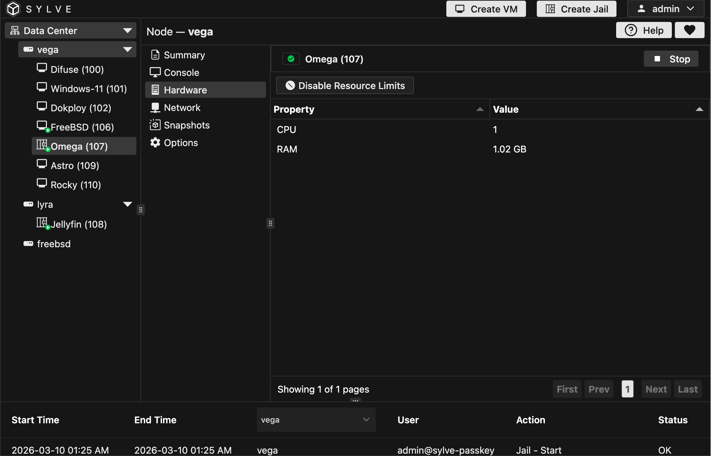

The **Hardware** page controls CPU and memory boundaries for your jail. In Sylve, this is driven by the **Resource Limits** switch: when enabled, the jail uses explicit RAM and CPU limits; when disabled, the jail is treated as unlimited in the UI.

RAM and CPU values are edited from their own dialogs and are intentionally locked while resource limits are disabled, which avoids accidentally applying partial limits.

:::note
Enabling limits defaults to **1 GB RAM** and **1 vCPU**. You can change both immediately after.
:::

