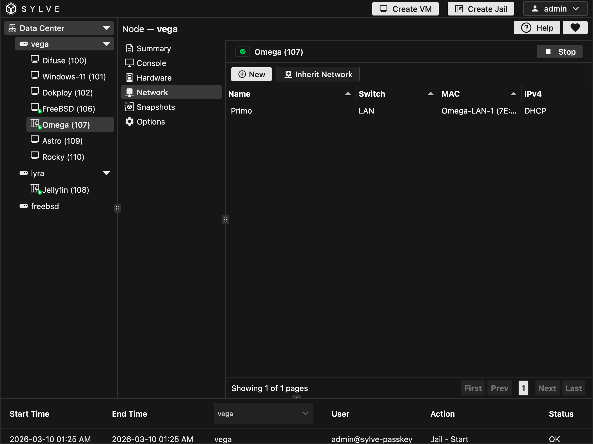
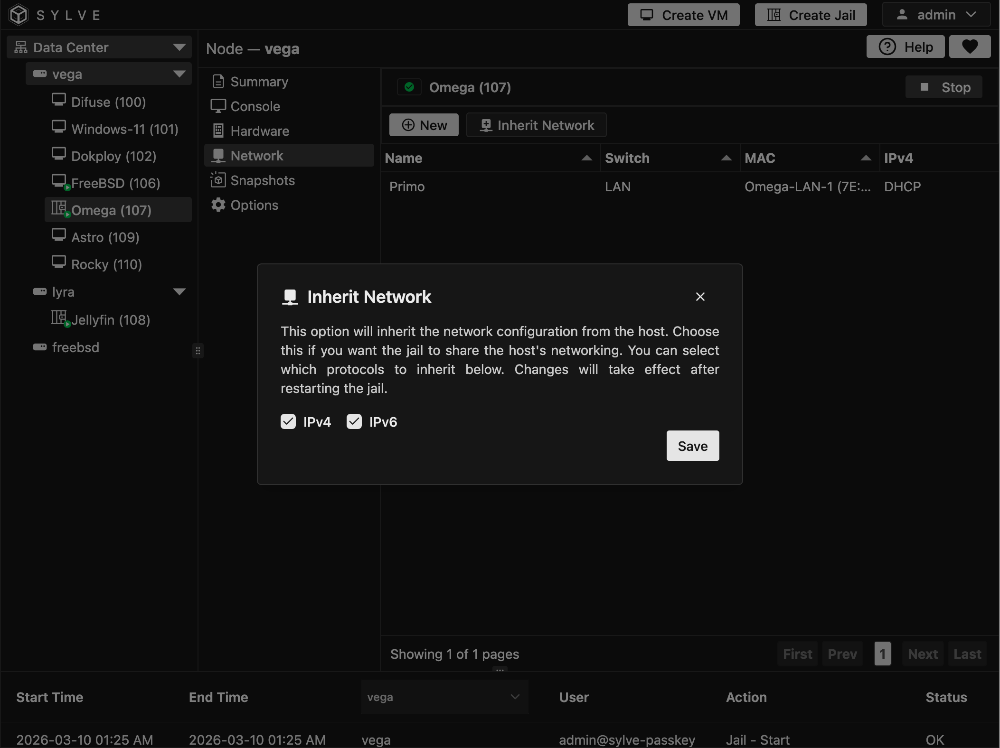
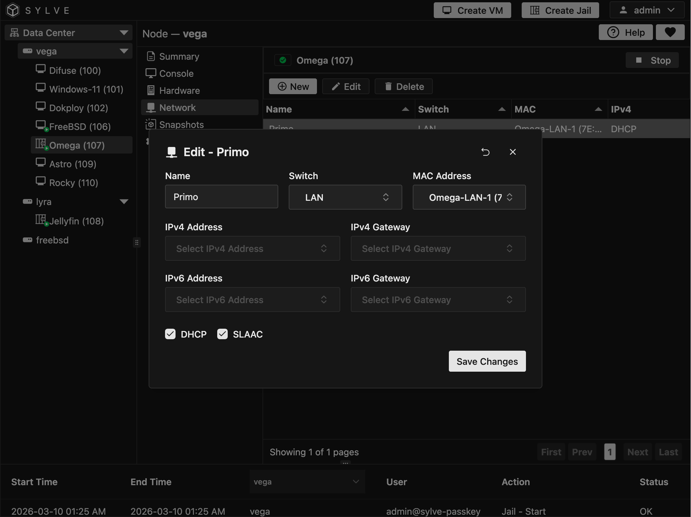

The **Network** page lets you run a jail either in inherited mode or in attached-switch mode. In inherited mode, the jail can share host networking for IPv4 and/or IPv6. In attached-switch mode, you manage one or more explicit network entries tied to your switches and network objects.

When the jail is not inherited, you can create, edit, and delete network attachments from the toolbar. The table displays each attachment with its name, switch, MAC, and resolved IPv4/IPv6 addressing.

:::tip
Use inherited networking when you want the fastest setup, and switch attachments when you need tighter per-jail network control.
:::

:::note
Addressing supports DHCP/SLAAC as well as static object-based IP and gateway assignments.
:::

 

 

