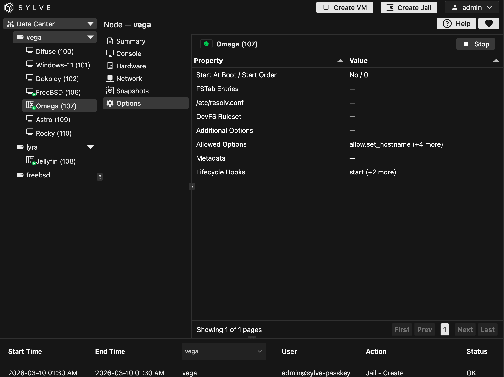
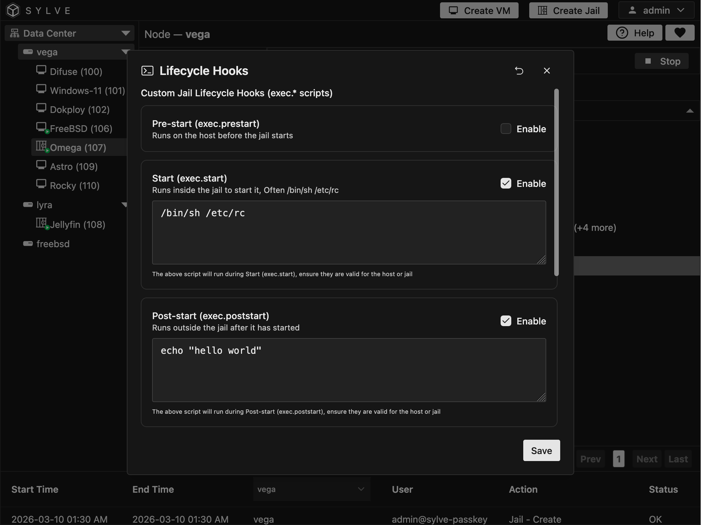
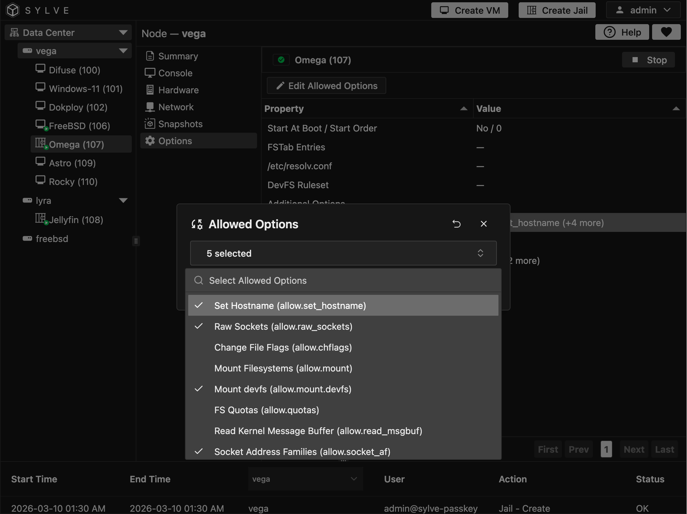

The **Options** page centralizes jail configuration fields that are not day-to-day lifecycle controls. You select a row in the table and Sylve opens the matching editor for that property.

This includes startup behavior, fstab entries, resolver config, DevFS rules, additional jail options, allowed options, metadata values, and lifecycle hook scripts (`exec.*`).

:::note
Long text values are previewed in the table and truncated with an ellipsis. Open the editor to view and edit the full value.
:::

 

 

