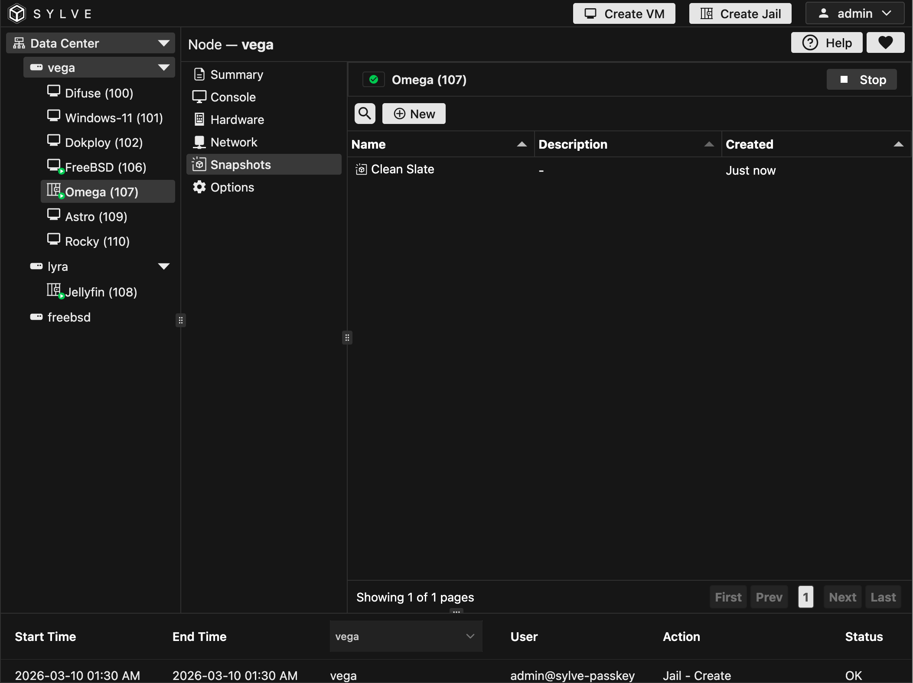
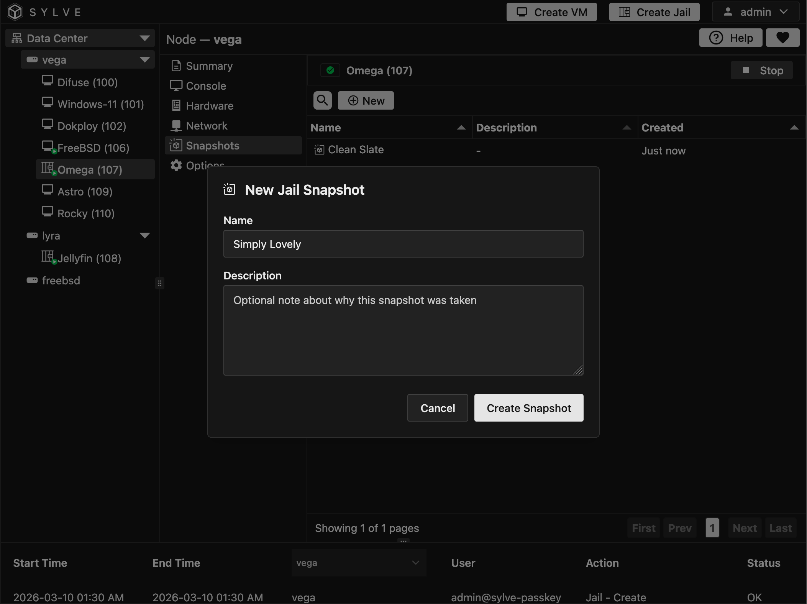
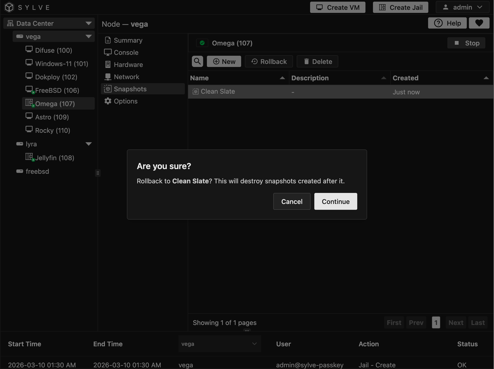

The **Snapshots** page lets you create recovery points and manage rollback history for a jail. Snapshots are shown as a tree, so parent and child relationships are visible directly in the table.

To create a snapshot, click **New**, enter a required name, and optionally add a description. To recover to a previous state, select a snapshot and use **Rollback**. You can also delete snapshots from the same view.

:::caution
Rolling back to an older snapshot destroys snapshots created after that point. Confirm the lineage before continuing.
:::

:::note
Snapshot deletion is permanent and cannot be undone.
:::

 

 

