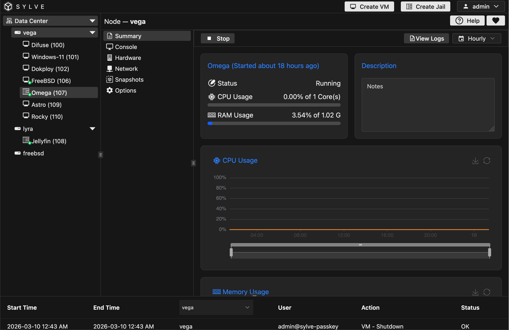
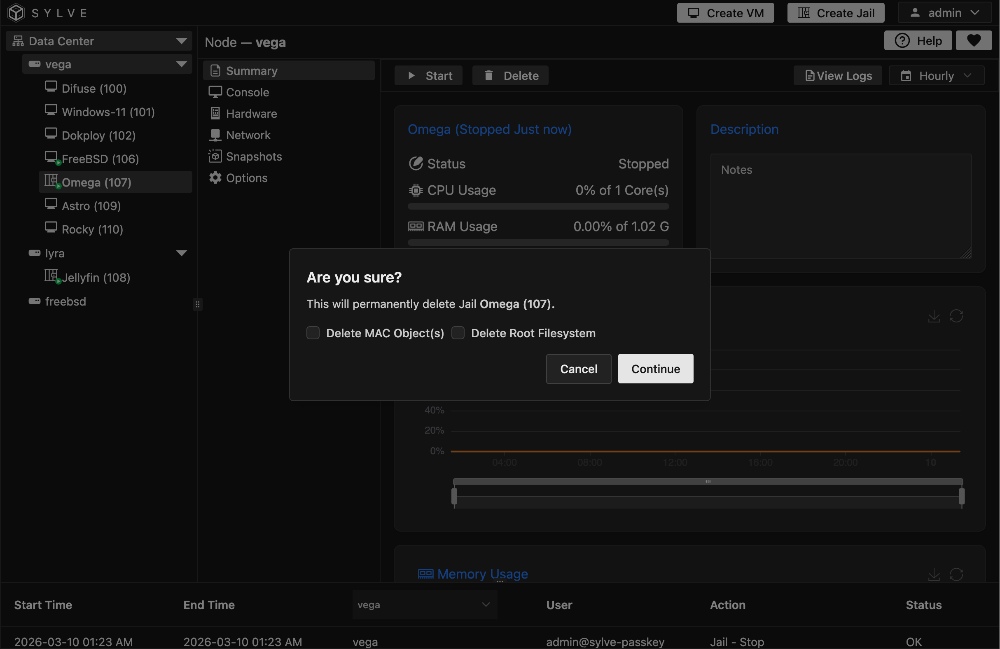
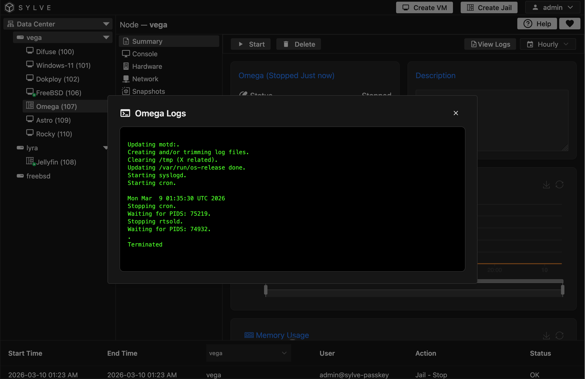

The **Summary** page is your live operational view for a jail. It is the place where you can trigger lifecycle actions, monitor current usage, and quickly check health without jumping to other tabs.

You can start and stop the jail directly from the header controls, and when actions are queued or running you will see a lifecycle badge so you can tell what is happening in real time. The same page also lets you update the jail description and inspect CPU and memory charts with selectable time ranges (**Hourly**, **Daily**, **Weekly**, **Monthly**, **Yearly**).

:::note
The **View Logs** button is shown when log data exists for the jail, and opens a live-follow log dialog.
:::

:::caution
The delete action is permanent. You can optionally include MAC object cleanup and root filesystem deletion during the same operation.
:::

 

 

