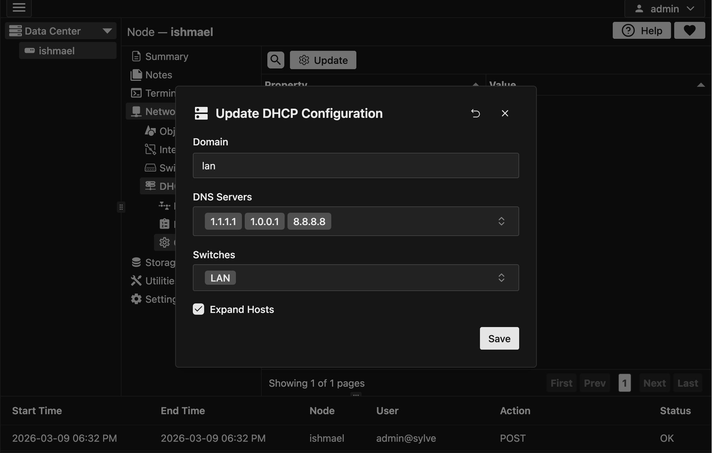

In this section, we will go over the dnsmasq configuration for DHCP and DNS in Sylve. You can click on the "Update" button to open up a form which allows you to make changes to all the rows in the table at once.

Let's go over the fields in the form:

- **Domain**: This is the domain that will be used for DNS resolution for all the DHCP leases, so if you have a lease with hostname "myhost" and the domain is "lan" then the full hostname for that lease will be "myhost.lan".

- **DNS Servers**: This is a list of DNS servers that will be used as forwarders for name resolution, it's pre-filled with some fast and free public DNS servers already, but you can change it to whatever you want, as it's a combobox.

- **Switches**: This is a list of switches that dnsmasq will listen on for DHCP requests and also RA if enabled, without specifying the switch here, dnsmasq will not listen on any switch and DHCP and RA **will not** work.

- **Expand Hosts**: If this is enabled, dnsmasq will expand the hostnames of the leases to include the domain specified above, so if you have a lease with hostname "myhost" and the domain is "lan" then the full hostname for that lease will be "myhost.lan". If this is disabled, the hostname will be just "myhost" without the domain.