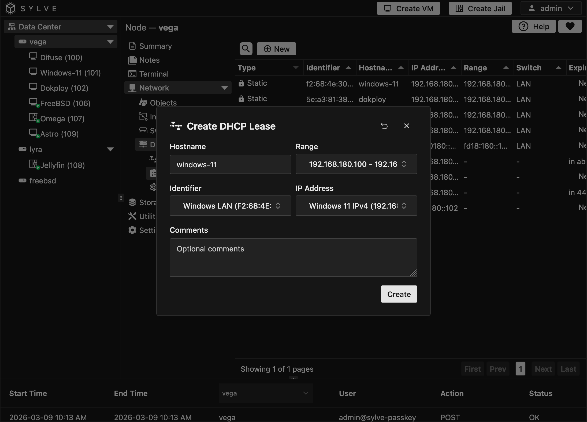
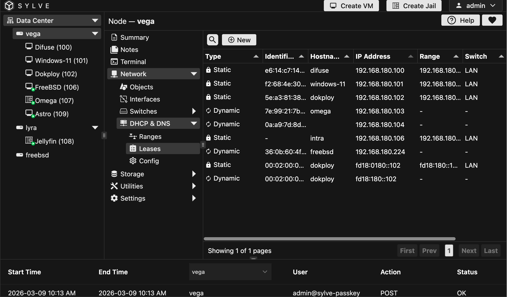

DHCP Leases are the IP addresses that have been given out by DHCP capable switches in Sylve to clients that have requested them, you can view all the leases including dynamic and static ones.

## Creating a Static Lease

Creating a static lease is pretty straightforward, a valid hostname and range is required, and you also need to specify a MAC address or a DUID for the client that you want to give the static lease to.

The IP Address here must be created in the Network Objects section as a Host object, and it must be in the same network as the switch that you are creating the lease for.

## Viewing Leases

Leases both static and dynamic will show up in the table like this:

The last column also shows it's expiry time, if it's a static lease it will show "Never" instead of an expiry time, and if it's a dynamic lease it will show the time remaining until it expires.