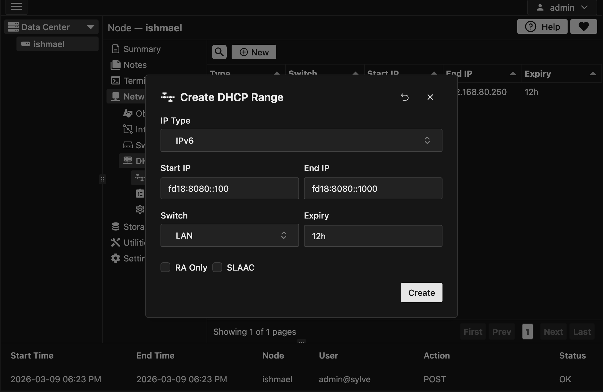

## Creating a Range

You can create both an IPv4 and an IPv6 range, we will be creating both for our LAN switch, now dnsmasq is the underlying DHCP server that Sylve uses for its DHCP capable switches. 

For IPv4 We're going to use the range `192.168.80.50 - 192.168.80.250` as this falls in our subnet of `192.168.80.0/24`. For IPv6 we're going to use the range `fd18:8080::100 - fd18:8080::1000` as this falls in our subnet of `fd18:8080::/64`.

:::caution
It is important to note that the DHCP range you specify should fall within the subnet of the switch, otherwise you will have issues with DHCP not working properly and clients not getting IP addresses, **especially IPv6**.

We validate this on both the frontend and backend, but it is still important to keep in mind when configuring your switches and ranges.
:::

Now for IPv6 you have 2 checkboxes below the form inputs:

- **RA Only**: This means that the switch will only send Router Advertisements to clients and will not provide any DHCPv6 functionality, this is useful if you want to use SLAAC for IPv6 configuration instead of DHCPv6.

- **SLAAC**: This means that the switch will provide both Router Advertisements and DHCPv6 functionality to clients, this is useful if you want to use both SLAAC and DHCPv6 for IPv6 configuration.

We'll check both the boxes as we want to provide both SLAAC and DHCPv6 functionality to our clients, but you can choose to only check one of them if you only want to use one of the methods for IPv6 configuration.

For creating the IPv4 range the procedure is almost identical, but you won't have the RA Only and SLAAC checkboxes as they are only relevant for IPv6.

:::note
FreeBSD VMs/Jails will not support DHCPv6 out of the box, you will need to install and configure a DHCPv6 client inside them to get IPv6 configuration from the switch, but they will support SLAAC without any additional packages/ports.
:::

## Viewing the Ranges

Now that we have created 2 ranges they should look something like this in the table:

