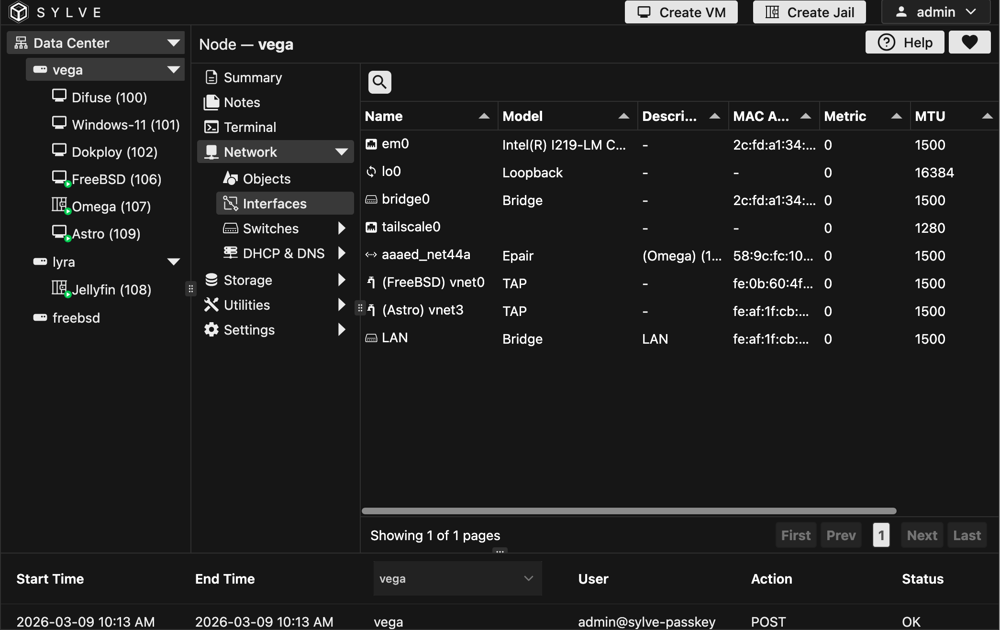

Think of this page sort of the visual representation of `ip link sh` on linux, or `ifconfig` on FreeBSD. It shows you all the network interfaces available on your machine along with their detailed information, ideally it should look something like this:

:::note
Some of these interfaces particularly the `Epair`, `TAP` and bridge interfaces might have weird names, don't worry about that, even though we let users give whatever name they'd like to their switches/jails, we use a small hash as their names to avoid collisons and also to make sure we don't make any mistakes in parsing/naming based on users input.

Nonetheless we try to make it as clear as possible which interface belongs to which switch/jail by showing the name of the switch/jail in the interface details, so you can easily identify them.
:::

