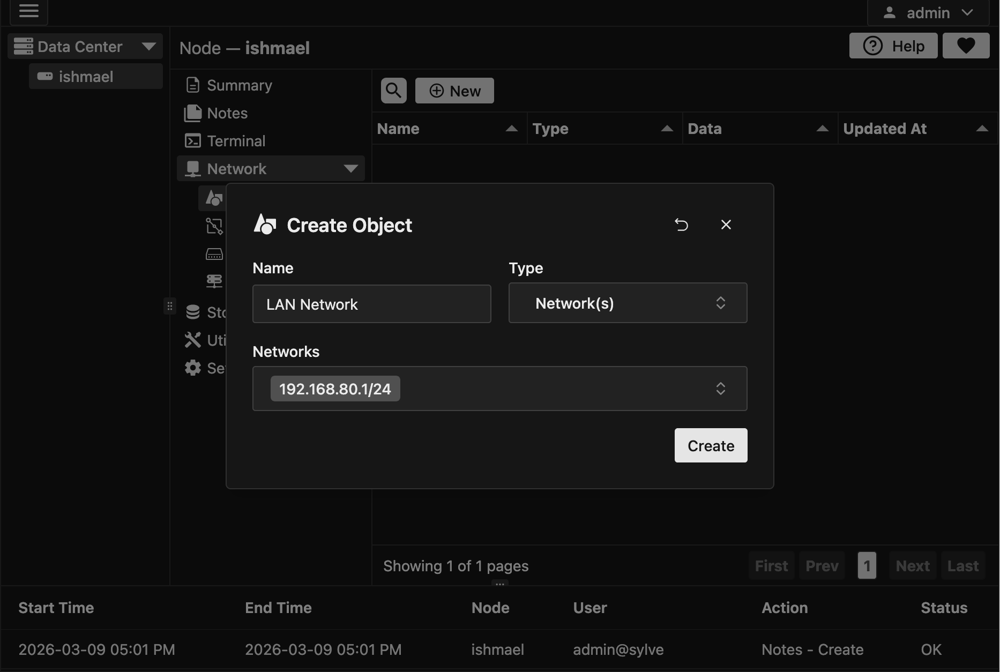
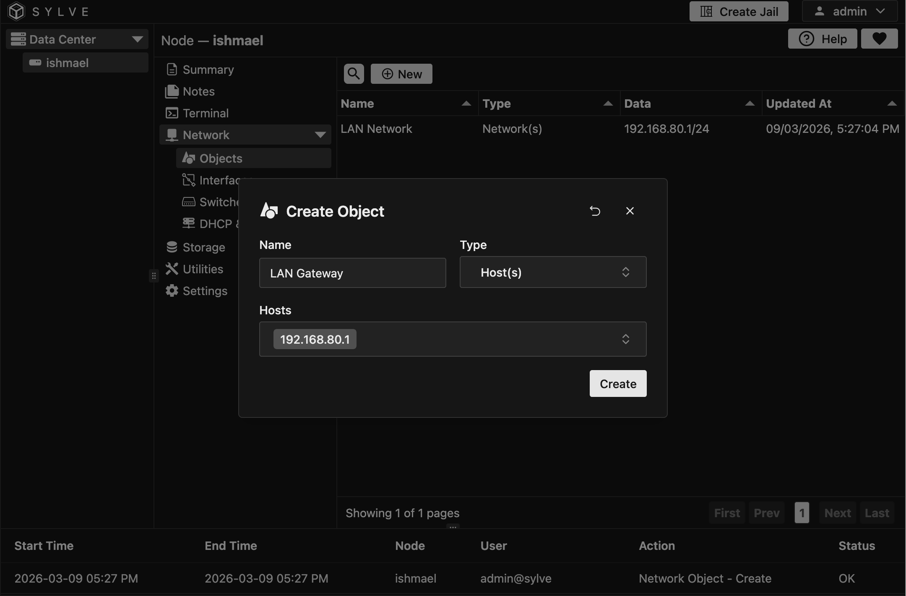
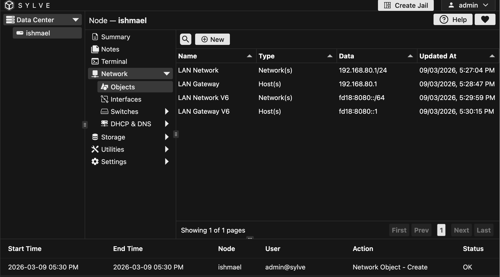

Network Objects are somewhat controversial in the Sylve community. They are a way to abstract away the details of your network configuration and allow you to use simple names instead of complex configurations throughout the application.

The idea is that you can define a Network Object for everything you need to reference in the application, and then use those objects instead of the raw values. This can make your configuration more readable and easier to manage, and more importantly if you need to change something, you can change it in one place instead of having to find and replace it throughout your configuration.

As an example we will be making 4 objects, namely:

| Name | Value |
|---|---|
| LAN Network | 192.168.80.1/24 |
| LAN Gateway | 192.168.80.1 |
| LAN Network V6 | fd18:8080::/64 |
| LAN Gateway V6 | fd18:8080::1 |

And then we will use them in the next section of the guide which is Switch creation.

## Creating a Subnet Network Object

Just like we did with other additions to the table, we will click on the "New" button and give a name for our Object, in this case it will be "LAN Network", and then in the second dropdown we pick "Network(s)" as we need to define a subnet.

The 3rd box is what we call a combobox, you can either select values from it if any or you could just add your own entries to it. In this case we need to add `192.168.80.1/24`. After all that's done it will look something like this:

## Creating a Host Network Object

Similar to a Subnet Object, we will click on the "New" button and give a name for our Object, in this case it will be "LAN Gateway", and then in the second dropdown we pick "Host(s)" as we need to define a host.

In the 3rd box we will add `192.168.80.1`. After all that's done it will look something like this:

Now after repeating the process for the IPv6 objects as well your table should look something like this:

:::note
You can click on an object's **data** in the network objects table to copy it to clipboard.
:::

Now in the next sections we will see how these objects are actualy used.

