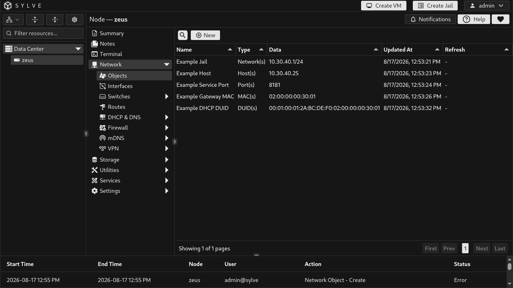
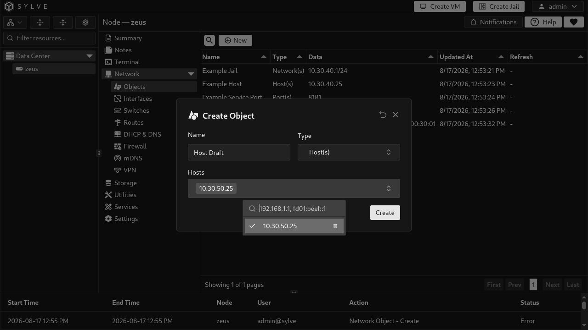

Network objects are named, reusable values for addresses, networks, ports, identities, and remote address sets. Create an object once, then select it wherever Sylve offers that type instead of repeating raw values in firewall rules, static leases, switches, routes, jails, or VMs.

## Object types

| Type | Example | Used by |
| --- | --- | --- |
| **Host(s)** | `192.0.2.25` | Firewall addresses, routes, jail addresses and gateways, switches, DHCP lease IPs. |
| **Network(s)** | `10.30.40.1/24` | Firewall addresses, route destinations, and switch networks. |
| **Port(s)** | `443`, `8000:8010` | Firewall traffic and NAT rule ports. |
| **MAC(s)** | `02:00:00:00:00:25` | VM and jail NICs, DHCP static leases, and Standard Switch bridge identities. |
| **DUID(s)** | `00:04:...` | DHCPv6 static leases. |
| **FQDN(s)** | `updates.example.net` | Firewall address matching; resolved and refreshed automatically. |
| **List(s)** | `https://example.net/deny.txt` | Firewall address matching; downloaded and refreshed automatically. |

## Network(s) means CIDR

A **Network(s)** value is always a CIDR block, not a host address. Use **Host(s)** for `10.30.40.25`; use **Network(s)** for `10.30.40.1/24`. The suffix defines the mask: `/24` covers 256 IPv4 addresses, while `2001:db8:30::1/64` is an IPv6 LAN prefix. A Host or Network object cannot mix IPv4 and IPv6 values.

:::note[VNET jail addressing]
A VNET jail needs one network and one gateway for each address family it uses. The CIDR suffix on the network value, such as `/24` or `/48`, includes the subnet mask, so Sylve can infer the network boundary without a separate subnet-mask field. For IPv4, select a network such as **Caddy IPv4** (`192.168.12.100/24`) and a gateway such as **LAN Gateway** (`192.168.12.1`). For IPv6, select a network such as **Caddy IPv6** (`fdc0:ffee:cafe::100/48`) and a gateway such as **LAN Gateway v6** (`fdc0:ffee:cafe::1`).
:::

## Create an object

Choose **Network → Objects → New**, give the object a purpose-based name, select a type, add its values, and click **Create**. Each value is a separate entry. A Port entry is one number or inclusive range, such as `443` or `8000:8010`.

Example objects: `Example Jail` as Network(s) `10.30.40.1/24`, `Example Host` as Host(s) `10.30.40.25`, `Example Service Port` as Port(s) `8181`, `Example Gateway MAC` as MAC(s), `Example DHCP DUID` as DUID(s), `Example Service DNS` as FQDN(s), and `Example Remote List` as List(s).

FQDN and List objects resolve or download their data on creation. The **Refresh** column records success, the last refresh time, or an error. List sources must be HTTP(S) and cannot include credentials.

## Edit, delete, and bulk delete

Select one row to reveal **Edit** and **Delete**. Editing is the right way to change a value in one place, but changing the type of an in-use object is rejected. DHCP leases require exactly one Host, MAC, or DUID value; route objects also require one value.

Select multiple unused rows to reveal **Bulk Delete**. Sylve checks every selected object first and blocks deletion if any is used by a firewall rule, DHCP lease, VM, jail, switch, or static route. Bulk deletion is all-or-nothing.

A MAC object used as a Standard Switch's bridge identity must contain exactly one valid non-zero unicast address. While that object is in use, Sylve prevents edits that would violate the single-value requirement.
