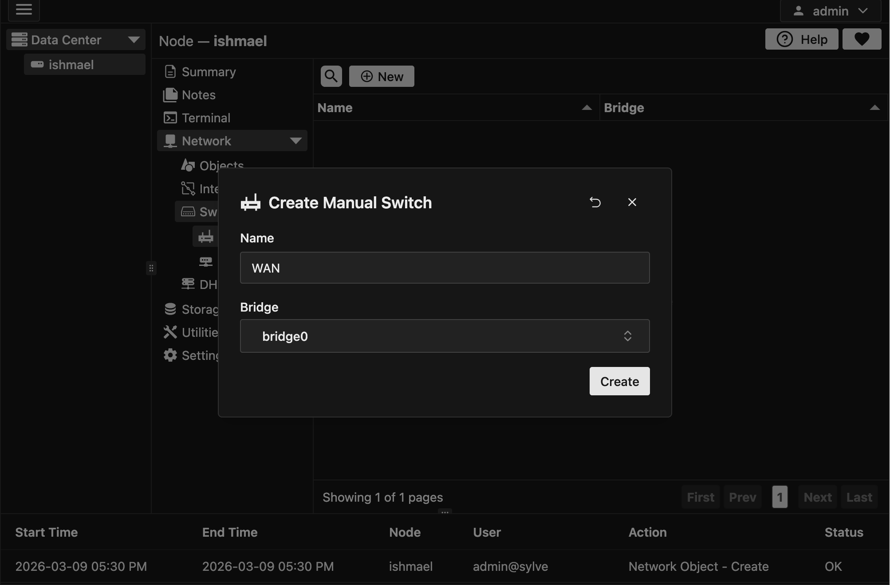
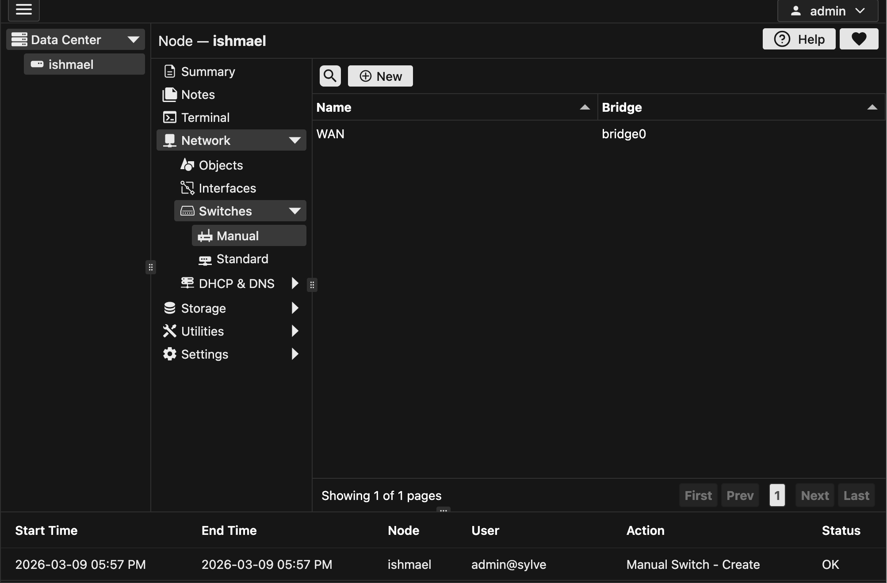

Manual Switches are basically bridges that you import from your running configuration, they are useful if you already have a working network configuration and you just want to import it into Sylve without having to recreate it from scratch using the Standard Switch form.

Importing a bridge is as simple as clicking on the "New" button and then giving it a name and selecting a bridge from the dropdown.

## Creating a Manual Switch

## Viewing a Manual Switch

After creating a Manual Switch, it should show up in the table like this:

