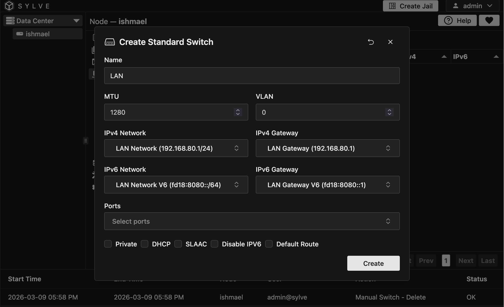
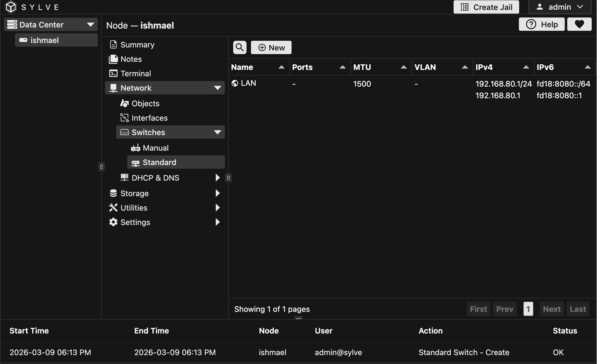

Standard Switches are basically bridges that you create from scratch using Sylve, they are useful if you want to build a new network configuration without relying on an existing one.

This is where the Network Objects we created in the previous section come in handy, as they allow us to reference them in our Switch configuration.

## Creating a Standard Switch

We're going to create a Standard Switch for our LAN network, which we will use for our Jails to get access to the internet and to each other.

After filling out the details of the form, it should look something like this:

Now a few things to note here, the **MTU** field and the **VLAN** field are optional, if you don't need them you can just leave them blank.

In the IPv4 Network and Host sections, you can select the Network objects we created in the previous section, and the same goes for the IPv6 Network and Host sections.

Now coming to ports, think of a Standard Switch as a physical Layer 2 switch, it has ports that you can connect devices to. In this case, we will be connecting our Jails to these ports, but if you have a router on another interface on your machine you can also connect it to the switch to provide internet access or DHCP or whatever you need.

:::caution
It is extremely important to note that if you are connecting a physical interface to the switch, you should not have any IP configuration on that interface, otherwise you will have network issues. This is because the switch will take over that interface and all traffic will go through it, so if you have an IP configuration on it, it will cause conflicts and connectivity issues.

There are ways to get around this limitation, but it is not recommended and we will not discuss them here.
:::

Now at the bottom of the form you can see a bunch of checkboxes, lets go over each of them:

- **Private**: If this is enabled, no traffic will be allowed between guests on the same
switch, however then will all be able to communicate with any physical
interfaces added to the switch.

- **DHCP**: Instead of giving a Network Object above, you can enable this and Sylve will try to get IPv4 configuration from a DHCP server on the network. This is useful if you have a router connected to the switch that provides DHCP, or if you have a DHCP server running on another machine on the switch (as a VM or a Jail).

- **SLAAC**: Instead of giving a Network Object above, you can enable this and Sylve will try to get IPv6 configuration from a router on the network using SLAAC. This is useful if you have a router connected to the switch that provides SLAAC, or if you have a router running on another machine on the switch (as a VM or a Jail).

:::caution
It is **never** a good idea to disable IPv6 on a switch, even if you don't have any need for it, because it can cause issues with some applications and services that expect IPv6 to be available. It is better to just leave it enabled and not use it if you don't need it.
:::

- **Disable IPv6**: If you don't want to use IPv6 on this switch, you can enable this and it will disable all IPv6 functionality on the switch. This is useful if you don't have any need for IPv6.

- **Default Route**: This checkbox tells Sylve whether that bridge should install the system-wide IPv4 default gateway when the switch is brought up. When defaultRoute is true, the backend runs basically runs `/sbin/route add default "gateway"` for the switch's IPv4 gateway (and keeps it in sync on edits). The UI also enforces that only one standard switch can have defaultRoute enabled at a time so you don't end up with conflicting default gateways on the same node.

## Viewing the Switch

Now after creating the switch, it should show up in the table like this:

Since we don't have any ports connected to it, this bridge is pretty much going to act as our router after we configure DHCP/Router Advertisements on it and connect our Jails/VMs to it, but we will get to that in the next sections of the guide.