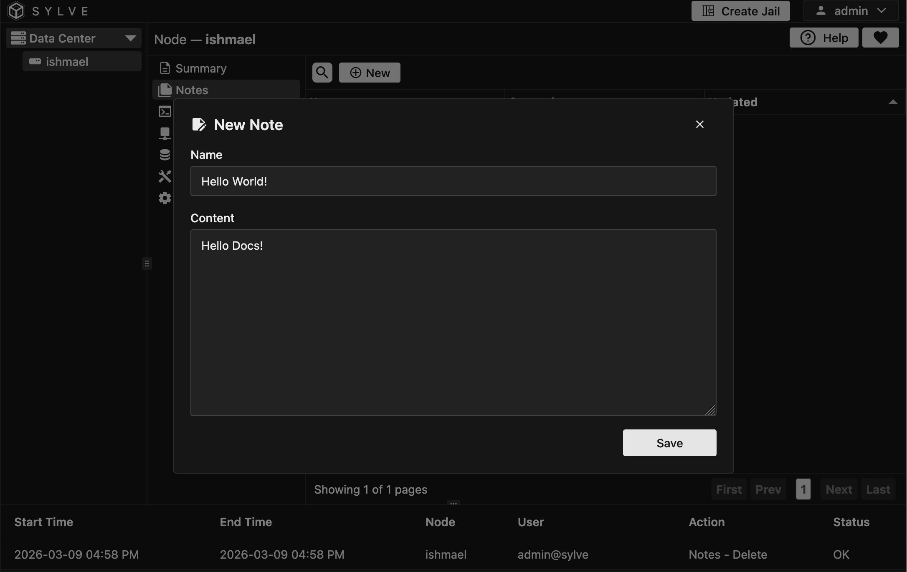
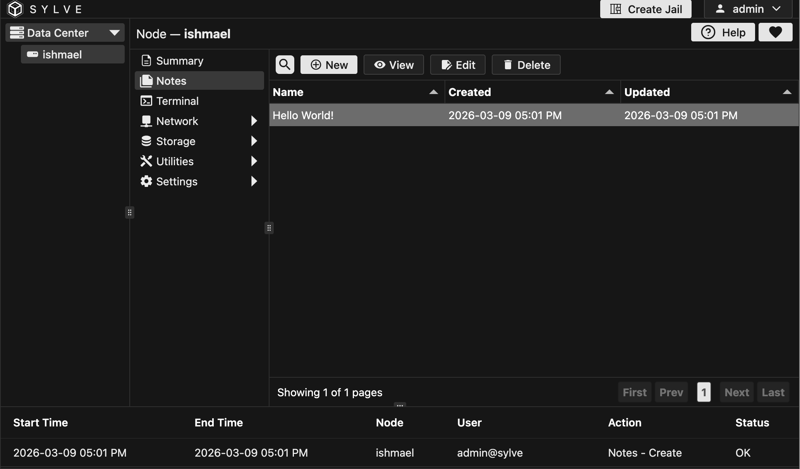

Admins can add notes for a node for reference later. This can be useful for keeping track of important information about the node, such as its purpose, configuration, or any issues that have been encountered.

## Adding a new Note

All tables in Sylve behave the same way, so we'll just look at the Node Notes table as an example. To add a note, click the "New" button and fill out the form with the note's content and a name. Once you've entered in the information, click "Save" to add the note to the table.

## Viewing Note in the Table

You can click on a row and near the "New" button it will show context options for that specific notes, in some tables you can even click on many rows together and perform bulk actions!

