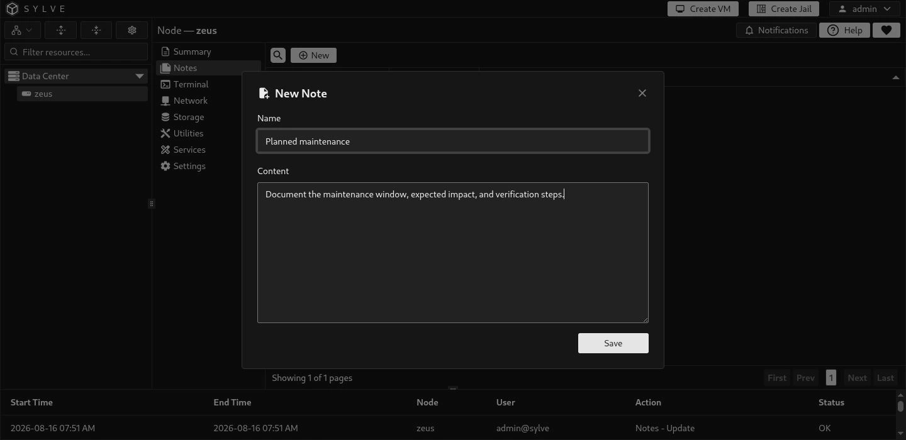
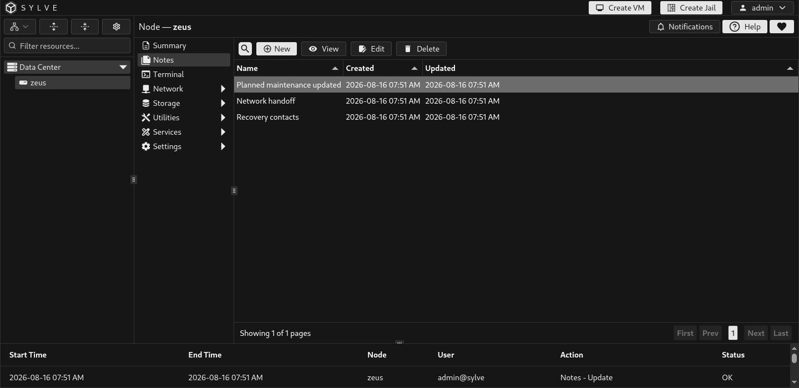
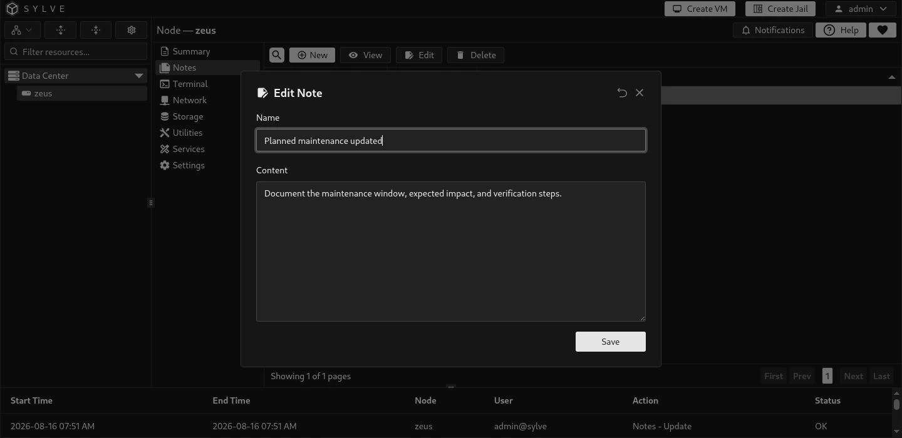
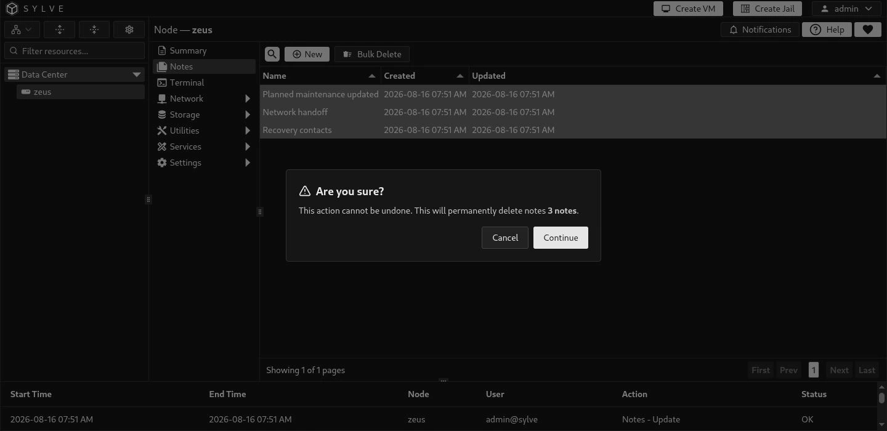

**Notes** is a lightweight record attached to the active node. Use it for information that should remain close to the host: maintenance context, recovery instructions, ownership, unusual configuration choices, or a handoff for another operator.

Each note has a **name** for scanning the table and a free-form **content** field for the detail.

## Create a Note

Select **New**, enter a concise, searchable name and the note content, then select **Save**. The note appears in the table immediately, with its creation and last-updated timestamps.

Choose names that describe the subject rather than the action, such as `Planned maintenance`, `Network handoff`, or `Recovery contacts`. That makes the list useful when there are many notes.

## Read and Select Notes

Select a single row to reveal **View**, **Edit**, and **Delete**. **View** is useful for reading a longer note without putting it into edit mode.

Use the table columns to scan note names and timestamps. Select **Toggle Search** when you need to narrow the list, and use the pager when the table contains more than one page.

## Edit a Note

Select one note, choose **Edit**, update its name or content, then select **Save**. The **Updated** column changes when the edit is stored. Use **Reset** in the edit dialog to discard unsaved changes and restore the saved values.

## Delete One Note

Select one row and choose **Delete**. Read the confirmation message carefully, then continue only when the note is no longer needed. Deletion is permanent.

## Bulk Delete Notes

To remove several notes together, select multiple rows with `Ctrl` on Windows and Linux, or `Command` on macOS. The action bar changes to **Bulk Delete**. Select it, confirm the displayed count, then choose **Continue** to permanently remove the selected notes.

Bulk deletion only affects the selected rows. If the selection is not what you expect, choose **Cancel**, clear the selection, and select the intended notes before trying again.
