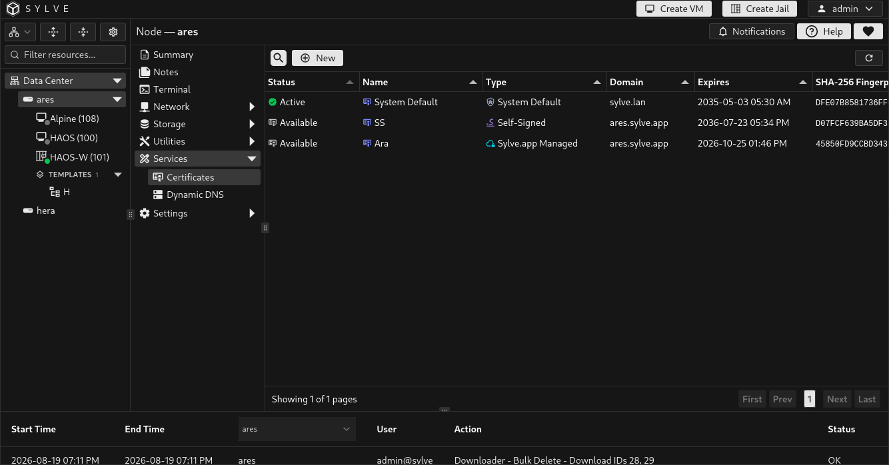

import certificateTypesWalkthrough from './certificates-create-types.mp4';

**Services → Certificates** manages the public TLS certificate that browsers use when connecting to this Sylve node. You can keep multiple certificates ready, but only one is active at a time. Selecting another certificate schedules it for activation at the next Sylve restart.

This page does not replace the internal certificate used for cluster communication.

## Certificate status and actions

The table shows a certificate's name, type, domain, expiry date, fingerprint, and readiness. Managed-certificate issuance status refreshes while work is pending.

| Status | Meaning |
| --- | --- |
| **Active** | The certificate is currently served by this Sylve node. |
| **Available** | The certificate is valid and ready, but is not currently selected. |
| **Pending Restart** | The certificate is selected to become active when Sylve restarts. |
| **Preparing Request**, **Issuance Queued**, or **Issuing** | A Sylve.app Managed certificate is being requested in the background. |
| **Waiting for Active Order** | The managed-certificate broker is waiting for another order before continuing. |
| **Issuance Failed** | The request stopped. Select the certificate and use **Retry Issuance** after resolving the reported issue. |
| **Expiring**, **Expired**, or **Not Yet Valid** | The certificate's validity dates require attention. |

| Action | Result |
| --- | --- |
| **Download Certificate & Key** | Downloads a ZIP archive containing `certificate.pem` and `private-key.pem`. Handle this archive as a secret. |
| **Activate on Restart** | Marks a ready, non-active certificate as the next active certificate. Restart Sylve or the node to apply it. |
| **Cancel Pending** | Cancels a scheduled activation before restarting. |
| **Renew** | Renews an eligible Let's Encrypt certificate directly, or queues renewal for an eligible Sylve.app Managed certificate. |
| **Retry Issuance** | Starts a fresh initial issuance attempt for a failed Sylve.app Managed certificate. |
| **Edit** | Updates a certificate's allowed fields. Certificate type cannot be changed after creation. |
| **Delete** | Removes a certificate that is neither active nor pending activation. The system default certificate cannot be edited or deleted. |

:::caution
Activating a certificate is deliberately restart-gated. Confirm that the certificate is valid for the node's hostname, schedule activation, then perform a complete node restart from a safe management path.
:::

## Create a certificate

Select **New**, give the certificate a recognizable name, select its type, and complete the fields for that type.

<video class="docs-walkthrough-video" autoplay muted loop playsinline controls aria-label="Certificate creation walkthrough showing Import PEM, Self-Signed, Let's Encrypt Direct, and Sylve.app Managed certificate types">
  <source src={certificateTypesWalkthrough} type="video/mp4" />
</video>

| Type | Use it when | Requirements and behavior |
| --- | --- | --- |
| **Import PEM** | You already have a certificate chain and matching private key. | Paste both PEM values. Each may be up to 1 MiB. Enable domain validation to require that the certificate matches the chosen domain. |
| **Self-Signed** | You need encryption for testing, an internal environment, or a temporary setup where clients can trust the certificate manually. | Sylve generates a P-256 certificate for the domain. Browsers will warn until they trust it. |
| **Let's Encrypt (Direct)** | The node is publicly reachable and you want a publicly trusted certificate without using the Sylve.app broker. | Uses TLS-ALPN-01 validation. The exact DNS hostname must be publicly reachable on TCP port 443. Wildcards and IP addresses are unsupported. **Staging** uses Let's Encrypt's test environment and is useful before requesting a production certificate. |
| **Sylve.app Managed** | You have a Sylve.app Dynamic DNS hostname and its update token. | Choose an eligible **Sylve.app** Dynamic DNS entry. Sylve creates a local P-256 private key and requests issuance in the background. Creating it does not activate it. |

For **Let's Encrypt (Direct)**, use the DNS-check button beside **Domain** before creating the certificate. It compares the hostname's resolved address with public addresses detected by the node. A match is useful evidence, but it cannot verify firewall rules or port forwarding, so make sure TCP 443 is reachable yourself.

### Free Sylve.app hostname and managed TLS

[Sylve.app](https://sylve.app) is completely free. You can obtain a free subdomain such as `your-node.sylve.app`, then add its per-hostname update token as a **Sylve.app** Dynamic DNS entry in Sylve.

That entry can be selected when creating a **Sylve.app Managed** certificate. The managed TLS certificate is also free. The two records are deliberately linked: the certificate uses the Dynamic DNS entry's hostname, and Sylve prevents deleting the entry or changing its provider or hostname while the certificate depends on it.

Sylve generates the certificate private key locally on the node and requests the certificate with a certificate signing request. The private key is not shared with Sylve.app.

### Activate a ready certificate

1. Wait until the certificate is **Available** and its validity dates are shown.
2. Select it in the table.
3. Select **Activate on Restart**.
4. Confirm that the row changes to **Pending Restart**.
5. Perform a complete node restart.

Only ready certificates can be activated. A pending activation can be cancelled before the restart.

## Renewal and expiry

Let's Encrypt and Sylve.app Managed certificates become eligible for renewal within 30 days of expiry. Sylve checks due certificates automatically. You can also select an eligible certificate and use **Renew**.

Direct Let's Encrypt renewal is completed during the request. A Sylve.app Managed renewal is queued and progresses through the table's issuance states. If a managed certificate fails before material is issued, use **Retry Issuance** after fixing the related Dynamic DNS or connectivity problem.

## Export safely

Use **Download Certificate & Key** only when another trusted service needs a copy of the certificate. The downloaded ZIP includes the private key. Store it in a protected location, do not attach it to tickets or chat messages, and delete temporary browser downloads when they are no longer needed.
