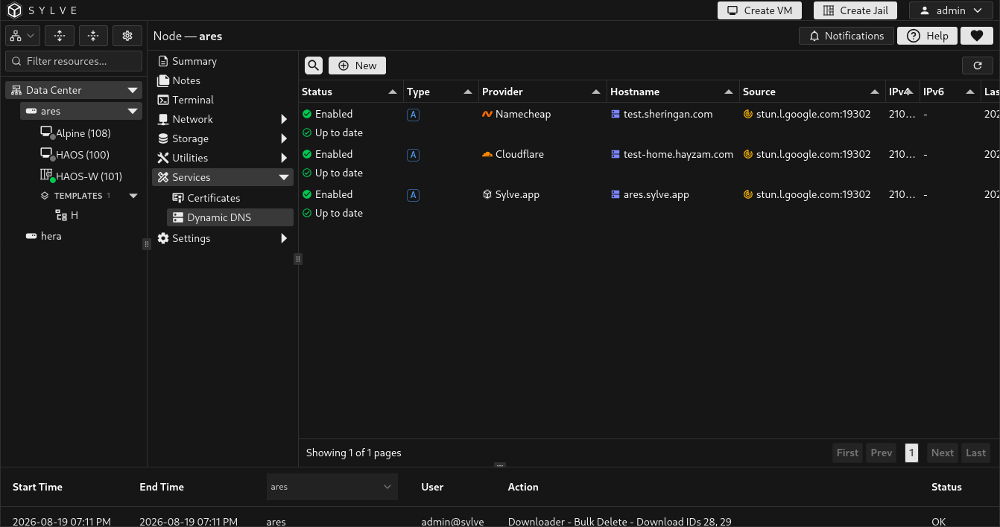
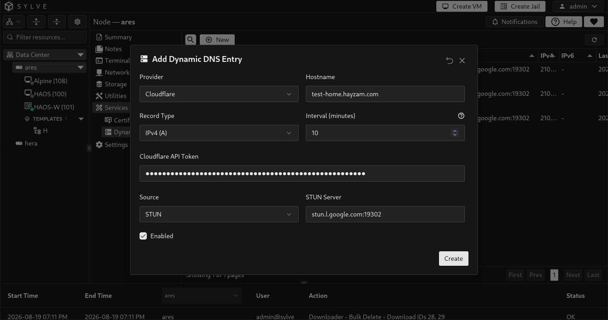

**Services → Dynamic DNS** updates DNS records when the address you want to publish changes. It is useful for a node behind a changing ISP address, for a WireGuard endpoint, or for a public service hosted on the node.

Each entry combines a DNS provider, hostname and record type, an address source, and an update interval. Provider credentials are stored by Sylve and are never shown again in the table.

## Create an entry

Select **New**, choose the provider and source, then save the entry. Sylve validates provider credentials and the target before it accepts the entry.

| Field | Description |
| --- | --- |
| **Provider** | The DNS service that owns the record: **Cloudflare**, **Namecheap**, or **Sylve.app**. |
| **Hostname** | The full record name to update, such as `home.example.com`. A Sylve.app entry must match the hostname assigned to that update token. |
| **Record Type** | **A** for IPv4, **AAAA** for IPv6, or **IPv4 + IPv6** for both. Namecheap supports A records only in this interface. |
| **Interval** | How often enabled entries are considered for synchronization. Enter whole minutes from 1 to 1440. The default is 10 minutes. |
| **Credential** | A Cloudflare API token, Namecheap Dynamic DNS password, or per-hostname Sylve.app update token. When editing without changing provider, leave it blank to keep the stored credential. |
| **Namecheap Domain** | Required for Namecheap. Use the exact domain shown by Namecheap, such as `example.com`. |
| **Enabled** | Includes the entry in scheduled synchronization. A disabled entry keeps its saved settings but is skipped by the worker. |

### Free Sylve.app hostname and managed TLS

[Sylve.app](https://sylve.app) is completely free and can provide a free subdomain such as `your-node.sylve.app`. Create the hostname there, then add its per-hostname update token to a **Sylve.app** Dynamic DNS entry in Sylve.

That entry is more than a DNS updater: it can be selected by **Services → Certificates** to obtain a free **Sylve.app Managed** TLS certificate for the same hostname. The certificate private key is generated and retained on the Sylve node. Sylve.app receives a certificate signing request, not the private key.

Once a managed certificate references the entry, its identity is protected. Sylve blocks deletion of the entry and prevents changes to its provider or hostname until the managed certificate is deleted. This keeps DNS publication and certificate issuance bound to the same hostname.

### Choose the address source

| Source | Use it when | Configuration |
| --- | --- | --- |
| **STUN** | You need the public address as seen from the internet, which is common behind NAT. | Specify a STUN server. The default is `stun.l.google.com:19302`. |
| **Interface** | The address assigned to a node interface is the address you want in DNS. | Select an eligible network interface, bridge, or WireGuard server interface. Loopback and jail `epair` interfaces are not offered. |
| **Manual** | You need to publish a fixed address that Sylve should not discover itself. | Enter the IPv4 address, IPv6 address, or both required by the selected record type. |

:::note
For **IPv4 + IPv6**, a source may provide only one family at a particular time. The table reports a partial result when only one record family was updated successfully.
:::

## Monitor and sync

Select an entry and choose **Sync** to request an update immediately. The scheduled worker checks enabled entries every minute and syncs each one when its configured interval is due.

| Table state | Meaning |
| --- | --- |
| **Up to date** | The provider confirms the requested address is published. |
| **Partial** | One address family was updated, while the other was unavailable or failed. Review the entry's Last Error. |
| **Publication pending** | The provider accepted or is still propagating an update. Sylve checks again after its retry time. |
| **Error** | The update failed. Select **Last Error** to open and copy the complete error message. |
| **Retry** | A transient provider failure has scheduled the next attempt. The table shows its time and the number of failed attempts. |

The **Refresh** action reloads entries, interfaces, and switches. It does not force a provider update. Use **Sync** for that.

## Edit and delete safely

Select an entry to edit or delete it. Sylve prevents overlapping entries from managing the same provider hostname and record family. For example, an `A` entry conflicts with an existing combined `A + AAAA` entry for the same provider hostname.

A Dynamic DNS entry that backs a **Sylve.app Managed** certificate has extra protection:

- You cannot delete it while the managed certificate exists.
- You cannot change its provider or hostname while that certificate uses it.

Delete the managed certificate first if you genuinely need to replace that Dynamic DNS identity. This prevents the certificate and DNS record from becoming disconnected.

## Use Dynamic DNS with certificates

Create and verify the Dynamic DNS entry first, then create a **Sylve.app Managed** certificate from **Services → Certificates**. The certificate form lists eligible Sylve.app entries with configured credentials and uses the selected entry's hostname as the certificate domain.

For direct Let's Encrypt certificates, a Dynamic DNS entry can keep the hostname current, but you still need to expose TCP port 443 publicly for TLS-ALPN-01 validation.
