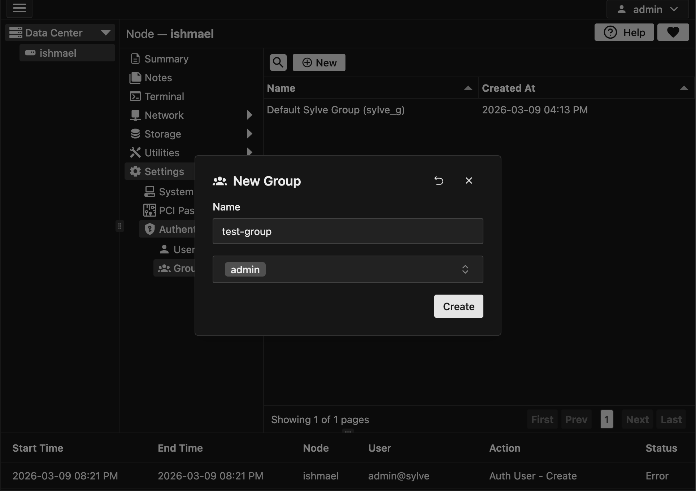

:::note
A default group sylve_g is created when you create your Sylve node. This group is used for all users that are created on the node. You can create additional groups if needed.
:::

## Creating a Group

Creating a group is pretty straightforward. You can create a group using the "New" button in the context menu and then filling out the form below:

You can add as many users as you'd line to the group. You can also add users to the group later on by editing this created group.

## Editing a Group

To edit a group, simply click on the group you want to edit and then click on the "Edit" button in the context menu. This will open the same form as when creating a group, but with the existing information filled out. You can then make any changes you want and save the group. 

You can also delete a group by clicking on the "Delete" button in the context menu. This will permanently delete the group and all users that are part of that group. Make sure to move any users that are part of the group to another group before deleting it.
