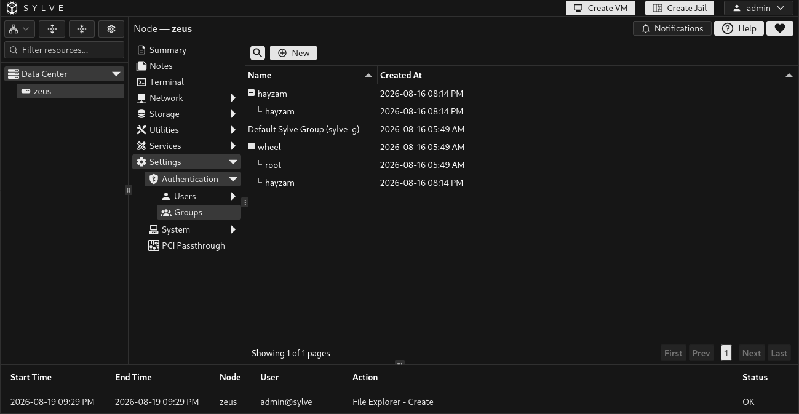
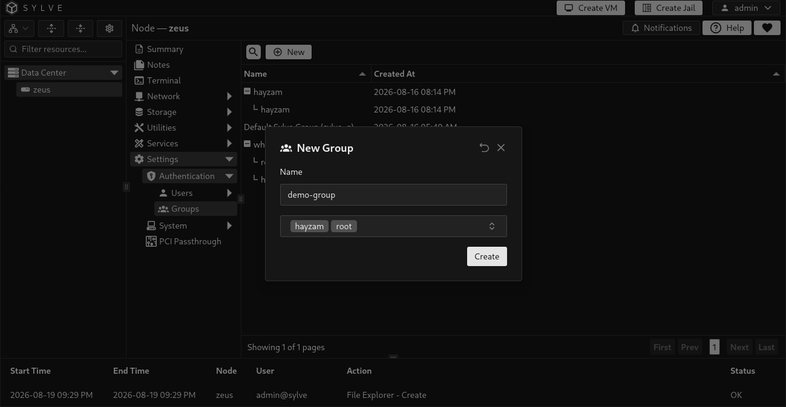
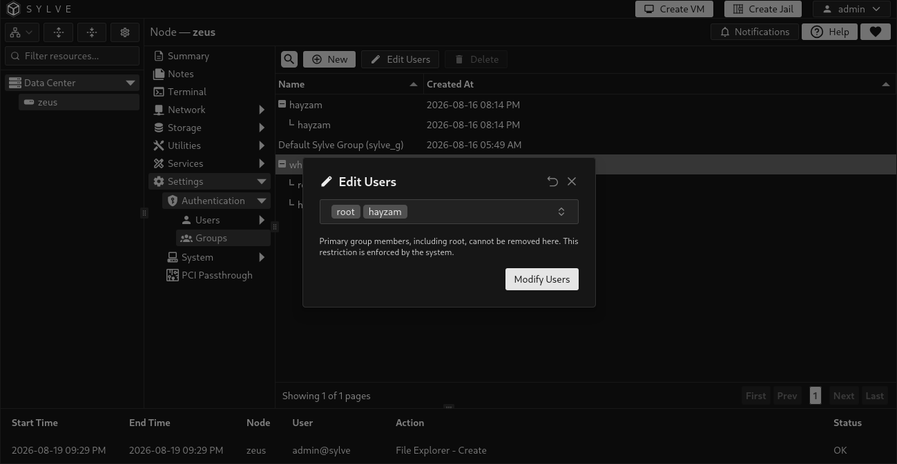

Groups are managed Unix groups on the node. They organize [PAM Users](/guides/node/settings/authentication/users/pam/) into reusable sets for filesystem permissions, Samba access, and other host-level access decisions.

Only PAM users can be members of a managed group because local users do not have Unix accounts. Creating a group creates the corresponding Unix group and its Sylve record.

## Groups and Samba shares

Managed groups are the recommended way to grant the same Samba access to several people. Add the PAM users to a group here, then assign that group as a read-only or writable group on the relevant Samba share.

Membership alone does not give a user access to every Samba share. The group must be selected on the share, and each person must also have a Samba user credential to authenticate to a non-guest share. Create that credential with **Samba User** when creating the PAM user, or select **Create or update Samba user** while editing it.

If the same group is assigned both read-only and writable access to a share, writable access takes precedence. Guest shares do not use individual users or groups.

## Create a group

Select **New Group**, enter a unique group name, then select one or more PAM users as members. A group must have at least one member when it is created.

| Field | Description |
| --- | --- |
| Name | The managed Unix group name. Choose a clear, durable name because it can be used by filesystem and share permissions. |
| Users | PAM users that should belong to the group. Local users are not available because they do not exist on the operating system. |

## View and edit members

Expand a group in the table to see its current members. Use **Edit Users** to add or remove PAM users. Member changes are applied to the managed Unix group as well as Sylve’s record.

Be deliberate when changing a primary group. Sylve prevents removing a user from their primary group through this screen. It also keeps `root` in the protected `wheel` group.

## Delete a group

Deleting a group removes the managed Unix group and its Sylve group record. It does **not** delete its user accounts.

Deletion is blocked when the group is a user’s primary group or when a Samba share still references it. Reassign the affected users or share before trying again. The built-in `sylve_g` and `wheel` groups are protected and cannot be deleted.

Avoid removing a group until you have checked filesystem ownership, ACLs, Samba shares, service accounts, and scheduled jobs that may rely on it.
