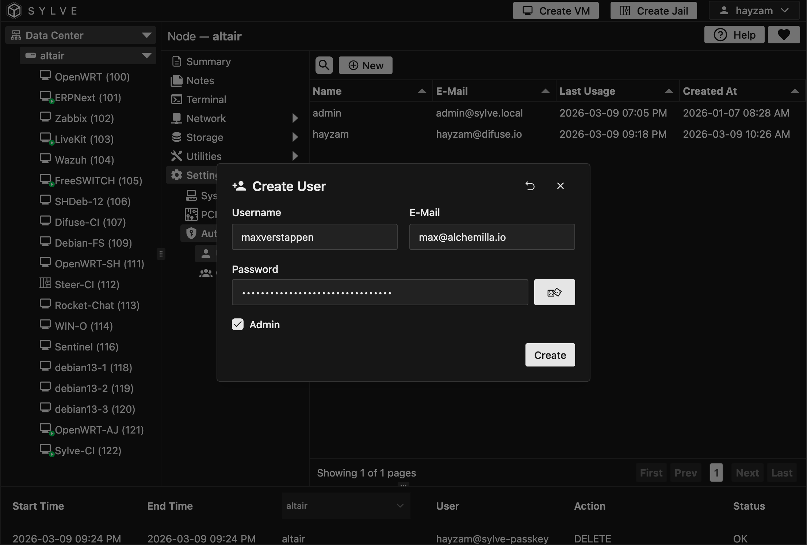

:::note
The initial **admin** user cannot be edited or deleted, you can change the password for that user in the config.json file if needed, but the username will always be **admin**.

You can also leave the password field blank in config.json for the admin user after the initial setup, and the system will preserve the existing password instead of resetting it to blank.
:::

## Adding Users

Adding a user is very straight forward, simply click the "New" button and fill out the form with the new user's information. You can specify a username, password, and role for the new user.

:::note
RBAC is not currently implemented but is planned for a future release, so for now all users are either admin or they are not, and only admins are allowed to login to the web interface. Non-admin users can still be added to groups and be used for things like Samba Shares.
:::

## Editing Users

Editing and deleting users are just as straight forward, simply click the edit button on the user you want to edit or delete and make your changes or confirm the deletion.

## Passkeys 

:::note
Passkeys absolutely require HTTPS with a proper TLS certificate to work, so make sure you have HTTPS set up on your node before trying to use passkeys. You can use a reverse proxy with a free SSL certificate from Let's Encrypt to easily set up HTTPS for your node if you don't already have it.
:::

Now this is a cool feature that allows you to setup a passkey for a user that they can use to login without a password. This is especially useful for users that need to access the web interface from a device that doesn't have a password manager or for users that simply prefer using passkeys over passwords. 

It is much more secure than using passwords and is also more convenient for users. To set up a passkey for a user, simply click the "Passkeys" button on the user you want to set up the passkey for and follow the instructions as given in the video:

<video src="https://adhoc-bucket.difuse.io/passkeys.mp4" muted autoplay loop />