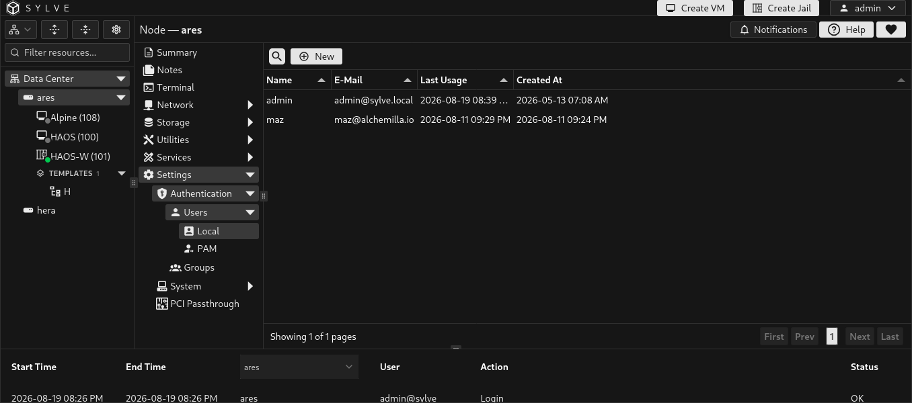
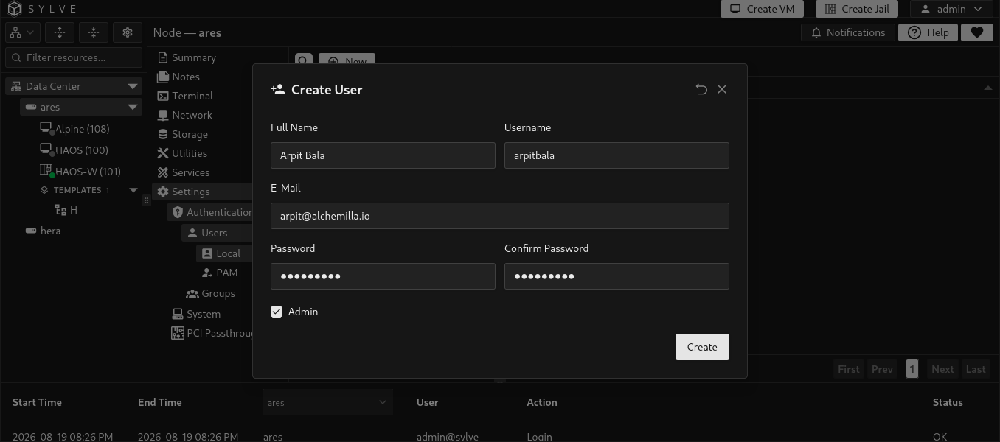

import passkeyWalkthrough from './authentication-local-user-passkeys.mp4';

Local users are accounts stored by Sylve itself. They are useful when someone needs access to the Sylve web interface but does not need a Unix account on the node.

Creating, editing, or deleting a local user does not create, modify, or remove a system user, home directory, Unix group, SSH key, Samba identity, or filesystem ownership. Use [PAM Users](/guides/node/settings/authentication/users/pam/) when the person also needs an account on the host operating system.

| Choose | When it fits |
| --- | --- |
| Local user | The person only needs to sign in to Sylve. |
| PAM user | The person needs a managed Unix account, SSH access, group membership, a home directory, Samba integration, or system authentication. |

Only users marked **Admin** can sign in to the Sylve web interface. This applies to local users, PAM users, and passkey sign-in.

Non-admin local users are still useful as named Sylve identities for notifications and contact details. They cannot sign in or manage the node, but retaining their name and email address lets notifications identify the intended recipient or owner clearly.

:::note
Role-based access control (RBAC) is planned but is not implemented yet. Today, a user either has administrator access to the Sylve web interface or no web interface access.
:::

## Create a local user

Select **New User** and provide the account details.

| Field | Description |
| --- | --- |
| Full Name | A descriptive name shown in Sylve. |
| Username | The account name used to sign in. It must be unique across both local and PAM users. A username cannot be changed after the account is created. |
| E-Mail | An optional contact address associated with the user. |
| Password | The Sylve password. New passwords must be 8 to 128 characters and match the confirmation field. |
| Admin | Allows the user to sign in to and administer Sylve. Leave this disabled for notification or contact-only identities that should not have web interface access. |

When editing a user, leave the password fields empty to keep the current password.

## Manage local users

The actions menu lets you edit a user, manage their passkeys, or delete the account. Deleting a local user removes its Sylve record and its Sylve authentication state. It does not affect any operating-system account because local users never create one.

The built-in `admin` account and `root` are protected from deletion. Keep at least one reachable administrator account before changing or removing other administrators.

## Passkeys

Passkeys let an administrator sign in with the browser or device authenticator instead of entering their password. Open **Passkeys** from the user’s actions menu, give the passkey a recognizable label, then complete the browser prompt.

Passkey registration is available only for active administrators with Sylve credentials. Existing passkeys can still be removed from the user record. Registration requires HTTPS and a browser or device that supports WebAuthn.

<video class="docs-walkthrough-video" autoplay muted loop playsinline controls aria-label="Walkthrough of registering a passkey for a local user and deleting the registration">
  <source src={passkeyWalkthrough} type="video/mp4" />
</video>
