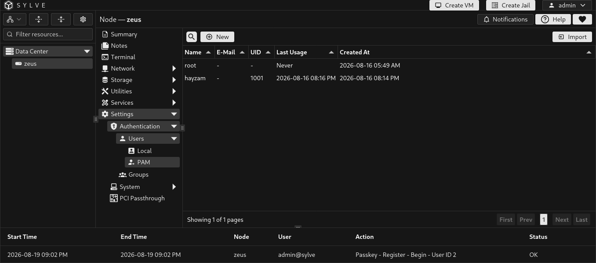
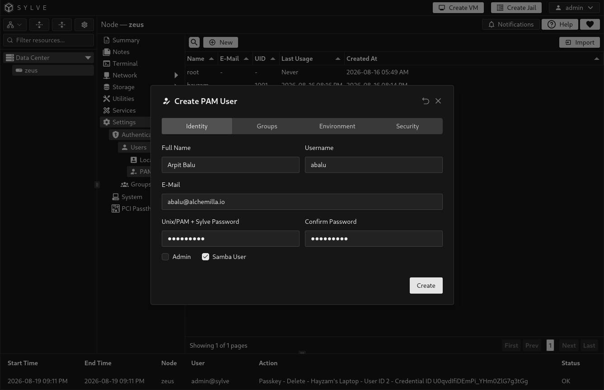
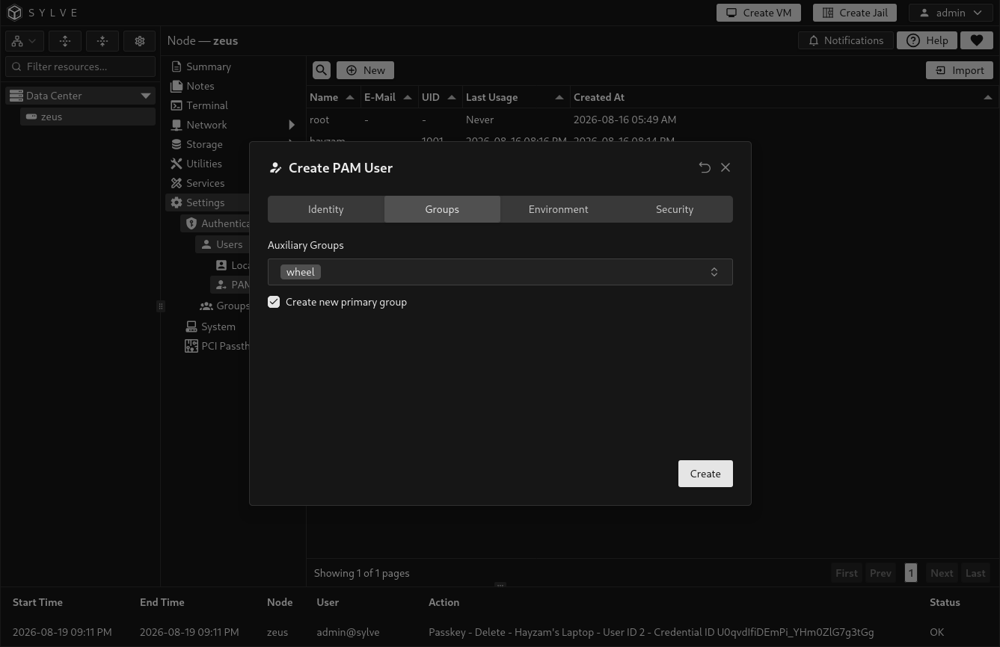
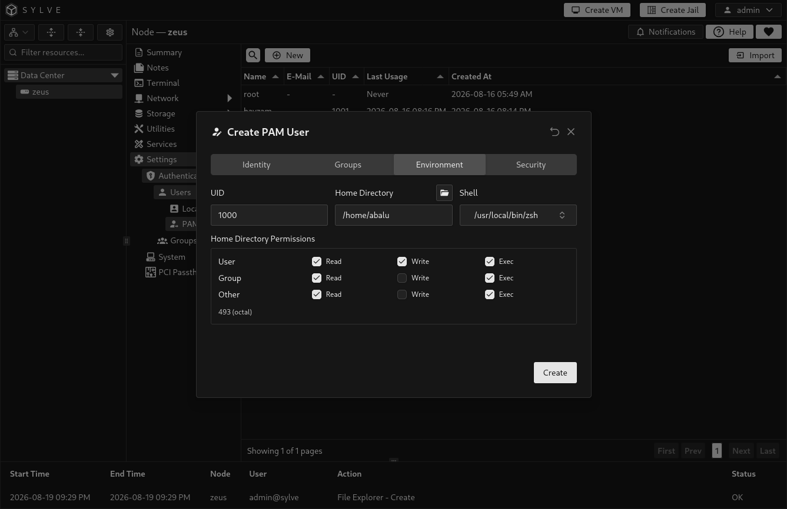
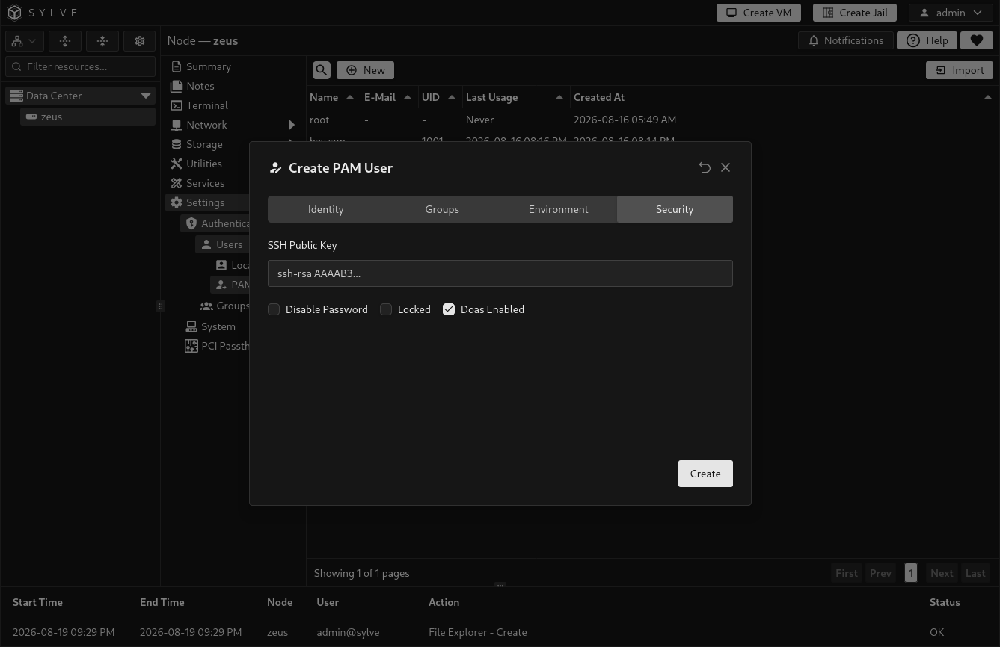
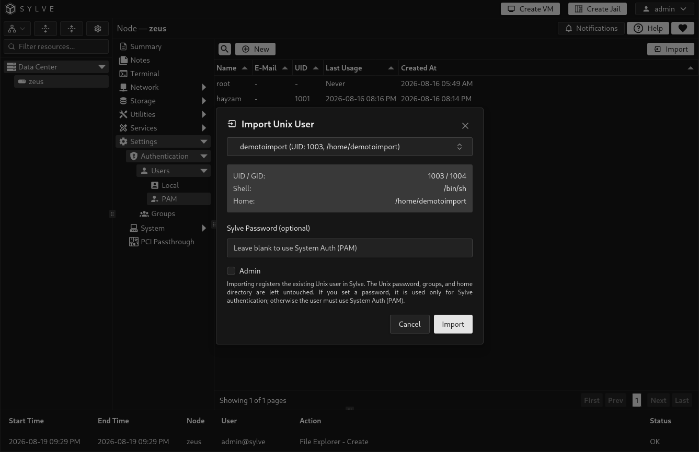

PAM users connect a managed Unix account on the node with a Sylve user record. Use them for people or service accounts that need operating-system access, ownership of files, SSH keys, Unix groups, Samba integration, or system authentication.

Creating a PAM user creates and configures the corresponding Unix account. Editing it can change that account’s groups, home directory settings, login shell, SSH public key, doas access, and Samba state. This is different from a [Local User](/guides/node/settings/authentication/users/local/), which exists only inside Sylve.

## Sign-in and permissions

Only PAM users marked **Admin** can sign in to the Sylve web interface. A PAM user can use **System Auth (PAM)** at sign-in only when PAM authentication is enabled in the node configuration. The user must also be registered in Sylve, enabled, and an administrator.

Non-admin PAM users are still useful for host-level work such as Unix ownership, SSH, Samba, and group membership. They simply cannot sign in to Sylve’s web interface.

## Create a PAM user

Select **New User**. The form is organized into Identity, Groups, Environment, and Security sections so you can configure the Unix account deliberately.

### Identity

| Field | Description |
| --- | --- |
| Full Name | A descriptive name for the account. |
| Username | The Unix and Sylve account name. It must be unique and cannot be renamed after creation. |
| E-Mail | An optional contact address stored with the Sylve record. |
| Unix/PAM + Sylve Password | The password used for the Unix account and Sylve password authentication. It must be 8 to 128 characters and match the confirmation. When Samba User is selected during creation, the same submitted password is also used to create its Samba credential. |
| Admin | Permits the account to sign in to and administer Sylve. |
| Samba User | When creating an account, creates the related Samba user. This requires Samba support and a password. |
| Samba action | When editing an account, keeps the current Samba state, creates or updates the Samba user, or removes the Samba user. |

If you enable password authentication while editing, provide a new password. Creating or updating a Samba user also requires one.

### Groups

Every PAM user has a primary Unix group and can belong to additional managed groups. You can create a private primary group for the user, select an existing primary group, and select auxiliary groups.

Groups in this form are managed Sylve groups. Create and maintain them from [Groups](/guides/node/settings/authentication/groups/). Use groups to grant the same filesystem or Samba-related access to several PAM users without configuring each person separately.

## Samba access and groups

A PAM user and a Samba user are related, but they are not the same thing:

| Item | What it provides |
| --- | --- |
| PAM user | The underlying Unix account, its UID, filesystem ownership, and managed group membership. |
| Samba user | A Samba credential for that Unix username, allowing the person to authenticate to non-guest Samba shares. |
| Share permission | The actual read or write access to a specific share. Configure this on the share by adding the PAM user or one of their managed groups. |

For a typical private share, create the PAM user with **Samba User** enabled, add the person to a managed group, then add that group to the share’s read-only or writable groups. Group membership alone does not grant access to every share. The group must also be assigned on that specific share. A user or group given writable access takes precedence over a duplicate read-only assignment.

Samba stores its own credential for the Unix username. If you later change the user’s password and leave **Samba action** set to **Keep current Samba state**, their Samba password remains unchanged. Select **Create or update Samba user** and provide the new password whenever you need to synchronize it. Selecting **Remove Samba user** removes only the Samba credential, not the PAM user or its Unix group memberships.

Guest shares do not use individual user or group permissions. Use a non-guest share when access should be restricted through PAM users or managed groups.

### Environment

| Field | Description |
| --- | --- |
| UID | The numeric Unix user ID. New users default to the next available ID. Sylve accepts values from 1000 through 65533. |
| Home Directory | The account’s Unix home path. The default `/nonexistent` intentionally avoids creating a usable home directory. Choose a real path only when the account needs one. |
| Home Permissions | Owner, group, and other read, write, and execute permissions applied when Sylve creates the home directory. |
| Shell | The shell started for interactive login. Available choices include sh, csh, tcsh, Bash, Zsh, and `nologin`. Use `nologin` for accounts that must not open an interactive shell. |

Selecting a real home directory can create and manage that directory as part of the Unix account. Check the path and permissions before saving, particularly on a shared dataset or mounted storage.

### Security

| Option | Effect |
| --- | --- |
| SSH Public Key | An optional public key written for the account’s SSH authorization. Enter only the public key, never a private key. |
| Disable Password | Prevents password authentication for the Unix account. |
| Locked | Locks the Unix account. A locked account cannot be used normally until unlocked. |
| Enable doas | Grants the managed doas configuration for this user when `doas` is available on the node. |

## Import an existing Unix account

Use **Import** when the Unix account already exists but was not created by Sylve. Importing registers the account in Sylve without changing its existing Unix password, groups, or home directory.

You may optionally set a **Sylve Password** during import. That password is stored for Sylve authentication only. If you leave it empty, the account uses System Auth (PAM) when PAM authentication is enabled. Choose the Admin setting carefully because only administrators can sign in to the web interface.

## Delete a PAM user

Deleting a PAM user is destructive. Sylve removes the managed Unix account, its home directory, related Samba user, doas configuration, and Sylve user record. Confirm that no service, scheduled job, share, dataset ownership rule, or person still depends on that account before deleting it.

The `root` account is protected from deletion.
