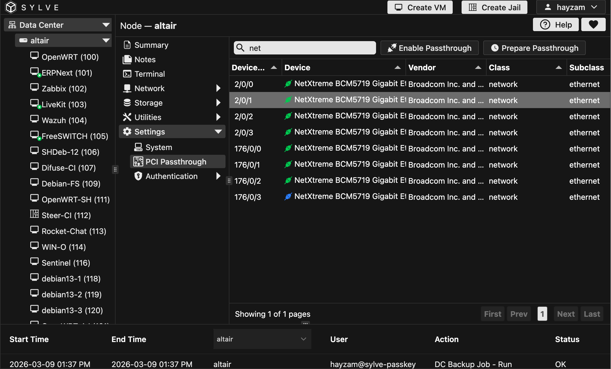

:::warning
PCI passthrough is an advanced feature that allows you to directly assign a physical PCI device to a virtual machine. This can provide improved performance for certain workloads, but it also comes with risks. Incorrectly configuring PCI passthrough can lead to system instability, data loss, or even hardware damage. It is recommended that only experienced users with a good understanding of their hardware and virtualization technology attempt to use PCI passthrough.
:::

To configure PCI passthrough settings for your Sylve node, navigate to the PCI Passthrough section in the settings. Here, you can view a list of available PCI devices on your system and select which ones you want to pass through to your virtual machines.

## Enabling PCI Passthrough

When you click on a row that is a device that is not already passed through, you will see 2 buttons, like this:

It is **highly** recommended to use the **Prepare Passthrough** button and then restart your node so that the device is properly configured for passthrough. This will ensure that the necessary drivers and configurations are set up correctly.

Otherwise if you're absolutely sure you know what you're doing, you can click the **Enable Passthrough** button to immediately start passing the device through to your virtual machines.

Once a device is passed through, it will be marked as such in the list with a blue icon instead of a green one, essentially green means the device is attached to the host and blue means it's available to be attached to a VM. You can click on the row again to see the option to disable passthrough for that device if needed.