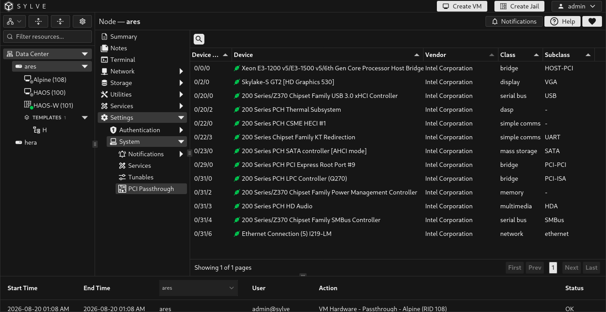
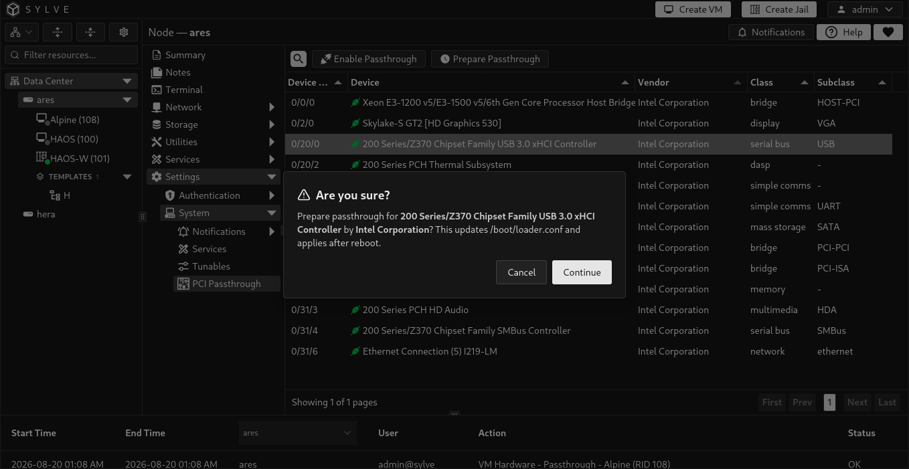
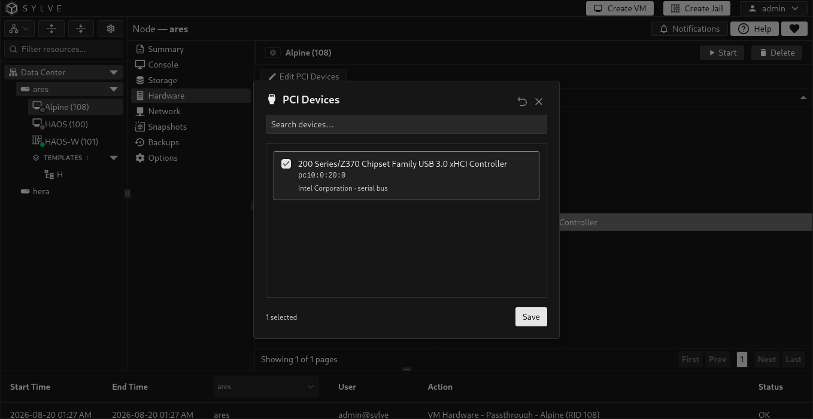
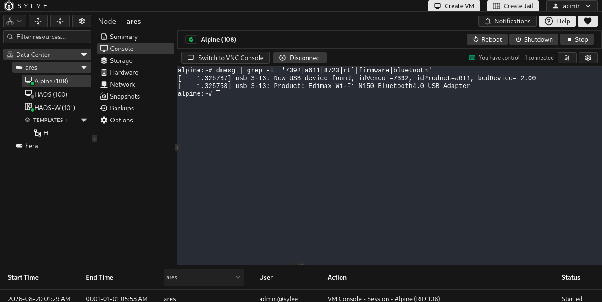
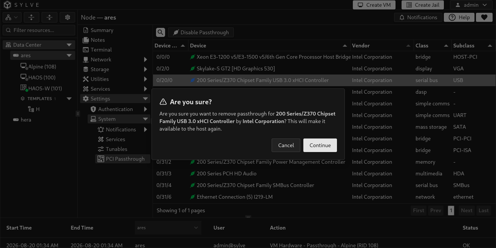

PCI passthrough gives a virtual machine direct access to a physical PCI device, such as a dedicated GPU, network adapter, USB controller, or hardware accelerator. The host cannot use a device while it is assigned to the `ppt` driver for passthrough.

Find this page at **Settings → System → PCI Passthrough**. It lists PCI devices detected on the node and whether each device is owned by the host or prepared for VM use.

:::caution
Do not pass through the node's boot-storage controller, active management network adapter, or any device required to keep the host accessible. A mistake can remove the host's network, storage, display, or other critical capability until you recover it from console access or restart it.
:::

## Before you start

Enable the **Virtualization** service in [Services](/guides/node/settings/system/services/) and restart the node before configuring a VM for passthrough. Confirm that the device is not needed by the host and that you have a safe way to manage the node after it is detached.

The table inventories devices from every detected PCI domain and identifies each with a **Device ID** in the form `bus/device/function`. Sylve currently permits new passthrough mappings only for devices in PCI domain 0. Devices from other domains remain visible but are marked unsupported for new mappings.

## Prepare a device for passthrough

For most devices, use **Prepare Passthrough**. Select a host-owned device, select **Prepare Passthrough**, confirm the prompt, then restart the node.

Preparation records the device in `/boot/loader.conf` so FreeBSD attaches it to the `ppt` driver during startup. Sylve also ensures the required passthrough driver is loaded. After the restart, Sylve recognizes the prepared device and adds it to its managed passthrough inventory.

:::caution
Strongly prefer **Prepare Passthrough** followed by a complete node restart. It is the cleanest path because FreeBSD assigns the device to `ppt` from boot, before the host has loaded and begun using its normal driver. In Sylve testing, moving an already-live device into `ppt` also caused issues on a running system. **Enable Passthrough** detaches a live device from the host immediately and is intended only for cases where you understand and accept that disruption.
:::

| Action | When to use it | Result |
| --- | --- | --- |
| Prepare Passthrough | Recommended for a host-owned device. | Persists the device for the `ppt` driver at the next boot. A restart is required. |
| Enable Passthrough | Only when you intentionally need the device detached from the host immediately. | Detaches the host driver and attaches the device to `ppt` now. The host loses access immediately. |
| Import Passthrough | The device already appears as `ppt` because it was prepared outside Sylve. | Adds it to Sylve’s managed inventory without changing its current `ppt` state. |

## Attach a device to a VM

Once a device is managed as passthrough hardware, open the target VM and go to **Hardware → PCI Devices**. The VM must be completely shut off before you save hardware changes.

1. Shut off the VM.
2. Open **Hardware → PCI Devices**.
3. Select one or more prepared PCI devices.
4. Save the change.
5. Start the VM and install or configure the guest driver if the operating system needs one.

Sylve adds the selected device to the VM's bhyve configuration and locks the VM's memory as required for PCI passthrough.

### Example: USB Wi-Fi dongle for an Alpine VM

Suppose the node has an `Intel 200 Series/Z370 Chipset Family USB 3.0 xHCI Controller` that is not needed by the host, and a USB Wi-Fi dongle is connected to one of that controller's ports. You want an Alpine VM named `Alpine` to use the dongle.

1. In **Settings → System → PCI Passthrough**, select the Intel USB controller and choose **Prepare Passthrough**.
2. Restart the node. Verify that the controller now appears as a managed `ppt` device.
3. Shut off `Alpine`.
4. Open **Alpine → Hardware → PCI Devices**, select the Intel USB controller, and save.
5. Start `Alpine`. Alpine sees the controller and the attached Wi-Fi dongle as its own USB hardware. Configure the adapter inside Alpine as you would on a physical machine.

PCI passthrough assigns the entire USB controller, not just the Wi-Fi dongle. Every USB port attached to that controller becomes unavailable to FreeBSD and is available to the guest instead. Check which physical ports belong to the controller before preparing it, especially if the host uses one for a keyboard, management device, or boot media.

## Sharing and removing devices

Sylve lets you select a managed PCI device in more than one VM configuration, but only one running VM can use that device at a time. Sylve blocks a VM from starting when another running VM already uses the same device.

To return a device to the host:

1. Shut off every VM that uses it.
2. Remove the device from each VM's **Hardware → PCI Devices** selection and save.
3. Return to **Settings → System → PCI Passthrough**, select the device, and choose **Disable Passthrough**.
4. Restart the node if Sylve reports that a restart is required to restore the host driver.

Sylve blocks removal while the device is still assigned to a VM. Removing passthrough deletes Sylve’s mapping and attempts to restore the device’s previous host driver when possible.

