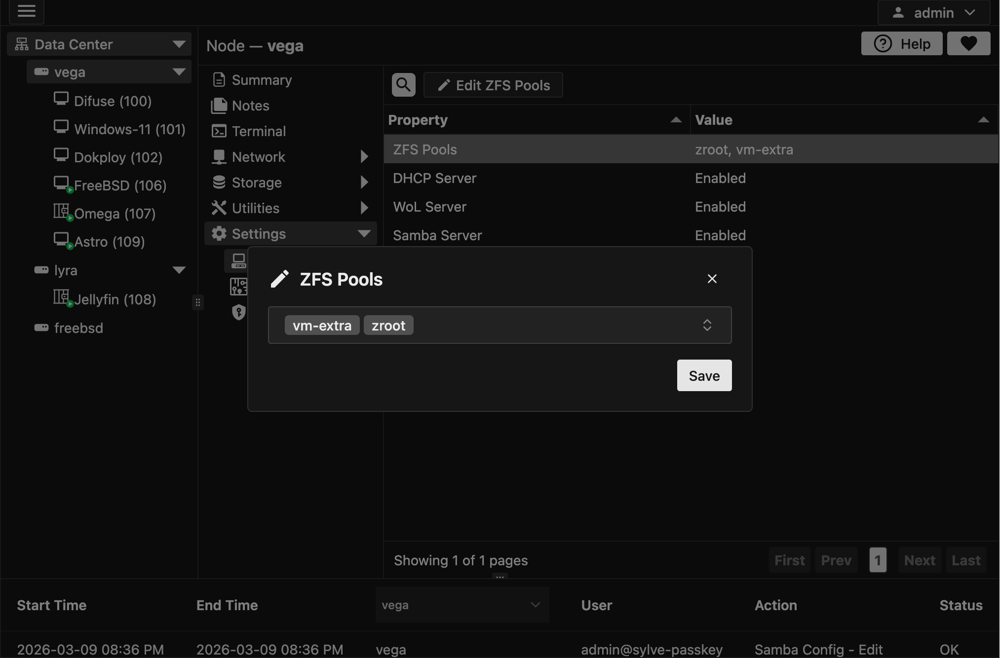
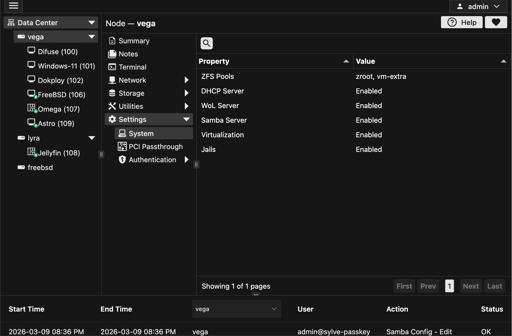

## ZFS Pools

Since sylve only touches pools that you allowed during initialization or created through Sylve, you can import pools that were created outside of Sylve. To do this, click the ZFS Pools row and then the edit button then a form like this should open up:

You can add/remove pools from this list. Although you **cannot** remove pools that are still being used by VMs, Jails or have periodic snapshots running on them. You can only remove pools that are not being used by any of those features. If you try to remove a pool that is still being used, you will get an error.

## Services

All other rows in this table are for toggling features on and off. If you click on a row, you will see a toggle switch that you can use to enable or disable the feature. It is considered best practice to restart your node if you change any of these toggles for the changes to take effect. 

:::caution
If you don't restart your node after changing any of these toggles, you may experience unexpected behavior or issues with the toggled feature.
:::