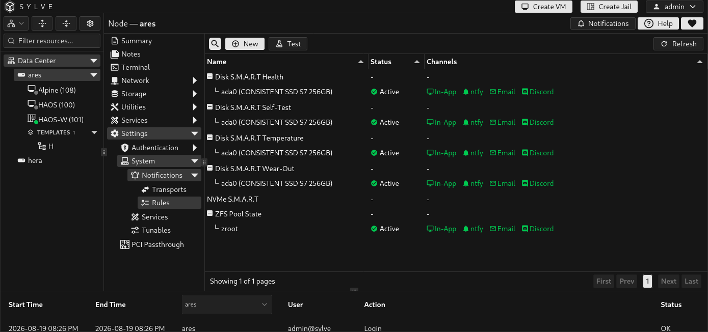
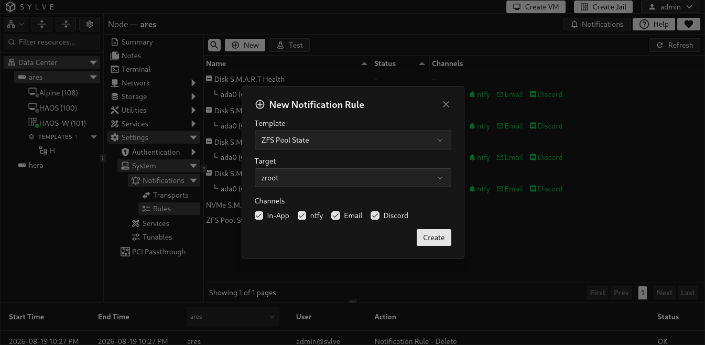
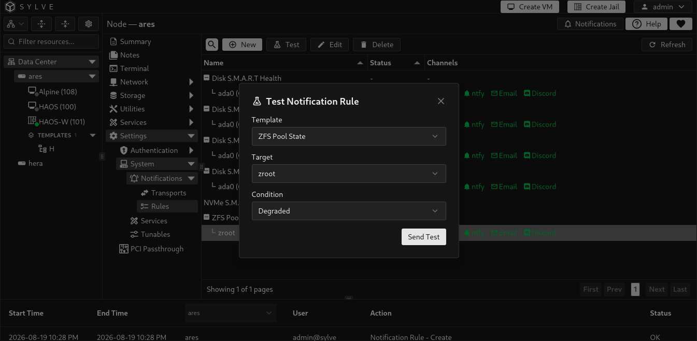
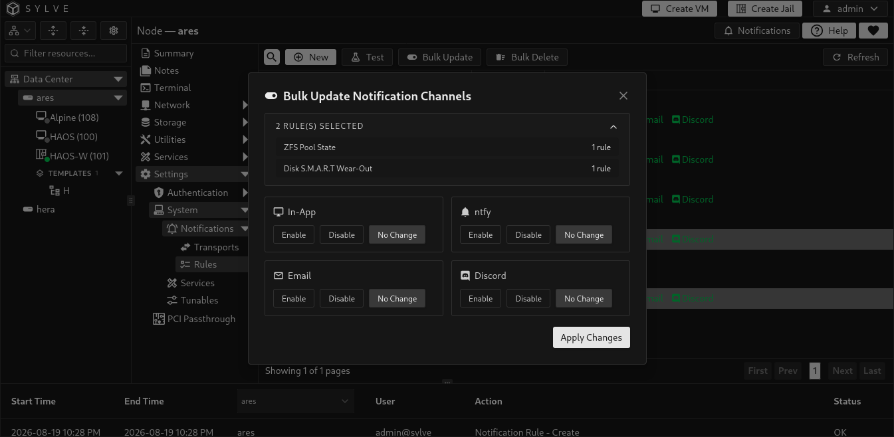

Notification rules connect an event template and a target to delivery channels. A template describes the event family, such as a disk SMART condition or ZFS pool state. A target identifies the affected disk or pool. Each rule then controls whether that event appears in the Sylve interface or is delivered through ntfy, email, and Discord.

## Create a rule

Select **New**, choose an available template and target, then choose the delivery channels.

| Channel | Delivery behavior |
| --- | --- |
| UI | Creates an in-app notification visible in Sylve. No transport is required. |
| ntfy | Sends to enabled ntfy transports. |
| Email | Sends to enabled SMTP transports. |
| Discord | Sends to enabled Discord transports. |

The available templates and targets are supplied by the node, so the list changes as hardware and pools change. Current templates include disk SMART temperature, wearout, health, NVMe, and self-test events, as well as ZFS pool state events.

## Test a rule

Use **Test** to select a template, target, and available condition, then send a test event through the rule. This verifies the rule’s selected channels and their configured transports. Test an external transport first if you are unsure whether the destination itself is reachable.

## Edit, bulk update, and delete

Select a rule to edit its channels or template configuration. Select multiple rules to apply the same channel choices in one bulk update, or to delete them together.

Some rules are automatically managed while their target is active. Sylve prevents deleting an active auto-managed rule. Do not work around that protection by deleting the related target merely to remove the rule. Disable the channels instead if notifications are not wanted, or remove the resource only when it is genuinely no longer needed.

:::note
An enabled external channel needs at least one enabled transport of its matching type. For example, an Email-enabled rule needs an enabled SMTP transport.
:::
