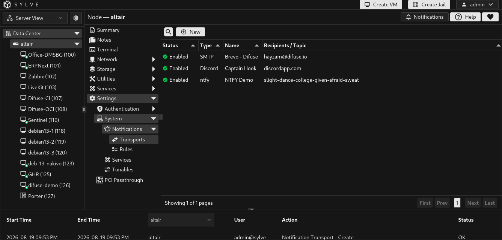
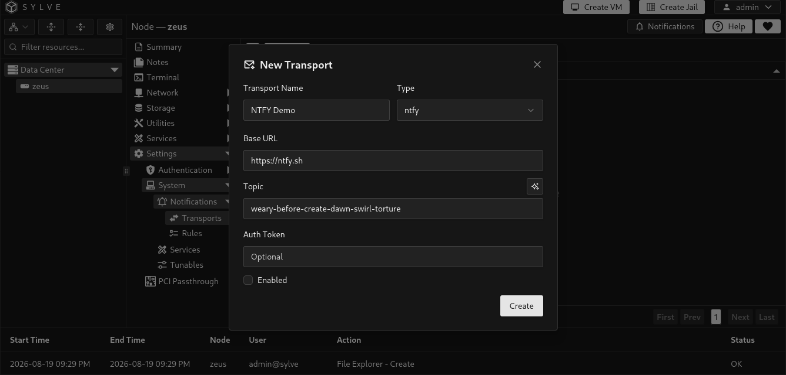
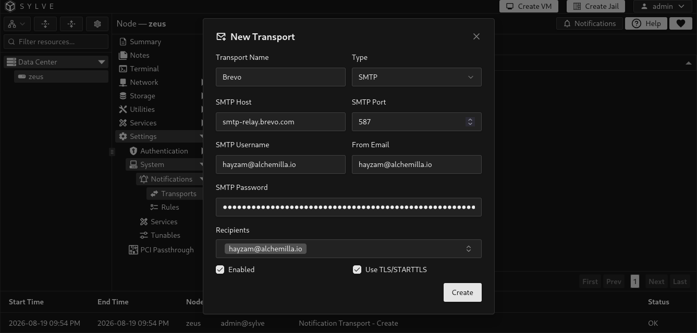
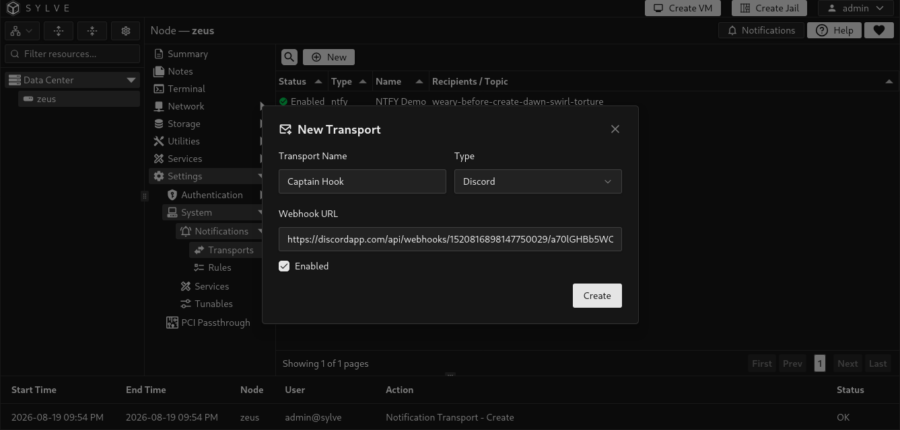
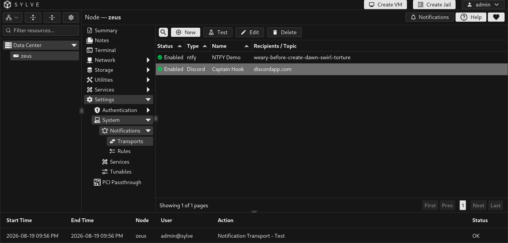
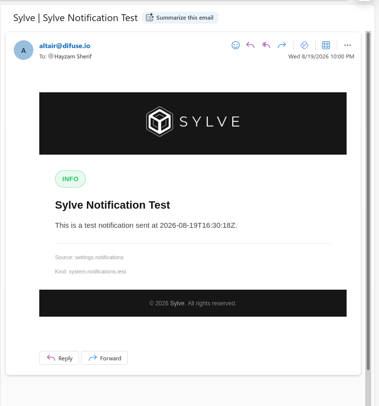
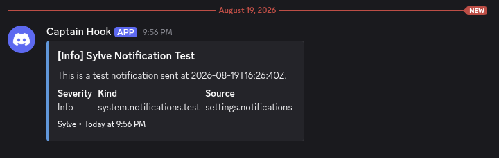

Notification transports are delivery destinations. Create one or more transports before enabling an external channel in a notification rule. Sylve can deliver to the web interface, ntfy, SMTP email, and Discord. The web interface is configured per rule and does not need a transport.

## Create a transport

Select **New**, give the transport a clear name, choose its type, configure its settings, then enable it. You can create multiple transports of the same type, such as separate email destinations for operations and backups.

| Type | Required configuration | Optional configuration |
| --- | --- | --- |
| ntfy | Topic | Base URL, which defaults to `https://ntfy.sh`, and an authentication token. |
| SMTP | SMTP host, From Email, and at least one recipient | Port, username, password, and TLS or STARTTLS. The default port is 587. |
| Discord | Webhook URL | None. |

For SMTP recipients, Sylve offers email addresses saved on local and PAM user records, and you can also enter a recipient address directly. A transport can be saved disabled while you finish configuration or wait for the destination to be ready.

### ntfy transport

### SMTP transport

### Discord transport

## Test before enabling rules

Select a transport in the table and use **Test** to send a test notification. Testing checks the configured delivery path without needing to wait for an actual disk, pool, or service event.

Treat the credentials and URLs in transport forms as secrets. Tokens, SMTP passwords, and Discord webhooks can grant access to notification destinations. When editing an existing ntfy or SMTP transport, leave a credential field blank to retain the stored value. Enter an explicit replacement only when you intend to change it.

### SMTP test delivery

### Discord test delivery

## Manage transports

The table shows the status, type, name, and recipient, topic, or webhook host details for each transport. Select one transport to edit, test, or delete it.

Deleting a transport removes that delivery destination without deleting notification rules or other transports. Review rules that use its channel afterward, because an enabled ntfy, email, or Discord channel cannot deliver without an enabled matching transport.
